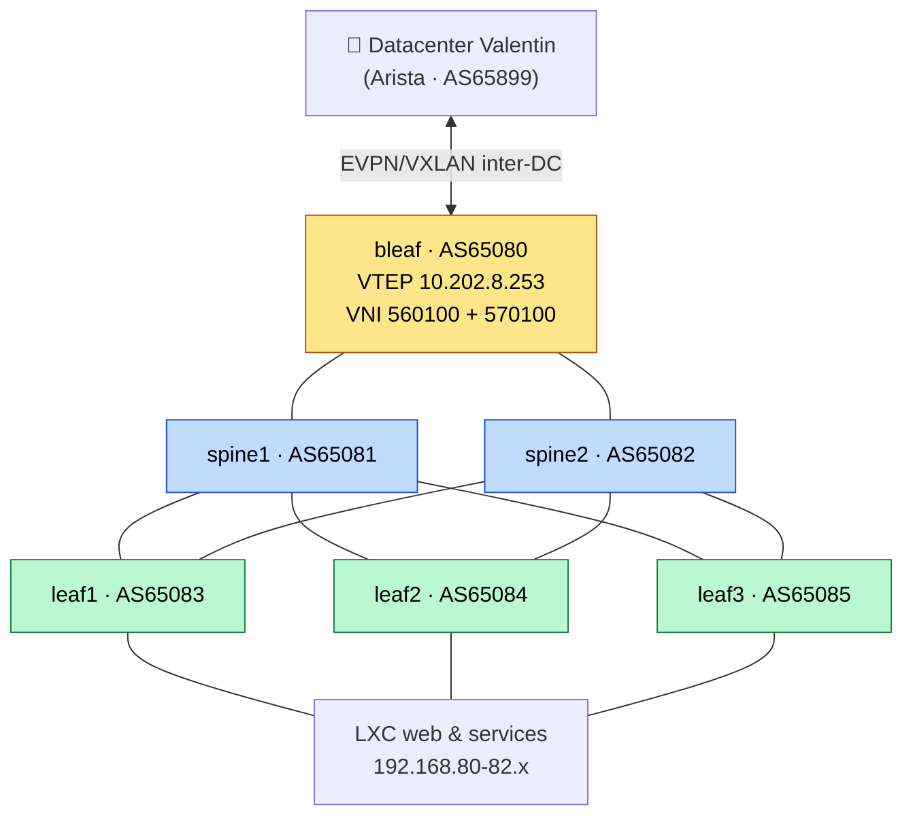

# DATACENTER-PIERRE — Fabric Leaf-Spine eBGP + VXLAN/EVPN

> SAE4D01 DevCloud — **Pierre URTADO**, BUT R&T (IUT Béziers)

Fabric datacenter leaf-spine (Clos) montée en lab **containerlab + FRR**.
**Architecture retenue : eBGP en underlay + VXLAN/EVPN en overlay L2**, étendue en **inter-datacenter**
(EVPN/VXLAN avec le fabric Arista de Valentin). 5 technologies de routage comparées par benchmark chiffré,
supervisées en Grafana, industrialisées en Ansible + CI GitHub Actions.

📄 **Compte-rendu complet → sur Notion** (espace SAE4D01 DevCloud, page `SYNTH_SAE4D01_MALOT_URTADO`).

---

## Sommaire

1. [Architecture retenue](#architecture-retenue)
2. [Infrastructure](#infrastructure)
3. [Quickstart](#quickstart)
4. [Ansible (déploiement à distance)](#ansible-déploiement-à-distance)
5. [Les 5 topologies](#les-5-topologies-containerlab)
6. [Benchmark](#benchmark-iperf3-vm221)
7. [Inter-DC EVPN/VXLAN](#inter-dc-evpnvxlan-border-leaf-bleaf)
8. [Monitoring & CI/CD](#monitoring--cicd)
9. [Commandes utiles](#commandes-utiles)
10. [Documentation](#documentation)

---

## Architecture retenue



> Underlay **eBGP /31** (ECMP + BFD) · Overlay **VXLAN/EVPN** · liens spine↔leaf = Clos full-mesh.

- **Underlay** : eBGP (RFC 7938, un AS par équipement), liens /31, **ECMP + BFD**. Pas de RR ni de
  next-hop-self à gérer (contraste avec l'iBGP du datacenter de Valentin).
- **Overlay L2** : VXLAN (UDP 4789) piloté par **BGP EVPN** (control-plane Type-2/3, route-target).
- **Inter-DC** : un border-leaf `bleaf` dédié étend 2 VLAN vers le fabric de Valentin — prouvé en **Wireshark**.
- **Résilience** : panne d'un spine → **0 % de perte** (ECMP, le 2ᵉ chemin reste dans la FIB).

## Infrastructure

| Hôte | IP | Rôle |
|------|-----|------|
| Proxmox `pvepierre` | `10.202.8.101` | Hyperviseur |
| **VM220** | `10.202.8.220` | **Prod** — `topo-ebgp` + border-leaf inter-DC + monitoring |
| **VM221** | `10.202.8.221` | **Lab / bench** — 5 topos + labs VXLAN IRB/Anycast + benchmark |

Accès campus : Tailscale. Outils : containerlab 0.76.1, FRR 10.6.1, Alpine.

## Quickstart

```bash
git clone https://github.com/frver0x/sae-datacenter
cd sae-datacenter/DATACENTER-PIERRE

# Bootstrap d'une Debian nue (Docker + containerlab + images, puis déploiement)
sudo bash setup.sh fabric     # topo-ebgp + EVPN inter-DC
sudo bash setup.sh bench      # prépare les topos + benchmark
```

Pour piloter les VM à distance (push SSH), voir **[Ansible](#ansible-d%C3%A9ploiement-%C3%A0-distance)** ci-dessous.

## Ansible (déploiement à distance)

Toutes les commandes se lancent **depuis le dossier `ansible/`** (qui contient
`ansible.cfg` pointant déjà l'inventaire `inventory/hosts.yml`).

### Prérequis (poste de contrôle)

```bash
cd sae-datacenter/DATACENTER-PIERRE/ansible

# 1. Collections requises (community.docker)
ansible-galaxy collection install -r requirements.yml

# 2. Clé SSH : l'inventaire utilise root@VM avec ~/.ssh/id_ed25519
#    (générer + copier sur les 2 VM si pas déjà fait)
ssh-keygen -t ed25519                          # si pas de clé
ssh-copy-id root@10.202.8.220                   # VM220 (prod)
ssh-copy-id root@10.202.8.221                   # VM221 (lab/bench)

# 3. Vérifier la connexion (Tailscale up côté campus)
ansible all -m ping
```

`inventory/hosts.yml` définit le groupe `containerlab_hosts` (VM220 `10.202.8.220`,
VM221 `10.202.8.221`). `group_vars/all.yml` fixe les versions containerlab 0.76.1,
FRR 10.6.1 et la liste des 5 topologies.

### Ordre de lancement

```bash
# 1. Bootstrap : installe Docker + containerlab + pull images FRR/Alpine (idempotent)
ansible-playbook playbooks/bootstrap.yml

# 2. Sync : copie les topos containerlab/ + benchmark.sh du repo vers /root sur VM220
ansible-playbook playbooks/sync-topologies.yml

# 3. Deploy : monte une topologie (défaut topo-ebgp). -e topo=... pour en choisir une
ansible-playbook playbooks/deploy-topo.yml -e "topo=topo-ebgp"
ansible-playbook playbooks/deploy-topo.yml -e "topo=topo-evpn"

# 4. Destroy : démonte la topologie (--cleanup)
ansible-playbook playbooks/destroy-topo.yml -e "topo=topo-ebgp"
```

### Benchmark

```bash
# Lance benchmark.sh sur VM220 (async 900 s) et rapatrie les JSON dans ../results/
ansible-playbook playbooks/benchmark.yml
```

| Playbook | Hôte ciblé | Rôle |
|----------|-----------|------|
| `bootstrap.yml` | `containerlab_hosts` (VM220+221) | Docker + containerlab + images |
| `sync-topologies.yml` | `vm220` | copie topos + `benchmark.sh` vers `/root` |
| `deploy-topo.yml` | `vm220` | `containerlab deploy` (var `topo`) |
| `destroy-topo.yml` | `vm220` | `containerlab destroy --cleanup` (var `topo`) |
| `benchmark.yml` | `vm220` | run `benchmark.sh` + fetch JSON |

## Les 5 topologies (`containerlab/`)

| Topo | Underlay | Overlay | Particularité |
|------|----------|---------|---------------|
| **topo-ebgp** | eBGP multi-AS | — | **baseline + prod**, porte le border-leaf EVPN inter-DC |
| topo-ibgp-rr | iBGP (spines = RR) | — | `next-hop-self force` |
| topo-ospf | OSPF area 0 | — | `ip ospf network point-to-point` sur /31 |
| topo-mixed | OSPF | iBGP RR (loopbacks) | modèle DC classique underlay/overlay |
| topo-evpn | OSPF | **BGP EVPN** | VXLAN VNI 100, Type-2/3, IRB, Anycast GW |

Topologie commune : **2 spines + 3 leaves** (Clos), chaque leaf relié aux 2 spines.

## Benchmark (iperf3, VM221)

| Techno | TCP 1 flux (G) | **TCP 4 flux `-P 4` (G)** | UDP 20G (G) |
|--------|----------------|----------------------------|-------------|
| eBGP | 10.50 | **38.91** | 8.35 |
| OSPF | 9.93 | **38.93** | 8.04 |
| mixed | 10.05 | **38.46** | 8.12 |
| iBGP-RR | 10.31 | **38.16** | 8.19 |

→ **Le protocole de routage n'impacte pas le débit** (38–39 G agrégé, écart < bruit veth). Un flux unique
plafonne à ~10 G (limite veth/cœur) ; l'agrégat 4 flux + ECMP tient ~39 G = la vraie capacité de la fabric.
La différence se joue ailleurs : convergence, scalabilité, policy.

## Inter-DC EVPN/VXLAN (border-leaf `bleaf`)

`bleaf` (AS65080, VTEP `10.202.8.253`) peer EVPN avec le border-leaf de Valentin (`10.202.8.205`, AS65899).
Deux VLAN étendus en L2 :

| VNI | VLAN | Plage L2 (côté Pierre) | Passerelle anycast |
|-----|------|------------------------|--------------------|
| 560100 | web | `172.16.30.0/24` | `172.16.30.254` |
| 570100 | machines | `172.16.31.0/24` | `172.16.31.254` |

```bash
docker exec clab-topo-ebgp-bleaf vtysh -c "show bgp l2vpn evpn summary"   # peer Established
docker exec clab-topo-ebgp-bleaf vtysh -c "show evpn mac vni 560100"      # MAC distantes via VTEP (BGP, pas flood)
# preuve data-plane : tcpdump -ni eth3 udp port 4789  → VXLAN vni 560100 + ICMP encapsulé
```

Capture d'encapsulation reproductible : `captures/evpn-vxlan-interdc.pcap` (filtre Wireshark `vxlan`).

## Monitoring & CI/CD

- **Grafana** : prod fabric `http://10.202.8.102:3000` · bench `http://10.202.8.220:3001` (admin/sae4d01).
  Stack Prometheus + Grafana + blackbox + node-exporter + exporter maison `clab_exporter.py`
  (`:9101`, métriques RX/TX par conteneur clab via `nsenter`).
- **CI** (`.github/workflows/`) : `ci.yml` (validation FRR `vtysh -C` + yamllint + shellcheck) +
  `ansible.yml` (syntax-check + ansible-lint). **CD** : `deploy.yml` (manuel, runner self-hosted).

## Commandes utiles

```bash
cd containerlab/topo-ebgp && containerlab deploy -t topology.clab.yml
containerlab destroy -t topology.clab.yml --cleanup
containerlab inspect --all
docker exec clab-topo-ebgp-spine1 vtysh -c "show bgp summary"
bash containerlab/benchmark.sh
```

## Documentation

- **Compte-rendu complet → Notion** (page `SYNTH_SAE4D01_MALOT_URTADO`, espace SAE4D01 DevCloud) :
  architecture, 5 labs, EVPN/VXLAN, IRB/Anycast, inter-DC, résilience, benchmark, observabilité, IaC/CI-CD.
- `captures/` — pcap d'encapsulation VXLAN inter-DC.
- `screens/` — captures (BGP, EVPN, Wireshark, Grafana, topologies).
