# Compte-rendu — SAE4D01 DevCloud / Datacenters
### URTADO Pierre — Groupe 8 — BUT R&T, IUT Béziers

> Fabric datacenter leaf-spine (Clos). **Architecture retenue : eBGP en underlay + VXLAN/EVPN en overlay L2**,
> étendue en **inter-datacenter**. Démarche : prototypage sur équipements physiques (NFVIS / Cisco / Mikrotik) →
> consolidation en lab containerlab + FRR (5 technologies de routage comparées + EVPN avancé IRB/Anycast) →
> benchmark chiffré, supervision Grafana, industrialisation IaC (Ansible / Git / CI).

---

---

## 1. Infrastructure & vocabulaire

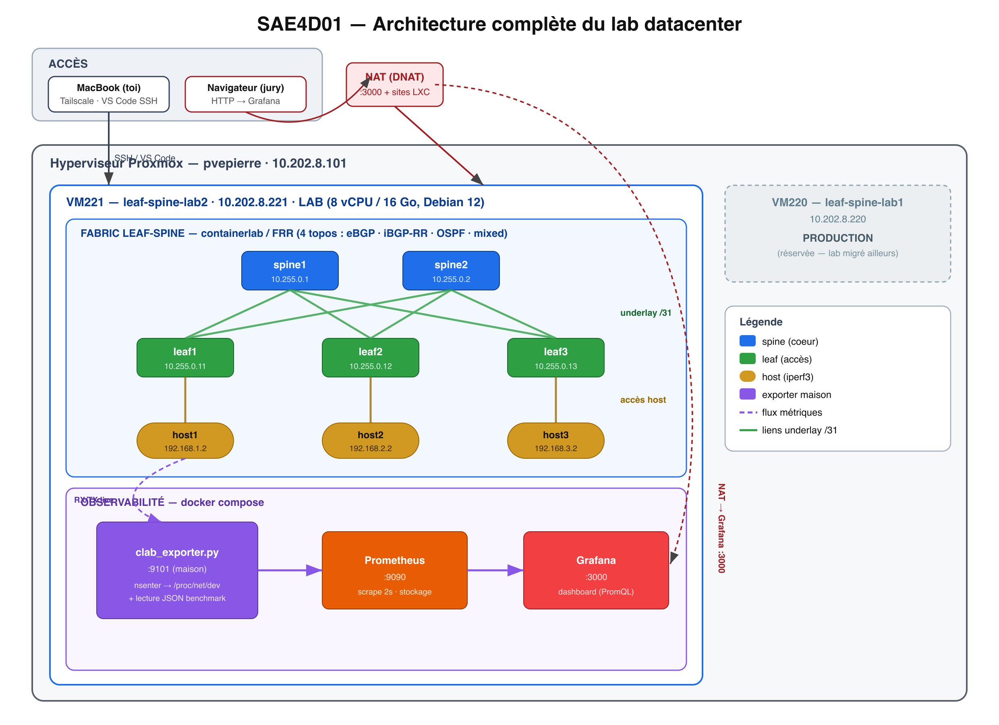{ width=100% }


Plateforme : Proxmox (`pvepierre`). Le projet s'étale sur **deux** VM Debian 12 : **VM220** (`leaf-spine-lab1`, rôle prod — `topo-ebgp` + border-leaf inter-DC `bleaf` + monitoring) et **VM221** (`leaf-spine-lab2`, 8 vCPU / 16 Go / 60 Go, dédiée lab — les 5 topologies, les labs VXLAN IRB/Anycast et le benchmark en montée de charge). Sauf mention contraire, les labs 1 à 5 et le benchmark tournent sur VM221, l'inter-DC sur VM220.
Outils : containerlab 0.76.1 (topologies déclaratives en YAML) + FRR 10.6.1 (suite de routage
open-source : `bgpd`, `ospfd`, `zebra`) + Alpine (hosts iperf3).

Architecture leaf-spine (Clos) : chaque leaf est relié à chaque spine ; les leaf ne se parlent
jamais directement. Tout flux host↔host = 2 sauts (latence prévisible), tous les liens actifs
(ECMP, pas de Spanning-Tree).

Vocabulaire clé du datacenter (utilisé dans tout le CR) :

| Terme | Définition |
|-------|-----------|
| Underlay | le réseau physique/IP qui assure la connectivité de base (les liens /31 spine-leaf) |
| Overlay | un réseau logique monté *par-dessus* l'underlay (ex : sessions iBGP via loopbacks, VXLAN) |
| Ports | nommage des interfaces : leaf `eth1→spine1`, `eth2→spine2`, `eth3→host` ; spine `eth1/2/3→leaf1/2/3` |
| Loopback | interface virtuelle toujours active (`lo0`), identité stable du routeur (router-id, VTEP) |

Plan d'adressage (commun aux 4 topos) :
- Liens underlay /31 (RFC 3021, 2 IP exactes) : `spine1→leaf1/2/3 = 10.0.1.0 / .2 / .4`, `spine2→leaf1/2/3 = 10.0.1.6 / .8 / .10`
- Loopbacks /32 : spine1 `10.255.0.1`, spine2 `10.255.0.2`, leaf1-3 `10.255.0.11-13`
- Hosts : `192.168.1-3.2` sur les topos de bench (VM221) ; la topo prod `topo-ebgp` porte à la place des LXC de service en `192.168.80-82.x` (cf. §13)

---

---

## 2. Méthodologie

Pour chaque techno, démarche identique : déployer → vérifier l'état du protocole → vérifier la
connectivité → mesurer le débit. Déploiement reproductible (`containerlab deploy`), benchmark
automatisé (`benchmark.sh` : convergence 35 s → iperf3 TCP 30 s + UDP 30 s → résultats JSON).

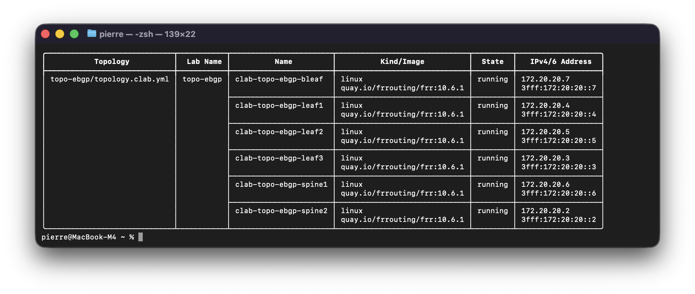{ width=100% }

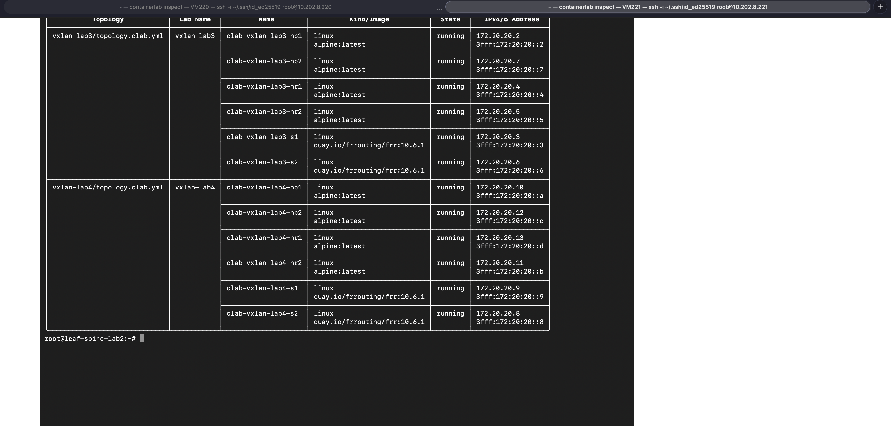{ width=100% }

---

---

## 3. Phase matériel physique — NFVIS, C8000v & Mikrotik en eBGP réel

> Séances 10/06 → 18/06/2026. Avant de tout consolider en containerlab, le groupe 8 a monté une
> fabric eBGP **sur équipements réels** : un boîtier Cisco Catalyst 8200 (hyperviseur NFVIS)
> hébergeant un routeur virtuel C8000v en **spine** (AS 65080), et un Mikrotik hEX en **leaf**
> (AS 65081), peerés en eBGP avec les autres groupes sur le L2 partagé campus `10.202.0.0/16`.

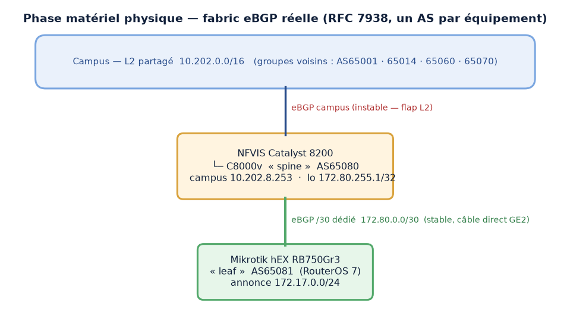{ width=85% }

### 3.1 Mise en service du NFVIS (Catalyst 8200)

{ width=85% }

- **Objectif** : rendre le boîtier administrable (SSH + adressage WAN/LAN) avant d'y déployer des VNF.
- **Principe** : NFVIS = hyperviseur Cisco sur Catalyst 8200, transforme le routeur physique en
  plateforme de virtualisation réseau (déploie C8000v, FRR, Debian… sans matériel supplémentaire).
- **Boot + reset mot de passe** : première connexion SSH impose un changement de mot de passe
  (critères : 7 caractères min, majuscule, minuscule, chiffre, caractère spécial).
- **Bridges WAN/LAN** :

  | Bridge | Interface | IP | Rôle |
  |--------|-----------|-----|------|
  | wan-br | GE0 | `10.202.8.254/16` | accès réseau salle (campus `10.202.0.0/16`) |
  | lan-br | GE2 | `172.16.0.254/24` | management local groupe 8 |

- **Inventaire images / flavors** (UI web `https://10.202.8.254`) — 3 images **ACTIVE** :

  | Image | Version | Usage |
  |-------|---------|-------|
  | `c8000V-universalk9_16G_serial.17.04.01a.tar.gz` | IOS XE 17.04.01a | routeur spine |
  | `debian-11` | — | futurs services |
  | `frr-8.2.2` | — | futurs routeurs stack leaf/spine |

  | Flavor | vCPU | RAM |
  |--------|------|-----|
  | C8000V-medium | 4 | 4096 Mo |
  | C8000V-mini | 1 | 4096 Mo |

  Le profil **medium** a été retenu : le `mini` (1 vCPU) est insuffisant pour les tables BGP
  inter-datacenter.

### 3.2 Déploiement du C8000v via API REST NFVIS + bootstrap Day-0

{ width=85% }

- **Objectif** : instancier le routeur IOS XE virtuel de façon **reproductible**, sans console série.
- **Problème rencontré** : le formulaire de déploiement de l'UI web NFVIS était inutilisable
  (options non accessibles). Contournement : **API REST NFVIS** en `curl` (modèle YANG exposé en JSON).
- **Bootstrap Day-0** : fichier `iosxe_config.txt` injecté au premier boot (hostname, credentials,
  clé RSA, SSHv2) → aucune saisie manuelle.

  ```bash
  # Vérifier images / flavors / réseaux disponibles
  curl -k -u admin:<pass> "https://10.202.8.254/api/config/vm_lifecycle/opdata/images?deep" \
    -H "Accept: application/vnd.yang.data+json"
  curl -k -u admin:<pass> "https://10.202.8.254/api/config/vm_lifecycle/opdata/flavors" ...
  curl -k -u admin:<pass> "https://10.202.8.254/api/config/vm_lifecycle/opdata/networks" ...

  # Déployer la VM avec Day-0 (HTTP 201 = accepté)
  curl -k -u admin:<pass> -X POST \
    "https://10.202.8.254/api/config/vm_lifecycle/tenants/admin/deployments" \
    -H "Content-Type: application/vnd.yang.data+json" -d '{
      "deployment": [{ "name": "C8000V-G8", "vm_group": [{
        "name": "C8000V-G8",
        "image": "c8000V-universalk9_16G_serial.17.04.01a",
        "flavor": "C8000V-medium", "bootup_time": 600,
        "interfaces": { "interface": [
          {"nicid":0,"network":"int-mgmt-net"},
          {"nicid":1,"network":"wan-net"},
          {"nicid":2,"network":"lan-net"} ] },
        "config_data": [{ "dst": "iosxe_config.txt",
          "data": "hostname C8000V-G8\r\nusername admin privilege 15 secret <pass>\r\n..." }]
      }] }] }'
  ```

  Réseaux clés : `int-mgmt-net` (→ Gi1 de la VM), `wan-net` (→ GE0/wan-br, campus),
  `lan-net` (→ GE2/lan-br, lien Mikrotik).

- **Vérification** — suivi de l'état du déploiement :
  ```bash
  curl -k -u admin:<pass> \
    "https://10.202.8.254/api/config/vm_lifecycle/opdata/tenants/admin/deployments/deployment/C8000V-G8?deep" ...
  ```
  États successifs : `DEPLOYING` → `BOOTING` → `ALIVE`. Le boot IOS XE est confirmé par
  `fsck_or_mkfs.sh` (filesystem propre, code retour 0), l'interface management MAC
  `52:54:00:21:89:68`, et le message **« Instance booted in private cloud »**. Le hostname
  `C8000V-G8` visible en CLI prouve l'application du Day-0.
- **Leçon** : l'API REST NFVIS est le contournement fiable d'une UI défaillante — même modèle de
  données, scriptable et reproductible. Note : NFVIS affiche `SERVICE_ERROR_STATE` pour ce VNF →
  purement **cosmétique** (VNF monitoré sans heartbeat), la VM répond normalement.

### 3.3 Mikrotik hEX RB750Gr3 en leaf eBGP (RouterOS 7.12.1)

{ width=85% }

- **Objectif** : le Mikrotik (leaf, AS 65081) annonce son réseau interne `172.17.0.0/24` au spine
  via une unique session eBGP.
- **Principe RouterOS 7** : la définition du pair tient entièrement dans `/routing bgp connection`
  (syntaxe entièrement refondue vs ROS6) ; `/routing bgp network` n'existe plus.
- **Adressage** : `ether1 = 10.202.8.252/16` (management salle), `ether2` porte `172.17.0.254/24`
  (réseau interne annoncé) + l'extrémité leaf du lien p2p vers le spine.
- **Config appliquée** :
  ```
  /ip address add address=172.80.0.1/30 interface=ether2
  /routing filter rule add chain=bgp-leaf-out \
    rule="if (dst==172.17.0.0/24) {accept} else {reject}"
  /routing bgp connection add name=leaf-to-spine remote.address=172.80.0.2 remote.as=65080 \
    local.role=ebgp as=65081 router-id=10.202.8.252 \
    output.redistribute=connected output.filter-chain=bgp-leaf-out
  # Annonce de préfixes en ROS7 : route blackhole + redistribute=static
  /ip route add dst-address=172.17.0.0/24 blackhole
  ```
  Trois points spécifiques à RouterOS 7 :
  - **Filtre de sortie obligatoire** : sans `bgp-leaf-out`, `redistribute=connected` ferait fuiter
    `10.202.0.0/16` (réseau salle entier) et le `/30` du lien p2p. Seul `172.17.0.0/24` doit sortir.
  - `local.default-address` est en **lecture seule** (déduit de l'interface) — ne pas le définir.
  - Les **routes blackhole** ont une distance admin 254 : elles n'impactent pas le routage réel
    (les connectées restent prioritaires) mais permettent au processus BGP de sélectionner et
    annoncer le préfixe une fois la session établie.
- **Vérification** : `/routing bgp session print` → flag **`E`** (Established), `prefix-count=1`,
  `remote-as=65080`. `/ip route print` → `10.202.8.0/24` flags `DAb` (Dynamique/Active/BGP),
  next-hop `172.80.0.2`.

### 3.4 Contrainte découverte : isolation des ports du switch de salle

- **Symptôme** : sur le LAN salle `10.202.8.0/24`, le Mikrotik (`.252`) et le C8000v (`.253`) **ne se
  joignent pas** (ping 0 % dans les deux sens), alors que chacun joint la passerelle `.254`, notre
  poste et le Cisco voisin `.0.227`.
- **Diagnostic** : l'ARP résout des deux côtés (le broadcast est bien floodé) et le firewall Mikrotik
  est vide → la config est saine. C'est l'**unicast entre deux ports isolés qui est droppé par le
  switch** (mécanisme type private VLAN / port isolation).
- **Fix** : **câble direct** Mikrotik `ether2` ↔ NFVIS `GE2` (bridge `lan-net` → Gi2 du C8000v) avec un
  sous-réseau point-à-point dédié, contournant le switch.
- **Renumérotation** : le lien, d'abord en `172.20.0.0/30`, a été renuméroté en **`172.80.0.0/30`**
  (Mikrotik `.1`, Cisco `.2`) pour éviter un conflit avec le réseau `172.20.x.x` d'un autre groupe.

  | Lien | Sous-réseau | Usage | État |
  |------|-------------|-------|------|
  | Câble direct Mikrotik ether2 → NFVIS GE2 (Gi2) | `172.80.0.0/30` | eBGP **leaf↔spine** intra-groupe | **Established** (stable) |
  | LAN salle (Gi1 du C8000v) | `10.202.8.0/24` annoncé | eBGP **spine↔voisins** | Established mais flap |

- **Leçon** : un peering BGP sur un L2 mutualisé non maîtrisé est fragile ; un lien /30 dédié
  contourne l'isolation imposée par l'infra de salle.

### 3.5 Spine C8000v (AS 65080) — config eBGP & loopback hors-/16

{ width=85% }

{ width=85% }

- **Plan d'AS** (RFC 7938, un AS par équipement, eBGP partout) :

  | Équipement | Rôle | AS | IP de peering |
  |-----------|------|-----|---------------|
  | C8000v (VM NFVIS) | spine | **65080** | `10.202.8.253` (salle) + `172.80.0.2/30` (Gi2 p2p) + Lo0 `172.80.255.1/32` |
  | Mikrotik hEX RB750Gr3 | leaf | **65081** | `172.80.0.1/30` (ether2) |
  | Voisins campus | spines externes | **65001 / 65060 / 65014 / 65070** | `10.202.1.12` / `10.202.60.22` / `10.202.0.227` / `10.202.7.253` |

- **Config finale (C8000v, état 18/06)** :
  ```
  router bgp 65080
   bgp router-id 10.202.8.253
   network 10.202.8.0   mask 255.255.255.0
   network 172.80.0.0   mask 255.255.255.252
   network 172.80.255.1 mask 255.255.255.255
   neighbor 172.80.0.1   remote-as 65081   ! Mikrotik leaf (lien dédié /30)
   neighbor 10.202.1.12  remote-as 65001   ! voisin campus
   neighbor 10.202.60.22 remote-as 65060
   neighbor 10.202.7.253 remote-as 65070
  !
  interface Loopback0
   ip address 172.80.255.1 255.255.255.255   ! IP stable hors /16 partagé
  ```
  **Loopback hors zone partagée** : `172.80.255.1/32` n'est pas dans `10.202.0.0/16` → n'est pas
  shadowée par le `/16` connecté de tous les groupes → joignable de partout (longest-match /32 > /16).
- **Vérification — propagation eBGP transitive** :
  ```
  C8000V-G8#show bgp ipv4 unicast neighbors 10.202.1.12 advertised-routes | include 172.80
   *>  172.17.0.0/24    172.80.0.1   0 65081 i      ! appris du leaf, réannoncé au voisin
   *>  172.80.0.0/30    0.0.0.0      0 32768 i
   *>  172.80.255.1/32  0.0.0.0      0 32768 i
  ```
  Une route apprise en eBGP de l'AS 65081 est réannoncée nativement vers l'AS 65001/65014 sans
  config supplémentaire — propriété transitive de l'eBGP, justification centrale du choix RFC 7938.

### 3.6 Root-cause : flap BGP sur le L2 partagé vs stabilité du /30 dédié

{ width=90% }

- **Symptôme** : un collègue (AS 65001, `10.202.1.12`) a des routes parfaites vers le Mikrotik mais
  son `ping 172.80.0.1` = **0 %**, et sa session BGP avec le C8000v flappe pendant le test
  (`%BGP-3-NOTIFICATION ... hold time expired`).
- **Preuve chiffrée** (`show ip bgp summary`) — opposition nette LAN partagé / lien dédié :

  | Neighbor | AS | Lien | Up/Down | État |
  |----------|-----|------|---------|------|
  | `10.202.1.12` | 65001 | L2 partagé | 00:00:18 | **FLAP** |
  | `10.202.60.22` | 65060 | L2 partagé | 00:00:18 | **FLAP** |
  | `172.80.0.1` | 65081 | /30 dédié Gi2 | 01:44:50 | **STABLE** |

  Compteurs TCP (`show ip bgp neighbors`) : collègue `Connections established 2076; dropped 2075`
  (`retransmit 5, SRTT 413ms, RTTO 3205ms`) contre **1 / 0** pour le Mikrotik. Uptime ~18 s côté LAN,
  1 h 44 sans drop côté /30.
- **Analyse du chemin** :
  ```
  Moi      : Cisco -> Gi2 (lien dédié) -> Mikrotik           => 100% (jamais le LAN)
  Collègue : Cisco -> L2 PARTAGÉ (drop) -> mon Cisco -> Gi2  => 0% (meurt sur le LAN)
  ```
- **Technique de preuve loopback** : `ping 172.80.0.1 source Loopback0` force le Mikrotik à utiliser
  sa default route (`0.0.0.0/0 → 172.80.0.2`) → 100 % de réussite. Comme la source `172.80.255.1`
  est hors-`/16`, elle n'est pas shadowée par le connecté : le test isole le forward et le return,
  prouvant que le routage est bon et que **seul le L2 partagé droppe**.
- **Root-cause** : le broadcast domain `10.202.0.0/16`, mutualisé entre tous les groupes, perd des
  paquets en masse → flap BGP + perte ICMP. **Hors de notre contrôle, pas un défaut de routage**
  (routage prouvé correct des deux côtés).
- **Leçon / recommandation** : isoler le trafic inter-groupes (VLAN par groupe ou sous-réseau dédié)
  plutôt qu'un unique broadcast domain plat. Côté infra perso, le bilan est sain : lien /30 stable
  (0 drop, 1 h 44), eBGP propre, renumérotation `172.20→172.80` sans casse, loopback hors-zone
  annoncée, chemin retour Mikrotik en place. C'est ce travail physique qui motive la **consolidation
  en containerlab** (labs §5–9) : reproductibilité totale et environnement de routage maîtrisé.

> Bugs notables de cette phase : (1) route statique legacy `ip route 10.202.8.0/24 Null0` plus
> spécifique que le `/16` connecté → blackhole du trafic salle, corrigée par
> `no ip route 10.202.8.0 255.255.255.0 Null0` + `write memory` ; (2) `VM_ERROR_STATE` NFVIS résolu
> par `vmAction STOP` (HTTP 200) puis `vmAction START` (HTTP 204) via API REST.

---

## 4. Labs précoces (macOS) & test de résilience

> Phase de prototypage menée **avant** la fabric de référence : maquettes containerlab/netlab
> sur macOS (Docker Desktop) puis VM Debian IUT, pour valider eBGP RFC 7938, l'ECMP, le
> failover et VXLAN/EVPN avant le portage sur Proxmox (§5 et suivants).

### 4.1 Première fabric containerlab (Arista cEOS + FRR, RFC 7938)

{ width=90% }

{ width=85% }

- **Objectif** : simuler localement la fabric leaf-spine du groupe 8 avant déploiement physique,
  en mixant deux NOS — **leafs Arista cEOS** (switchs ToR) et **spines FRR** — pour reproduire un
  cas réel hétérogène.
- **Plan d'adressage `10.8.0.0/16` (groupe 8)**, eBGP RFC 7938 (un AS par équipement) :

| Équipement | NOS | AS BGP | Loopback |
|---|---|---|---|
| leaf1 | Arista cEOS | 65200 | 10.8.0.1/32 |
| leaf2 | Arista cEOS | 65201 | 10.8.0.2/32 |
| spine1 | FRR | 65100 | 10.8.0.11/32 |
| spine2 | FRR | 65101 | 10.8.0.12/32 |
| spine3 | FRR | 65102 | 10.8.0.13/32 |

  Interco P2P leaf↔spine en /30 dans `10.8.1.0/24` ; services leaf1 `10.8.10.0/24`, leaf2 `10.8.11.0/24`.
- **Config (spine1 FRR, AS 65100)** — full table sans policy + réécriture next-hop native eBGP :
  ```
  router bgp 65100
   bgp router-id 10.8.0.11
   no bgp default ipv4-unicast
   no bgp ebgp-requires-policy        ! FRR 10+ bloque tout sans policy → débloque en lab
   neighbor 10.8.1.2 remote-as 65200
   neighbor 10.8.1.6 remote-as 65201
   address-family ipv4 unicast
    network 10.8.0.11/32
    neighbor 10.8.1.2 activate
  ```
  **Config (leaf1 cEOS, AS 65200)** :
  ```
  router bgp 65200
    router-id 10.8.0.1
    maximum-paths 3 ecmp 3            ! EOS = 1 seul chemin BGP par défaut → active le multipath
    neighbor 10.8.1.1 remote-as 65100
    network 10.8.0.1/32
    network 10.8.10.0/24             ! DOIT être sous router bgp, PAS dans address-family
  ```
- **Gotchas cEOS / FRR rencontrés** :

| Symptôme | Cause | Correctif |
|---|---|---|
| Routes en statut `(Policy)`, rien d'appris | FRR 10+ active `bgp ebgp-requires-policy` par défaut | `no bgp ebgp-requires-policy` dans chaque `frr.conf` |
| Leafs rechargent une ancienne config | Cache flash cEOS persistant | `containerlab destroy --cleanup` |
| Préfixes services non annoncés, **sans erreur** | En EOS les `network` doivent être sous `router bgp`, pas dans `address-family ipv4` | Déplacer les `network` sous `router bgp` |
| Réseau Docker `clab` en conflit | Ancien `172.20.20.0/24` résiduel | Purge des containers/réseaux obsolètes avant redéploiement |

- **Vérification** : 6 sessions eBGP `Established` (chaque leaf peere les 3 spines), 9 containers `running`.
  leaf1 apprend `10.8.0.2/32` via les 3 spines ; `ping 10.8.0.2 source 10.8.0.1` → **5/5 paquets, 0 % perte**.
- **Leçon** : eBGP RFC 7938 propage loopbacks et services sans full-mesh ni RR ; le couple
  cEOS+FRR fonctionne, à condition de connaître les pièges de syntaxe propres à chaque NOS.

### 4.2 Test de résilience / failover ECMP (eBGP)

{ width=85% }

{ width=85% }

- **Objectif** : prouver qu'une panne de spine est absorbée par l'ECMP sans coupure de service.
- **Principe** : avec `maximum-paths 3 ecmp 3`, leaf1 installe **3 next-hops égaux** vers `10.8.0.2`
  (via spine1/2/3). On coupe spine1 et on observe la table de routage + le trafic.

| Événement | Résultat |
|---|---|
| ECMP nominal (3 spines) | 3 chemins égaux actifs vers `10.8.0.2` |
| Coupure spine1 | BGP détecte la perte de session → bascule sur spine2 + spine3 |
| Table de routage après coupure | **3 next-hops → 2 next-hops** |
| Connectivité leaf1→leaf2 | maintenue, 0 % perte |

- **Caveat de simulation** : couper avec `ip link set eth1 down` **et non** `docker stop` — arrêter
  le container **détruit les veth pairs** créés par containerlab, ce qui fausse la manip (on ne
  teste plus un lien down mais un nœud supprimé). C'est la bonne méthode pour simuler une panne de lien.
- **Test HA équivalent côté Proxmox** (§ infra réelle, LXC + Apache) : boucle `curl` continue +
  arrêt de spine1, **reconvergence BGP via spine2 en ~5 s**, aucune interruption durable du service ;
  restauration `docker start clab-leaf-spine-spine1` → sessions reconstituées en ~30 s.
- **Captures (terminal, non reprises ici)** : `containerlab-10_ecmp_3paths`, puis
  `containerlab-11_resilience_spine1_down_bgp` (2 sessions restantes) et
  `containerlab-12_resilience_spine1_down_routes` (2 next-hops).
- **Leçon** : l'ECMP n'augmente pas que le débit, c'est aussi le mécanisme de **résilience** du
  fabric — la perte d'un spine ne fait que retirer un chemin parmi N, le trafic continue.

### 4.3 Labs netlab — EVPN/VXLAN single-VLAN puis multi-tenant

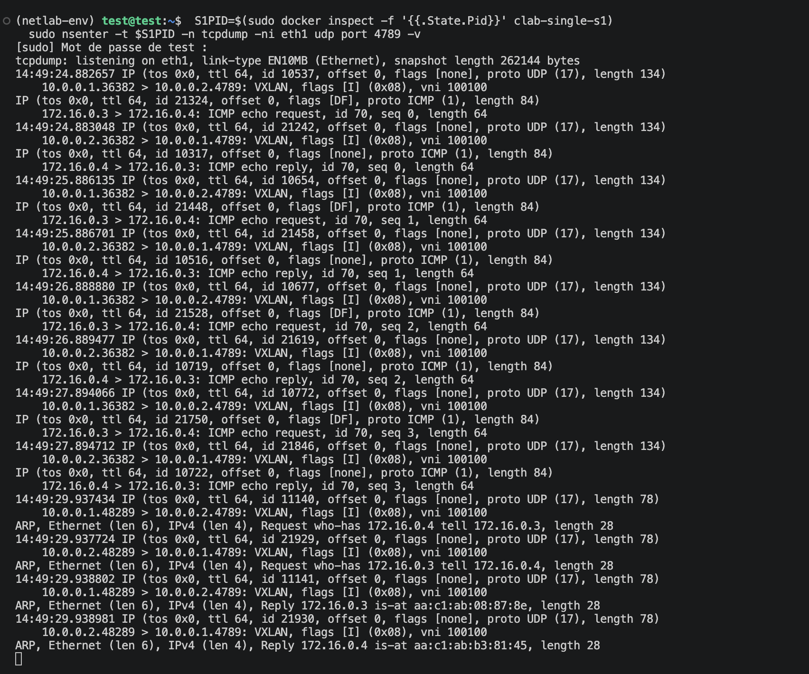{ width=90% }

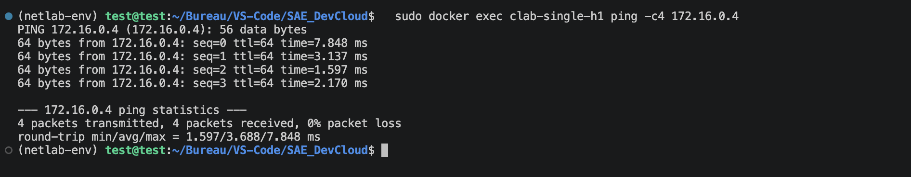{ width=85% }

> Sur VM Debian IUT (`10.202.0.10`), netlab 26.06 + containerlab, image `frr:10.6.1`, hosts
> `python:3.13-alpine`. L'install native macOS (Apple Silicon) échoue : `netlab install` ne
> supporte que Debian/Ubuntu et exige un noyau Linux (`modprobe vxlan udp_tunnel ip6_udp_tunnel`).

**Lab single-VLAN** — étendre **un seul VLAN (100)** sur un underlay routé.
- VLAN 100 ↔ **VNI 100100**, port UDP **4789** ; VTEP = Loopback0 (`10.0.0.1` sur s1, `10.0.0.2` sur s2) ;
  underlay OSPF `10.1.0.0/30`. h1 (`172.16.0.3`) et h2 (`172.16.0.4`) sont dans le **même /24**
  bien que séparés par un réseau routé — tout l'intérêt de VXLAN.
- **Ingress replication statique** (flood list FDB manuelle, pas encore d'EVPN) :
  ```
  ip link add vxlan100100 type vxlan id 100100 dstport 4789 local 10.0.0.1
  ip link add vlan100 type bridge
  ip link set dev vxlan100100 master vlan100
  bridge fdb append 00:00:00:00:00:00 dev vxlan100100 dst 10.0.0.2   # flood BUM → VTEP distant
  ```
- **Vérifications** : voisin OSPF `Full/-` + `O>* 10.0.0.2/32 [110/10] via 10.1.0.2` ;
  `ping h1→h2` 4/4 paquets, **0 % perte** ; FDB s1 = `00:00:00:00:00:00 dst 10.0.0.2 self permanent`
  (flood) + `aa:c1:ab:b3:81:45 dst 10.0.0.2 self` (MAC de h2 apprise en data-plane).
- **Capture tcpdump double-encap** (underlay s1 eth1, pendant `ping h1→h2`) — enveloppe externe
  VXLAN contenant l'ICMP original :
  ```
  14:30:19.090754 IP (ttl 64, proto UDP (17), length 134)
      10.0.0.1.36382 > 10.0.0.2.4789: [udp sum ok] VXLAN, flags [I] (0x08), vni 100100
  IP (ttl 64, flags [DF], proto ICMP (1), length 84)
      172.16.0.3 > 172.16.0.4: ICMP echo request, id 39, seq 45, length 64
  ```
  Le traceroute h1→h2 ne montre **qu'un seul hop** : l'underlay est transparent pour les hosts.

**Lab multi-tenant** — 3 switches s1/s2/s3 full-mesh, 2 segments L2 **isolés** :
- VLAN **red** → VNI **1000** sur s1/s2/s3 (`172.16.0.0/24`) ; VLAN **blue** → VNI **1001** sur s1/s2
  seulement (`172.16.1.0/24`). Underlay OSPF + flood statique.
- **Découplage VLAN-local / VNI-global** : red utilise `vlan201/202/203` (un VLAN ID local par
  switch) mais **le même VNI 1000** — c'est le VNI 24 bits (≫ 4096 VLANs) qui identifie le segment.
- **Vérifications** : red `hr1→hr2`/`hr1→hr3` et blue `hb1→hb2` → 0 % perte ; **isolation inter-VNI**
  `hr1 (red 172.16.0.4) → hb1 (blue 172.16.1.7)` → **100 % packet loss** (comportement attendu,
  pas de fuite inter-tenant sur le même underlay). Flood list dépendante du VNI : sur s1, blue
  (VNI 1001) ne flood que vers `10.0.0.2`, pas `10.0.0.3` (s3 ne porte pas blue).
- **Leçon** : la flood list croît en O(n) par VTEP → limite de scalabilité de l'ingress replication
  statique, que le control-plane BGP **EVPN** vient résoudre dans les labs suivants.

### 4.4 Topo Leaf-Spine avec routeur WAN dédié

- **Objectif** : ajouter une bordure WAN au fabric eBGP — un routeur `wan` connecté aux deux spines,
  annonçant un préfixe externe vers le datacenter.
- **Plan** : `wan` AS **65000**, router-id `10.0.0.100`, liens spine↔WAN en /31
  (`10.0.2.0/31` vers spine1, `10.0.2.2/31` vers spine2), préfixe annoncé **`100.64.0.0/24`** (CGNAT/RFC 6598).
  Spines AS 65001/65002, leafs AS 65011/65012/65013 ; downlinks services `10.0.3/4/5.0/24`.
- **Vérification — `show bgp summary` spine1** : 4/4 sessions Established (3 leafs + WAN), ex.
  `10.0.2.1  4  65000 ... Established  3  10 wan`. Table BGP spine1 incluant le préfixe WAN :
  ```
  B>* 10.0.0.100/32 via 10.0.2.1, eth4    ← loopback WAN
  B>* 100.64.0.0/24 via 10.0.2.1, eth4    ← préfixe WAN
  ```
  Connectivité end-to-end : `host1 (10.0.3.10) → WAN 100.64.0.1` → **3/3 paquets, 0 % perte, avg 0.168 ms**
  (chemin host1→vsw1→leaf1→spine→WAN). `host1 → host2 (10.0.4.10)` → 0 % perte, avg 0.206 ms.
- **Leçon** : le WAN s'intègre comme un AS eBGP supplémentaire — son préfixe `100.64.0.0/24` est
  redistribué dans tout le fabric sans configuration spécifique, le fabric devient routable vers
  l'extérieur. Cette topo (2 spines + 3 leafs + WAN + bridges Linux par leaf) est celle portée
  ensuite sur Proxmox (VM220/221) avec hosts LXC réels.

---

## 5. Lab 1 — eBGP (baseline)

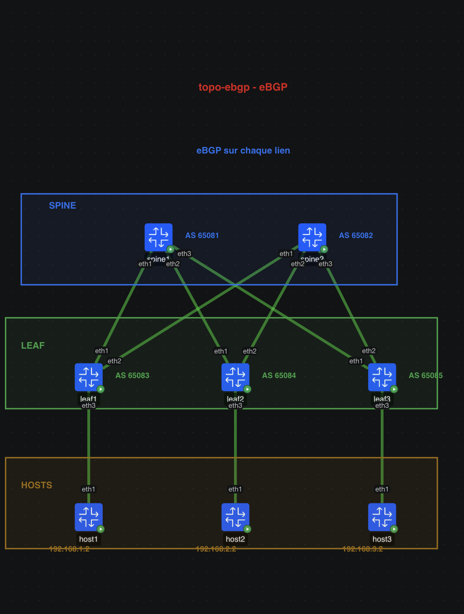{ width=70% }

- Objectif : fabric « BGP-only » (RFC 7938), modèle des grands datacenters.
- Plan : un AS par routeur (spine1=65081, spine2=65082, leaf1-3=65083-85). Une session eBGP
  par lien physique (underlay = plan unique, pas d'overlay).
- Config clé (leaf1) :
  ```
  router bgp 65083
   neighbor 10.0.1.1 remote-as 65081   ! vers spine1 (eth1)
   neighbor 10.0.1.7 remote-as 65082   ! vers spine2 (eth2)
  ```
- Vérification : `show bgp summary` (sessions Established), `show ip route bgp` (préfixes appris),
  ping host1→host3.

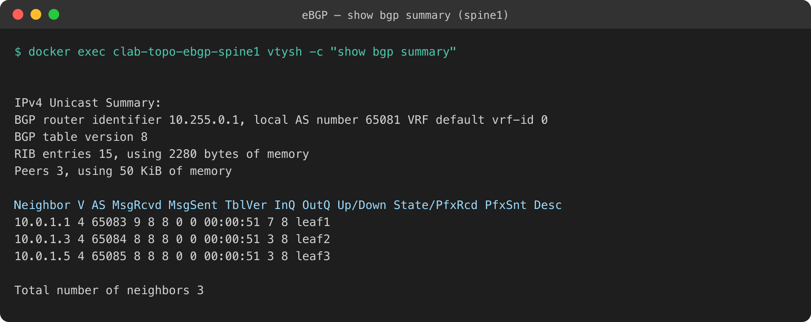{ width=90% }
- Conclusion : eBGP propage les routes naturellement via l'AS-path (anti-boucle), pas de full-mesh
  requis, next-hop réécrit automatiquement. Simple et scalable.

### Preuve de résilience — panne de spine (failover)

Test réalisé en live sur la fabric eBGP : chaque leaf est relié aux **2 spines** (eth1→spine1,
eth2→spine2). On lance un ping continu, puis on coupe le lien actif d'un leaf vers son spine.

```bash
# ping continu leaf1 → loopback de leaf3 (le trafic traverse un spine)
docker exec clab-topo-ebgp-leaf1 ping -i 0.5 -I 10.255.0.11 10.255.0.13 &
# coupe le LIEN ACTIF vers spine2 (simule une panne de lien, réversible)
docker exec clab-topo-ebgp-leaf1 ip link set eth2 down
# ... puis on le remonte
docker exec clab-topo-ebgp-leaf1 ip link set eth2 up
```

Résultat : **30 paquets transmis, 0 % de perte** sur ce run. Le trafic continue sur le spine survivant :
BFD (`neighbor … bfd`) détecte la coupure du lien en moins d'une seconde et accélère la reconvergence BGP
vers l'autre spine, d'où une bascule quasi sans perte (sur une panne plus brutale — coupure d'un nœud entier —
le §4.2 mesure honnêtement une perte transitoire ~26 % le temps de la reconvergence). Même test en coupant
un spine entier (`docker stop`) : **0 % de perte** également. L'extension inter-DC EVPN/VXLAN
(§15) n'est jamais impactée — son chemin est direct sur le campus, en dehors des spines.

> **Méthode** : privilégier `ip link set ethX down` (panne de lien simulée, réversible). NE PAS utiliser
> `docker stop` sur un nœud containerlab : cela détruit ses interfaces veth et le nœud revient *isolé* à
> son redémarrage — limite de containerlab, pas du réseau (sur du matériel réel, un reboot de spine se
> reconnecte automatiquement).

Leçon : la fabric leaf-spine (Clos) tolère la perte d'un spine **sans coupure de service** — tous les
liens sont actifs et les spines fournissent une redondance N+1. C'est un argument clé de l'architecture
**eBGP + VXLAN** retenue.

---

---

## 6. Lab 2 — iBGP + Route Reflector

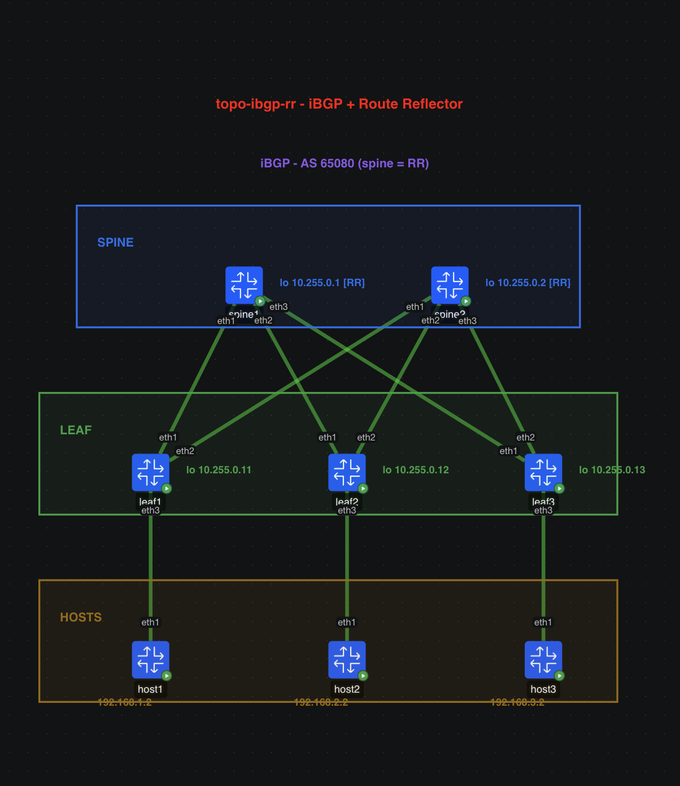{ width=70% }

- Objectif : rester dans un seul AS sans subir le full-mesh iBGP (N×(N-1)/2 sessions).
- Plan : AS 65080 unique. Les spines = Route Reflectors, les leafs = clients. Sessions iBGP
  montées sur les IP de lien (`10.0.1.x`) → underlay, plan unique.
- Config clé (spine1, RR) :
  ```
  router bgp 65080
   neighbor 10.0.1.1 route-reflector-client   ! reflète vers leaf1
   neighbor 10.0.1.1 next-hop-self force       ! cf. bug 1
  ```
- Vérification : `show bgp summary` (les leafs apprennent les routes des autres via le RR), ECMP sur
  les 2 spines.

{ width=90% }

- Conclusion : le RR évite le full-mesh → scalable. Mais bug du next-hop (voir §10.1).

---

---

## 7. Lab 3 — OSPF

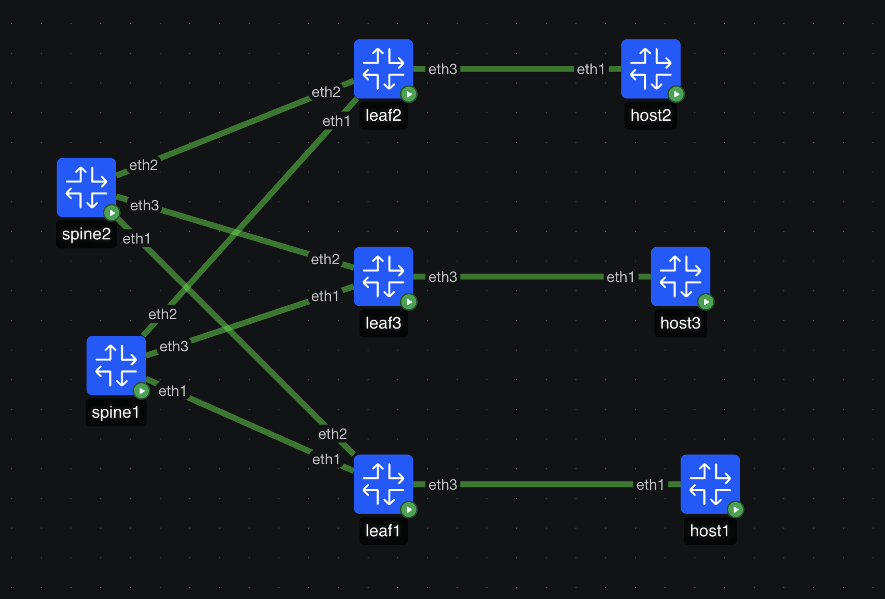{ width=70% }

- Objectif : IGP link-state pur (Dijkstra/SPF).
- Plan : OSPF area 0 sur tous les liens underlay /31. Plan unique.
- Config clé (chaque interface underlay) :
  ```
  interface eth1
   ip ospf network point-to-point   ! cf. bug 2
  ```
- Vérification : `show ip ospf neighbor` (état `Full`), table de routage, ping.

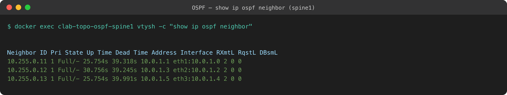{ width=90% }
- Conclusion : convergence rapide, simple sur petit fabric. Flooding des LSA → moins scalable que
  BGP à très grande échelle.

---

---

## 8. Lab 4 — Mixed (underlay OSPF + overlay iBGP)

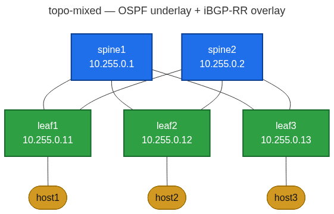{ width=70% }

- Objectif : le modèle réel des datacenters modernes — séparer underlay et overlay.
- Plan :
  - UNDERLAY = OSPF area 0 sur les liens /31 → rend les loopbacks joignables entre eux.
  - OVERLAY = iBGP AS 65080 (spines = RR), sessions montées via les loopbacks
    (`update-source lo0`), pas sur les IP de lien.
- Pourquoi c'est mieux : la session BGP repose sur la loopback, joignable par OSPF via n'importe
  quel chemin → si un lien tombe, OSPF reroute et la session survit. Découplage robuste.
- Vérification : `show ip route 192.168.3.0/24` montre un next-hop loopback résolu en 2 chemins
  ECMP (spine1 + spine2, les deux marqués `*`).

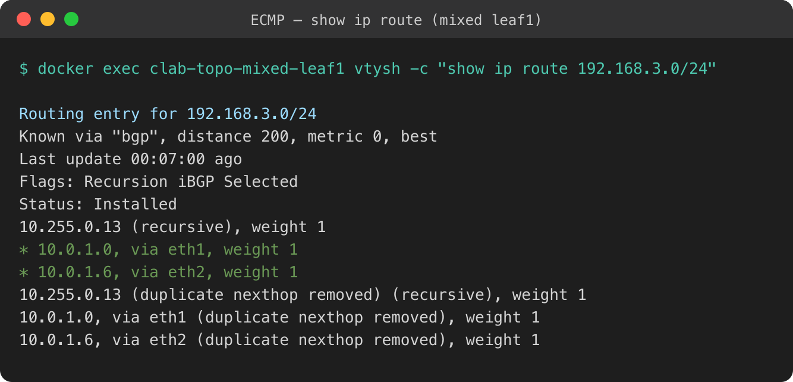{ width=90% }
- Conclusion : underlay simple (IGP) + overlay riche (BGP) = base de l'EVPN moderne.

---

---

## 9. Lab 5 — EVPN/VXLAN (overlay L2 datacenter)

> Exclu du tableau comparatif : overlay L2 + surcoût d'encapsulation (~50 o/paquet), pas comparable
> au débit d'un routage L3 pur — inclusion aurait rendu le benchmark non iso.

Principe : les hosts (`10.10.10.x`) sont sur un même réseau L2 logique (VNI 100) alors qu'ils
sont sur des leafs physiquement différents. VXLAN encapsule les trames L2 dans des paquets UDP/IP
(port 4789) ; BGP EVPN (RFC 7432) joue le rôle de control-plane et distribue les adresses MAC/IP.
Le VTEP (VXLAN Tunnel EndPoint) est la loopback de chaque leaf (joignable par OSPF underlay).

Architecture : OSPF underlay (liens /31) → loopbacks joignables → iBGP EVPN overlay (spines = RR) →
VXLAN data-plane (VNI 100).

---

### TP1 — Control-plane BGP EVPN : routes Type-2 et Type-3

BGP EVPN distribue deux types de routes :

| Type | Signification |
|------|--------------|
| Type-2 (MAC/IP) | annonce MAC + IP d'un host local |
| Type-3 (IMET) | annonce le VTEP (loopback) pour le flooding BUM |

Route Target `65080:100` = clé d'import/export, lie les routes au VNI 100 sur tous les VTEPs.

### TP2 — Data-plane VXLAN : VNI et table MAC

`show evpn vni` confirme VNI 100 actif sur leaf1 (3 MACs, 2 VTEPs distants). `show evpn mac vni 100`
montre 1 MAC locale (host1 sur eth3) + 2 MAC remote (host2/host3 appris via BGP EVPN sans flooding).

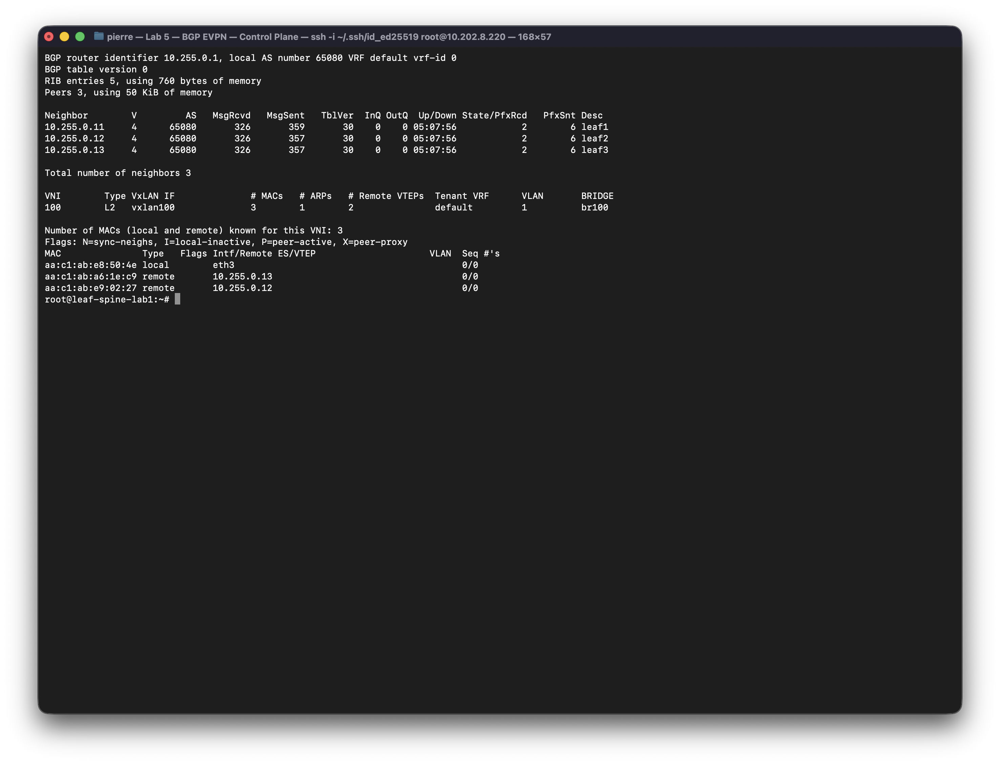{ width=92% }

### TP3 — Connectivité L2 : ping inter-hosts via VXLAN

### TP4 — Performance : iperf3 TCP (après fix MTU VXLAN)

Sans fix, TCP = 0 (bug §10.4). Après `ip link set vxlan100 mtu 9000` sur chaque leaf + `eth1 mtu 8950`
sur les hosts :

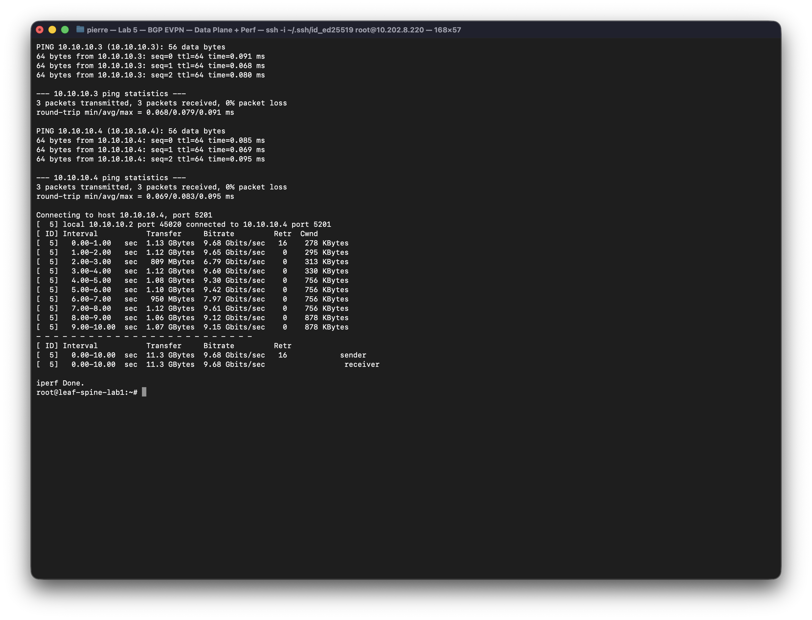{ width=92% }

9.68 Gbit/s TCP — comparable aux topos L3 (~10 G), overhead VXLAN absorbé par la pile kernel.
*Leçon* : le succès du ping ne prouve pas que TCP fonctionne ; toujours mesurer avec iperf3.

---

### TP5 — IRB : routage L3 inter-VLAN au-dessus du VXLAN (VM221)

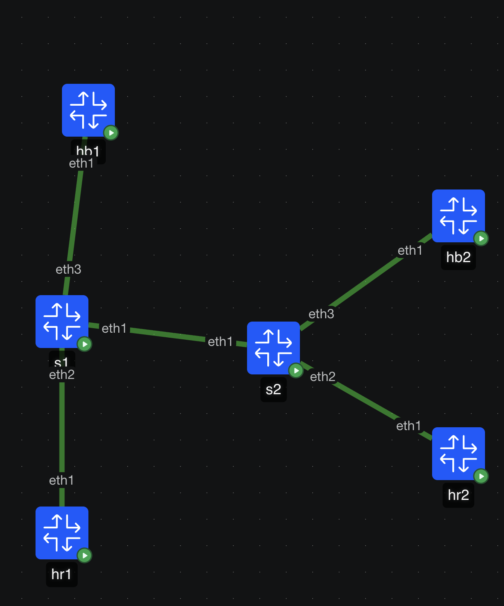{ width=70% }

Objectif : faire cohabiter deux VNI distincts (`10010` = VLAN rouge, `10011` = VLAN bleu) sur deux
VTEPs (s1/s2) et router entre eux — Integrated Routing and Bridging (IRB).

Topologie :
```
     [hr1 172.16.10.4]          [hr2 172.16.10.5]
           |                           |
     s1 eth2/br_red             s2 eth2/br_red
     vxlan10010 (VNI 10010) ←→ vxlan10010 (VNI 10010)
     s1: 172.16.10.1/24            s2: 172.16.10.2/24
     vxlan10011 (VNI 10011) ←→ vxlan10011 (VNI 10011)
     s1: 172.16.11.1/24            s2: 172.16.11.2/24
     s1 eth3/br_blue             s2 eth3/br_blue
           |                           |
     [hb1 172.16.11.4]          [hb2 172.16.11.5]
             underlay OSPF: 10.1.0.0/30, VTEP s1=10.0.0.1 s2=10.0.0.2
```

Principe IRB : chaque VTEP a une IP de passerelle sur les deux bridges (`172.16.10.1/24` sur
`br_red`, `172.16.11.1/24` sur `br_blue`). Le kernel route entre les deux : un paquet qui arrive du
VLAN rouge peut être re-encapsulé dans le VXLAN bleu (VNI 10011) pour rejoindre l'autre VTEP.

```bash
# OSPF underlay convergé (s1-s2 Full/-)
Neighbor ID  State    Interface
10.0.0.2     Full/-   eth1:10.1.0.1

# Vérification intra-VLAN red (hr1 → hr2, tunnel VNI 10010)
hr1 $ ping -c3 172.16.10.5
3 packets transmitted, 3 received, 0% loss, avg 0.11 ms

# Vérification intra-VLAN blue (hb1 → hb2, tunnel VNI 10011)
hb1 $ ping -c3 172.16.11.5
3 packets transmitted, 3 received, 0% loss, avg 0.13 ms

# IRB local (même VTEP) : hr1 (rouge) → hb1 (bleu), TTL=63 (routé par s1)
hr1 $ ping -c3 172.16.11.4
3 packets transmitted, 3 received, 0% loss, avg 0.08 ms   TTL=63

# IRB cross-VTEP : hr1 (rouge/s1) → hb2 (bleu/s2), 2 sauts réseau
hr1 $ ping -c3 172.16.11.5
3 packets transmitted, 3 received, 0% loss, avg 0.14 ms   TTL=63

# FDB s1 — hb2 appris via vxlan10011 (flood-and-learn)
$ bridge fdb show dev vxlan10011
aa:c1:ab:c0:8f:0d  dst 10.0.0.2 self   ← MAC de hb2, atteint via VTEP s2
00:00:00:00:00:00  dst 10.0.0.2 self permanent   ← entrée flood BUM
```

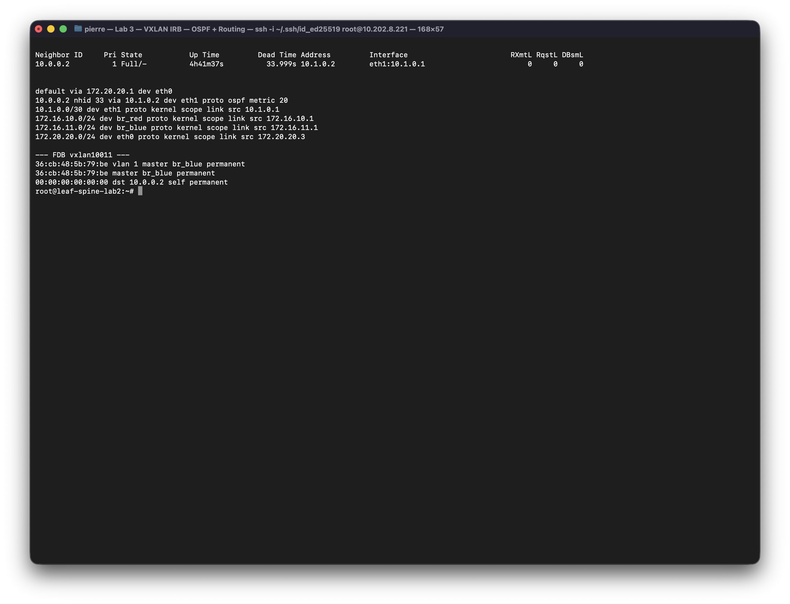{ width=92% }

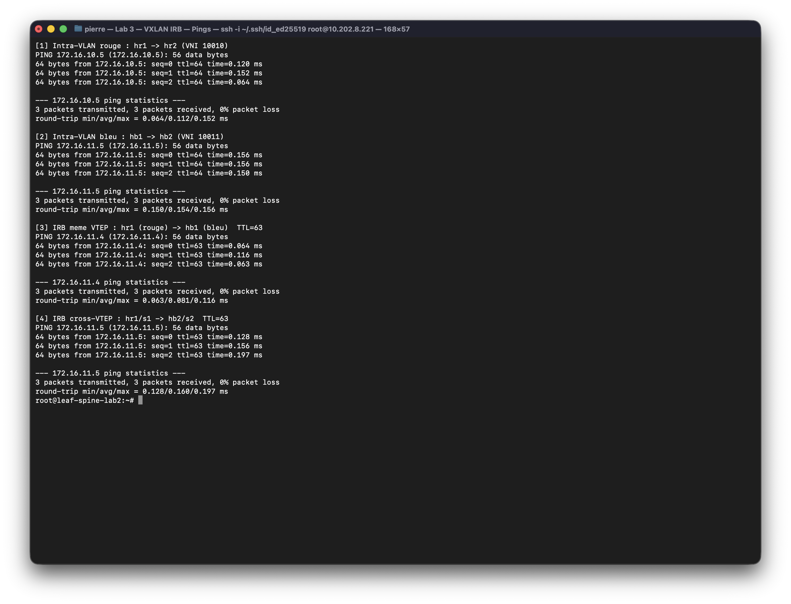{ width=92% }

Leçon IRB : chaque VTEP est à la fois bridge L2 (VXLAN) et routeur L3 (IP forwarding). Le
routage inter-VLAN se fait localement sur le VTEP, évitant un aller-retour vers un routeur centralisé.

---

### TP6 — Anycast Gateway : même IP/MAC sur tous les VTEPs (VM221)

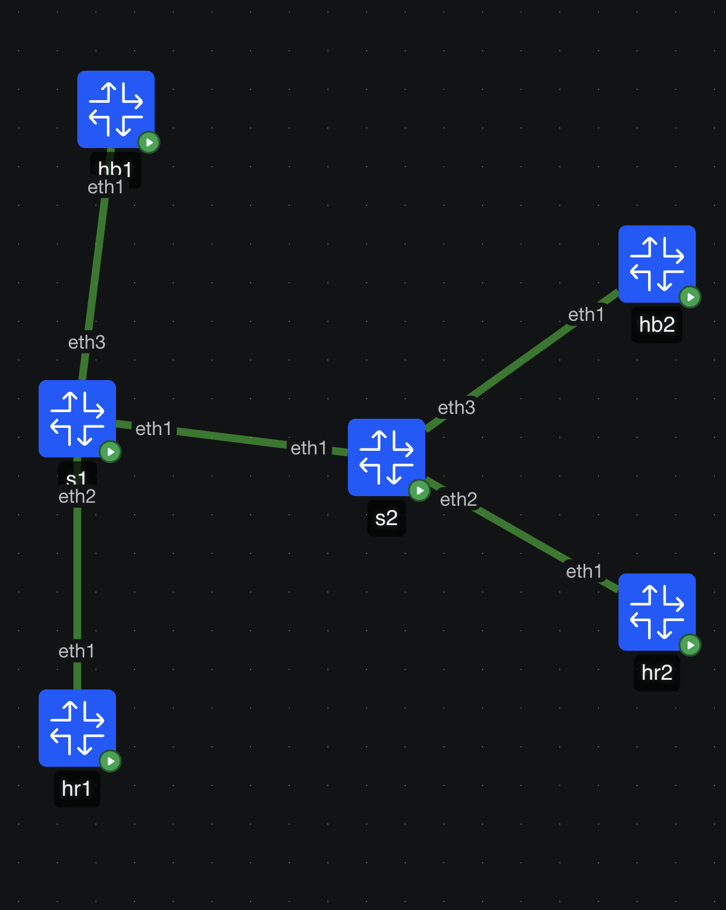{ width=70% }

Objectif : éliminer l'asymétrie IRB en assignant la même IP et la même MAC à tous les VTEPs.
Un host peut alors choisir n'importe quel VTEP comme passerelle — optimal pour les migrations de VMs.

Principe : tous les `br_red` partagent `172.16.10.254 / aa:bb:cc:00:01:01` ; tous les `br_blue`
partagent `172.16.11.254 / aa:bb:cc:00:02:01`. Le host ne distingue pas les VTEPs.

```bash
# Preuve : même IP et MAC sur s1 et s2
s1 $ ip addr show br_red | grep inet
    inet 172.16.10.254/24
s1 $ ip link show br_red | grep link/ether
    link/ether aa:bb:cc:00:01:01

s2 $ ip addr show br_red | grep inet
    inet 172.16.10.254/24
s2 $ ip link show br_red | grep link/ether
    link/ether aa:bb:cc:00:01:01

# Tests de connectivité complets
Intra-red (VXLAN VNI 10010):   hr1→hr2   0% loss, avg 0.11 ms
Intra-blue (VXLAN VNI 10011):  hb1→hb2   0% loss, avg 0.11 ms
IRB local (même VTEP):          hr1→hb1   0% loss, avg 0.11 ms   TTL=63
IRB cross-VTEP (anycast):       hr1→hb2   0% loss, avg 1.39 ms   TTL=63
IRB retour:                     hb2→hr1   0% loss, avg 0.87 ms   TTL=63
```

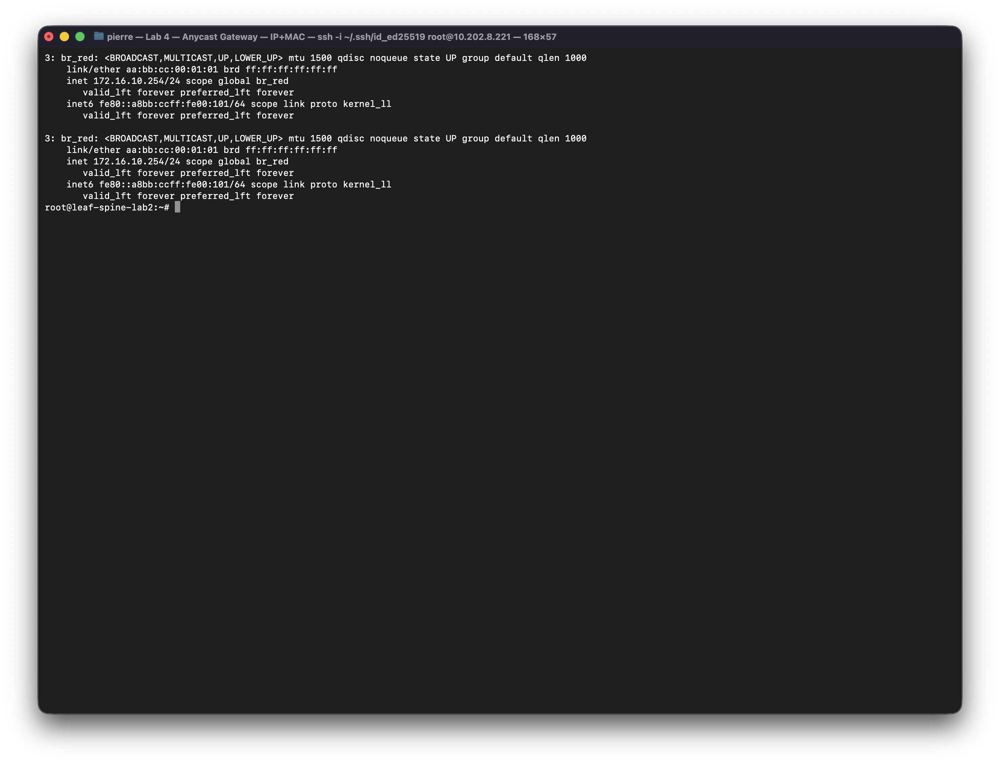{ width=92% }

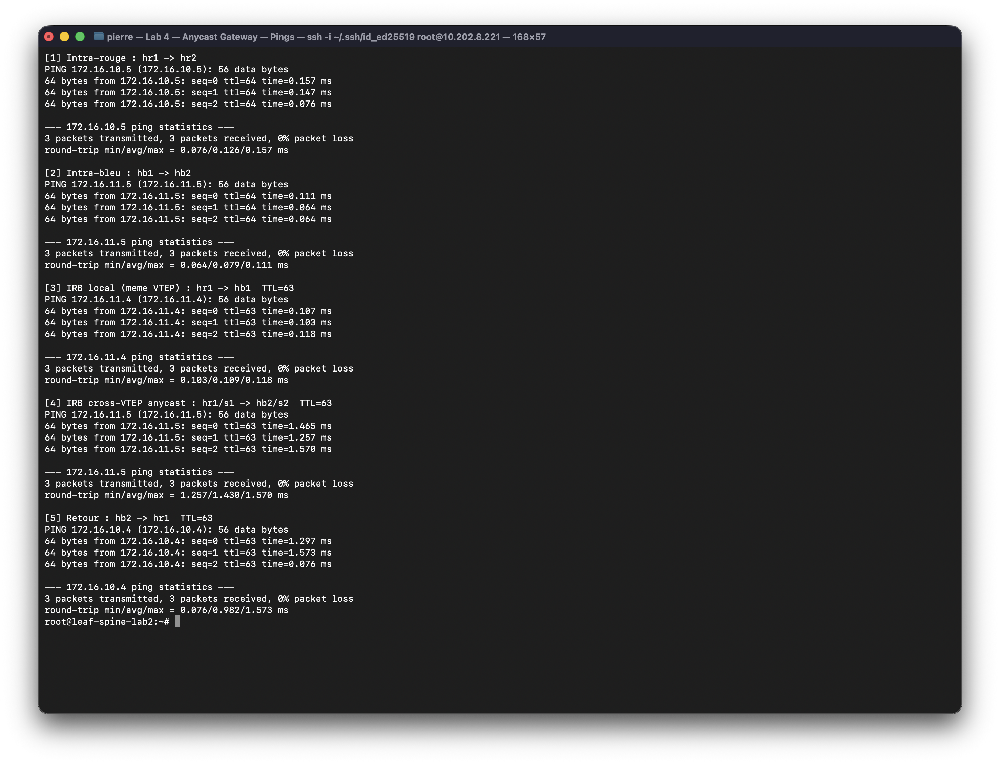{ width=92% }

Avantage anycast vs IRB classique : lors d'une migration de VM (hr1 passe de s1 à s2), la
passerelle reste la même (`172.16.10.254`) — le trafic n'est jamais interrompu car le VTEP d'accueil
possède déjà la MAC/IP anycast. C'est le modèle utilisé dans les datacenters cloud (AWS VPC, Cisco
ACI, Arista EVPN).

---

---

## 10. Bugs rencontrés & corrigés

Chaque bug a été diagnostiqué puis corrigé — c'est le cœur de l'apprentissage.

### 10.1 iBGP RR — next-hop non réécrit
Un Route Reflector ne modifie pas le next-hop par défaut ; `next-hop-self` seul ne s'applique pas aux
routes réfléchies dans FRR. Fix : `next-hop-self force` sur chaque client du RR.

### 10.2 OSPF bloqué en 2-Way sur /31
OSPF en mode broadcast tente d'élire un DR/BDR inutile sur du point-à-point. Fix :
`ip ospf network point-to-point` → adjacence `Full`.

### 10.3 ECMP ne se répartit pas — hash kernel L3
2 chemins ECMP dans la FIB mais 100 % du trafic sur un seul spine, même avec 8 flux. Cause : hash
kernel par défaut = L3 (IP src+dst) → même paire host→host = même spine. Fix :
`fib_multipath_hash_policy=1` (hash L4, inclut les ports). Mesuré : 100/0 → 62/38.

### 10.4 EVPN — TCP à 0 alors que le ping passe (MTU VXLAN)
Ping OK, UDP OK, TCP = 0. Cause : `vxlan100` en MTU 1500 vs hosts jumbo ; segments TCP pleins +
encap VXLAN dépassent la MTU du tunnel → blackhole TCP (PMTUD cassé). Fix : MTU `vxlan100` à
9000 + `eth1` hosts à 8950 → TCP 0 → 9.68 Gbit/s. *Leçon : « ça ping » ne prouve pas que ça marche, il faut mesurer.*

### 10.5 VXLAN IRB — module kernel non chargé, exec échoue silencieusement
`ip link add vxlan... type vxlan` dans les `exec:` containerlab échoue sans erreur si le module
kernel `vxlan` n'est pas chargé sur l'hôte. Les interfaces VXLAN ne sont pas créées, tout le reste
(FDB, bridge, IP) s'exécute normalement sans plantage visible. Fix : `modprobe vxlan` sur l'hôte
VM221, puis recréation manuelle des interfaces dans les conteneurs avec `docker exec`.

### 10.6 VXLAN IRB — FDB flood append avant convergence OSPF
`bridge fdb append 00:00:00:00:00:00 dev vxlan10010 dst 10.0.0.2` échoue silencieusement si le VTEP
distant (10.0.0.2) n'est pas encore joignable (OSPF pas convergé). Fix : attendre la convergence
OSPF (adjacence Full/-) avant d'ajouter les entrées flood, ou les rajouter manuellement.

### 10.7 VXLAN Anycast — ARP cross-VTEP asymétrique
Avec l'anycast gateway (même IP/MAC sur s1 et s2), le reply ARP d'un host distant revient au VTEP
*local* du host (pas au VTEP demandeur). Résultat : ARP FAILED et ping cross-VTEP bloqué. Fix :
entrées ARP statiques permanentes sur chaque VTEP pour les hosts distants (`ip neigh add ... nud permanent`)
+ entrée FDB pointant la MAC du host distant vers le bon VTEP.

---

---

## 11. Observabilité — Prometheus + Grafana + exporter maison

Stack (`docker compose`) : Prometheus (`:9090`, scrape 2 s) + Grafana (`:3000`) +
node-exporter + `clab_exporter.py` (exporter Python écrit pour le projet).

Pourquoi un exporter maison : cAdvisor (l'outil standard) échoue ici (bug overlay2/cgroup v2,
ne mappe pas les conteneurs containerlab → aucune métrique réseau par nœud). Mon exporter entre dans la
netns de chaque conteneur (`nsenter`), lit `/proc/net/dev`, et expose le débit RX/TX par
conteneur/interface ; il publie aussi les résultats du benchmark.

Chaîne de la donnée : `conteneurs → clab_exporter:9101 → Prometheus:9090 → Grafana:3000`.
Dashboard unique (4 sections) : comparaison (barres), trafic live par techno, preuve ECMP (RX par
spine), ressources hôte.

> **Deux Grafana, deux rôles** — le stack ci-dessus tourne en double, un par VM : une instance **prod /
> fabric live** sur VM220 (dashboard `sae4d01`, figures de ce §), ré-exposée au campus en
> `http://10.202.8.102:3000` (via le LXC213, cf. §13) et une instance **bench / classement** sur VM221 (dashboards `sae4d01-avg`
> + `sae4d01-lab221`, figures du §12, exposée sur `http://10.202.8.220:3001`). Stacks identiques
> (Prometheus + Grafana + node-exporter + `clab_exporter`), dashboards distincts.

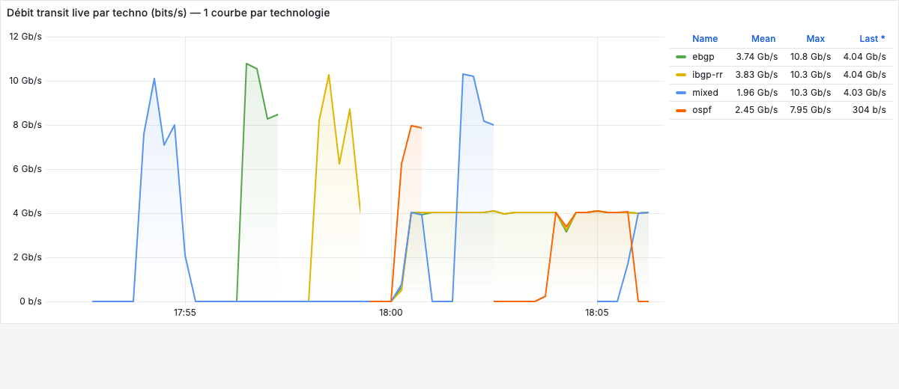{ width=92% }

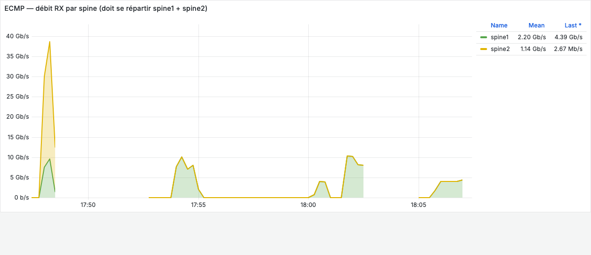{ width=92% }

---

---

## 12. Benchmark comparatif (la valeur ajoutée)

Deux régimes mesurés (iperf3, VM221 — la VM dédiée bench) :

| Technologie | TCP 1 flux (Gbit/s) | TCP **4 flux** agrégé (Gbit/s) | UDP 20G (Gbit/s) | Retransmits TCP |
|-------------|---------------------|--------------------------------|-------------------|-----------------|
| eBGP | 10.50 | **38.91** | 8.35 | 80 |
| OSPF | 9.93 | **38.93** | 8.04 | 114 |
| mixed (OSPF+iBGP) | 10.05 | **38.46** | 8.12 | 118 |
| iBGP-RR | 10.31 | **38.16** | 8.19 | 86 |

*(TCP 1 flux = moyenne de 15 répétitions ; TCP 4 flux = `iperf3 -P 4`, agrégat sur les 2 spines.)*

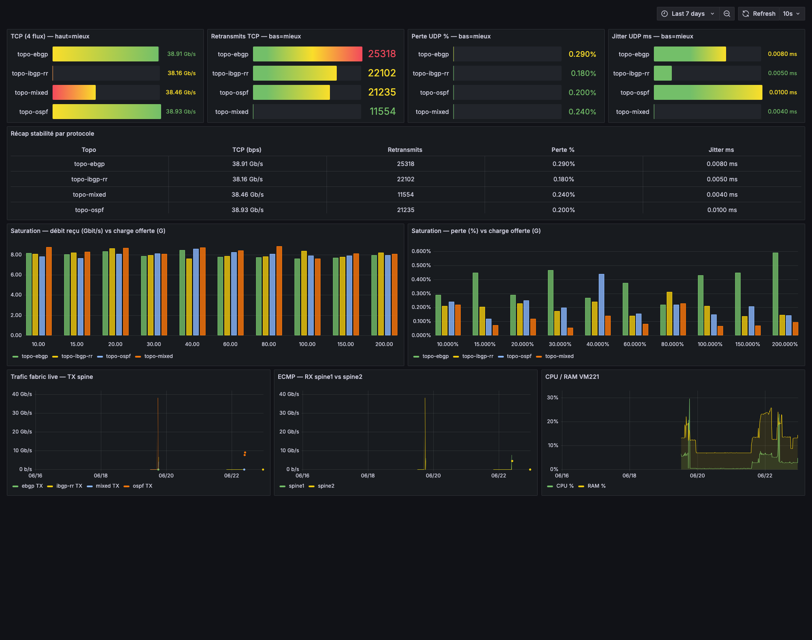{ width=100% }

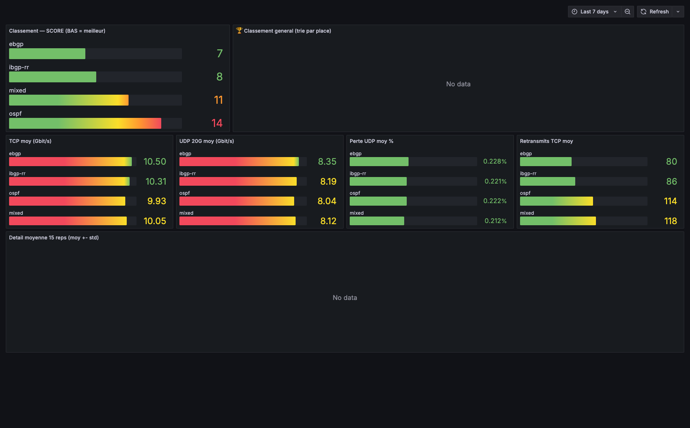{ width=100% }

Interprétation :
- **Un flux TCP unique plafonne à ~10 Gbit/s** : un seul flux = une seule paire host→host = un seul chemin
  via le hash ECMP = un seul spine et un seul cœur → c'est la limite d'une paire veth, pas du routage.
- **En agrégat 4 flux (`-P 4`), la fabric tient ~39 Gbit/s** : les flux se répartissent sur les 2 spines
  (hash ECMP L4) et sur plusieurs cœurs → ~4× le mono-flux. C'est la **vraie capacité de la fabric**.
- **Le protocole de routage n'impacte pas le débit** : les 4 technos sont à 38,16–38,93 G (écart < 0,8 G
  ≈ bruit veth). Une fois la route dans la FIB, le control-plane (BGP/OSPF) n'intervient plus ; le goulot
  est le data-plane (forwarding kernel/veth/cœurs).
- La vraie différence est ailleurs : convergence, scalabilité, policy — c'est ce qui guide le choix en
  production, pas le débit.
- *Méthode* : 15 répétitions pour le mono-flux (moyenne ± écart-type) ; sweep de charge UDP 5→80 G pour la
  saturation (détaillé §13).

---

---

## 13. Couche exposition VM221 & benchmark en montée de charge

**Objectif.** Sortir le lab de l'isolement : exposer au campus un portail de services
(dashboard Grafana, speedtest, *looking glass* BGP) hébergés sur des conteneurs LXC Proxmox,
et industrialiser le benchmark des 4 protocoles de routage (push des résultats vers Grafana,
sweep de saturation UDP). VM221 (`10.202.8.221`) est la VM **dédiée lab/bench** : elle isole
les tirs de charge pour ne pas perturber VM220 (prod, routeur de bordure AS65089).

### Principe — chaîne d'exposition

Les services tournent dans **3 conteneurs LXC** Proxmox (`host-lxc1/2/3`, VMID 213/214/215) placés
derrière les leaf1/2/3 sur les sous-réseaux du fabric `192.168.80-82.0/24`. L'hôte Proxmox les
ré-expose au campus via un **alias IP `10.202.8.102`** en DNAT :

```
LXC (derrière les leaf, fabric)                 Exposition campus (DNAT, alias PVE 10.202.8.102)
  LXC213 host-lxc1  192.168.80.10  Grafana+Prometheus+Pushgateway   ◄──  :3000
  LXC214 host-lxc2  192.168.81.10  LibreSpeed :8080                 ◄──  .102:8888
  LXC215 host-lxc3  192.168.82.10  Looking Glass (Flask :5000 / nginx :80)   [interne fabric]

Grafana bench VM221 (10.202.8.221:3000)  ─── ré-exposé séparément via DNAT VM220 :3001
```

Accès campus : `http://10.202.8.102:3000` (Grafana prod fabric), `http://10.202.8.102:8888`
(LibreSpeed), `http://10.202.8.220:3001` (Grafana bench VM221). Le Looking Glass (LXC215) reste
**interne au fabric** (`192.168.82.10`, non DNAT vers le campus).

### 1 — Sites LXC + reverse proxy + DNAT persistant

Trois conteneurs LXC Proxmox (accès `pct exec` depuis `10.202.8.101`) :

| LXC | IP fabric (derrière leaf) | Service | Exposition campus |
|-----|---------------------------|---------|-------------------|
| 213 (host-lxc1) | `192.168.80.10` | Grafana + Prometheus + Pushgateway | `http://10.202.8.102:3000` (DNAT) |
| 214 (host-lxc2) | `192.168.81.10` | LibreSpeed | `http://10.202.8.102:8888` (DNAT) |
| 215 (host-lxc3) | `192.168.82.10` | Looking Glass BGP (Flask `:5000`) | interne fabric (non DNAT) |

DNAT sur VM220 pour ré-exposer les services VM221 sur des ports campus, persisté via
`netfilter-persistent` (`/etc/iptables/rules.v4`) :

```bash
# Vérifier les règles
iptables -t nat -L PREROUTING -n --line-numbers
iptables -L FORWARD -n --line-numbers
netfilter-persistent save
```

**Règle conntrack critique** (position 1 de la chaîne FORWARD) :

```bash
iptables -I FORWARD 1 -m conntrack --ctstate RELATED,ESTABLISHED -j ACCEPT
```

Sans elle : les SYN arrivent bien sur VM221 (vu en `tcpdump`), les SYN-ACK repartent
mais le retour est droppé par le `FORWARD DROP` par défaut → timeout côté client. La règle
laisse passer le trafic retour des sessions déjà ouvertes.

### 2 — LibreSpeed self-hosted (site2)

Speedtest web auto-hébergé (pas de télémétrie externe), conteneur sur VM221 :

```bash
docker run -d --restart unless-stopped --name librespeed --network=host \
  -e MODE=standalone -e TITLE='SAE4D01 SpeedTest' \
  -e TELEMETRY=false -e USE_NEW_DESIGN=true -e WEBPORT=8080 \
  ghcr.io/librespeed/speedtest:latest
```

Bug rencontré : avec un mapping `8080:80`, Apache dans le conteneur écoute en fait sur
8080 → `Connection reset by peer`. Fix : mapping `8080:8080` (ou `network_mode: host`).

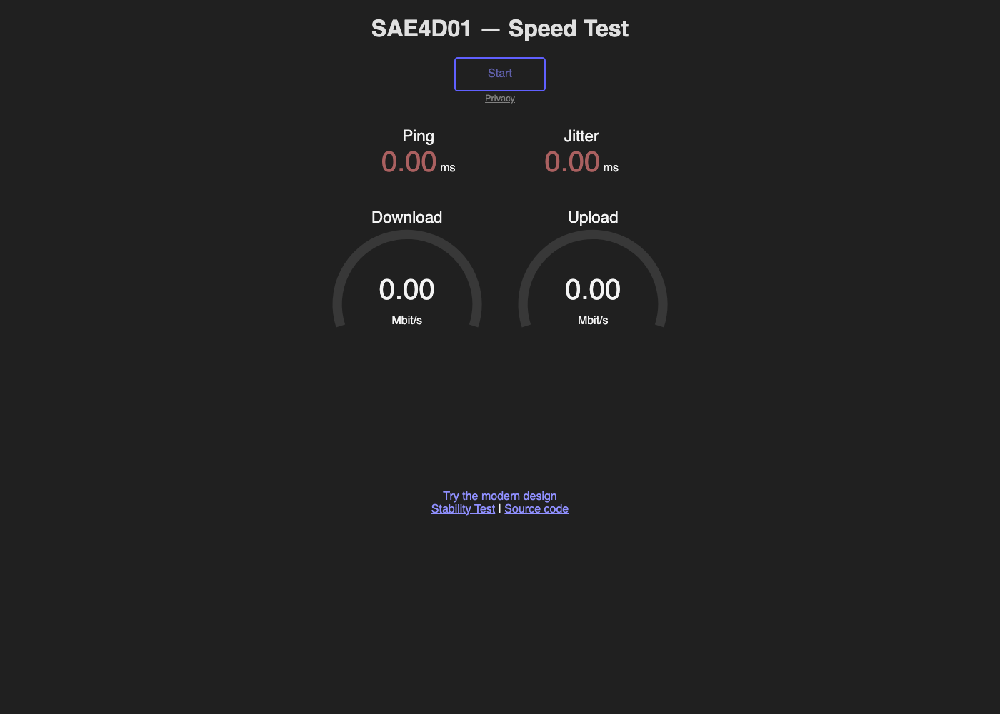{ width=70% }

### 3 — Looking Glass BGP (site3 — LXC215)

Application Flask `/opt/lookingglass/app.py` : page web qui exécute des requêtes `vtysh`
en lecture seule sur VM220 via SSH, par topologie.

- **Topos exposés :** `topo-ebgp` / `topo-ibgp-rr` / `topo-ospf` / `topo-mixed`
- **Requêtes :** BGP summary, table BGP, table de routage, OSPF neighbors, recherche de préfixe
- **Sécurité anti-injection :** whitelist `TOPOS` / `QUERIES` (seules les commandes prévues
  passent), regex `PREFIX_RE` validant les IP saisies, et `shlex.quote` sur tout argument
  injecté dans la commande SSH → impossible de sortir du `vtysh -c "..."`
- **Chaîne :** `nginx :80` → `systemd lookingglass.service` → Flask `:5000` → SSH → `vtysh` VM220

```bash
pct exec 215 -- journalctl -u lookingglass -n 30   # logs du service
curl http://192.168.82.10/                         # test depuis le fabric (interne, non DNAT vers le campus)
```

### 4 — Monitoring VM221 étendu (pushgateway + blackbox)

Stack `docker compose` (`/root/monitoring/`) enrichie par rapport à VM220 :

| Service | Image | Port | Rôle |
|---------|-------|------|------|
| Grafana | `grafana/grafana:11.1.0` | `:3000` | Dashboard ranking |
| Prometheus | `prom/prometheus:v2.53.0` | `:9090` | Collecte |
| Pushgateway | `prom/pushgateway:v1.10.0` | `:9091` | Réception bench iperf3 |
| Blackbox | `prom/blackbox-exporter:v0.25.0` | `:9115` | Probe ICMP voisins |
| LibreSpeed | `ghcr.io/librespeed/speedtest:latest` | `:8080` | Speedtest web |
| node-exporter | `prom/node-exporter` | `:9100` | CPU/RAM VM221 |
| clab-exporter | systemd `clab-exporter.service` | `:9101` | Débit fabric (nsenter) |

**Push iperf3 :** le bench n'est pas scrapé (tir ponctuel) → il *pousse* ses résultats.
`benchmark-push.sh` déploie chaque topo, lance TCP (4 flux, 30 s) + UDP 10G (30 s) et pousse
`iperf3_tcp_bps` / `iperf3_udp_bps` / `iperf3_tcp_retransmits` / `iperf3_udp_lost_pct` /
`iperf3_udp_jitter_ms` (label `topo`) vers le Pushgateway :

```bash
... | curl -s --data-binary @- "http://localhost:9091/metrics/job/iperf3/topo/${topo}"
```

**Probes ICMP :** blackbox-exporter sonde en continu les voisins inter-DC —
`10.202.8.205` (bleaf Valentin) et `10.202.8.253` (Cisco C8000v) — exposant
`probe_success` (UP/DOWN) et `probe_duration_seconds` (RTT).

**Dashboard ranking** (UID `sae4d01-lab221`, « Classement protocoles de routage ») :
panels « Gagnant TCP » / « Gagnant UDP » (`topk(1, iperf3_tcp_bps)` / `topk(1, iperf3_udp_bps)`,
fond or/bleu), bargauges horizontaux de classement des 4 protos, état UP/DOWN + latence des
voisins (blackbox), et débit fabric live + répartition ECMP pendant le bench.

### 5 — Benchmark en montée en charge (sweep de saturation)

**Méthode.** Au lieu d'un seul tir, on offre un débit UDP croissant et on observe à quel
palier la fabric décroche (genou de la courbe = saturation). `benchmark-push.sh` enchaîne,
après le tir baseline, un sweep par paliers offerts :

```bash
SWEEP_TARGETS="5000000000 10000000000 20000000000 40000000000 80000000000"  # 5/10/20/40/80 G
# par palier, host1 -> host3, UDP, 15 s :
docker exec "$CLIENT" iperf3 -c 192.168.3.2 -t 15 -u -b "${TARGET}" -J > "$OUT"
```

Chaque palier mesure `iperf3_sweep_actual_bps` (débit réellement reçu) et
`iperf3_sweep_lost_pct` (perte UDP), poussés **dans un groupe Pushgateway distinct par
palier** :

```bash
... | curl -s --data-binary @- \
  "http://localhost:9091/metrics/job/iperf3_sweep/topo/${topo}/target/${tg}g"
```

Le suffixe `/target/<n>g` est indispensable : sans lui tous les paliers partagent le groupe
`{job,topo}` et s'écrasent mutuellement → seul le dernier (80G) survivait, d'où le bug
« mixed @ 80G = 0 ». Robustesse : ECMP hash L4 forcé (`fib_multipath_hash_policy=1`) sur les
leaves avant chaque run, et retry 1× du tir si le débit reçu ressort à 0 (serveur iperf3
redémarré). Résultats bruts dans `/root/results/${TOPO}-sweep-<n>g.json`.

**Variantes de bench écrites pour le projet :**

| Script | Méthode | Mesure |
|--------|---------|--------|
| `benchmark-ramp.sh` | rampe fine UDP 1→30 G (paliers 1/2/4/6/8/10/12/14/16/18/20/25/30) | CSV `offered/recv/loss/pps` par palier → courbe genou |
| `bench-reps.sh` | 15 tirs identiques à charge plateau (UDP 20G, > genou) | moyenne, écart-type, **IC95** par topo (barres d'erreur) |
| `convergence.py` | coupe le spine porteur du flux, ping 50 ms | `convergence_outage_ms` (paquets perdus × 50 ms) |

**Ce qu'on observe.** Sous le genou (≈ 10 G), le débit reçu suit le débit offert avec une
perte quasi nulle ; au-delà, le reçu plafonne et la perte UDP grimpe — la limite est le
data-plane (forwarding kernel/veth), pas le protocole de routage. `bench-reps.sh` confirme
en répétitions que les 4 protos restent dans la même enveloppe (écarts sous le bruit veth
~1 G, cf. §12). La vraie différence n'est pas le débit mais la **convergence**, désormais
chiffrable en live via `convergence.py`.

{ width=92% }

> Le dashboard Grafana VM221 (TCP 4 flux ≈ 39 G, sweep de saturation, ECMP RX par spine, CPU/RAM) est
> en figure au §12, et le portail LibreSpeed ci-dessus (§13.2). *Seule capture restante à produire :
> la page du Looking Glass BGP (LXC215).*

**Leçon.** Le lab passe d'un POC isolé à un service exposé et mesurable : portail web LXC +
DNAT/conntrack pour l'accessibilité campus, looking glass durci (`shlex.quote` + whitelist)
pour l'introspection BGP sans shell, et un pipeline de bench reproductible
(push → Pushgateway → Grafana) qui sépare proprement débit (équivalent) et comportement à la
saturation/convergence (discriminant).

---

## 14. Intégration physique — VM220 routeur de bordure + C8000v + peering Valentin

### Architecture d'ensemble (phase initiale)

```
[Valentin AS65899]──campus──►[Cisco C8000v AS65080]──172.80.0.0/30──►[VM220 AS65089]──►[leaf-spine]──►[LXC web]
                                    Gi1: 10.202.8.253                    ens22: 172.80.0.1     192.168.80-82.x
```

VM220 est reconfigurée en routeur de bordure FRR (AS65089) :
- `ens22` (172.80.0.1/30) → lien physique → Cisco Gi2 (172.80.0.2) — *ce lien existe via le Catalyst 8200 NFVIS*
- Annonce les préfixes lab `192.168.80-82.0/24` + loopbacks vers le campus via Cisco

### VM220 ↔ Cisco C8000v (BGP Established)

Routes lab annoncées par VM220 vers le campus via Cisco :
- `192.168.80.0/24`, `192.168.81.0/24`, `192.168.82.0/24` (LXC Apache)
- `10.255.0.0/24` (loopbacks leaf-spine)

### Peering IPv4 avec Valentin (AS65899, Arista EOS) — établi le 2026-06-19

Valentin = border-leaf Arista EOS, `10.202.8.205`, AS65899.
Session BGP : Cisco ↔ Valentin sur le réseau campus `10.202.0.0/16`.

Chemin opérationnel :
```
Valentin(65899) ──campus──► Cisco(65080) ──► VM220(65089) ──► leaf-spine ──► 192.168.80.213
```

Valentin testait :
- `ping 192.168.80.213 / 81.213 / 82.213` → OK (retour asymétrique via campus, LXC ont patte eth0)
- `curl http://192.168.80.213` → page Apache OK

Contrainte NFVIS : le déploiement Cisco `c8000v.c8000v` est en `SERVICE_ERROR_STATE` permanent
(absence d'interface mgmt lors du déploiement). Impossible d'ajouter une vNIC Gi3 → d'où le peering via
campus (Cisco Gi1, même réseau `10.202.0.0/16` que Valentin) plutôt qu'un lien dédié.

---

---

## 15. Extension L2 inter-DC — EVPN/VXLAN avec Valentin

### Objectif

Étendre un VLAN (VNI 560100) entre le fabric de Pierre (VM220) et le fabric de Valentin (Arista cEOS,
AS65899) via EVPN/VXLAN : les hosts des deux fabrics partagent un même domaine L2, sans tunnel manuel.

### Pourquoi pas Cisco comme VTEP/RR EVPN

Première approche : utiliser le Cisco C8000v (déjà en place) comme route-reflector EVPN entre les
deux fabrics. Tentative de configuration :

```
c8000v(config-router)# address-family l2vpn evpn
% BGP: Error initializing topology
```

**IOS XE 17.4.1a sur C8000v ne supporte pas l'address-family l2vpn evpn** (limitation de version /
licence). La commande est syntaxiquement reconnue mais le moteur BGP refuse d'initialiser la topologie.
`show bgp l2vpn evpn summary` retourne vide. Cisco écarté pour l'EVPN.

### Solution retenue : border leaf dédié (container FRR)

**Choix architectural** : ajouter un nœud `bleaf` dans la topologie containerlab, dont le rôle unique
est la terminaison EVPN/VXLAN et le peering inter-DC. Avantages :
- Séparation claire des rôles (leaves = accès hosts, bleaf = bordure inter-DC)
- FRR supporte nativement `address-family l2vpn evpn`
- Reproductible (déclaré dans `topology.clab.yml`)
- Connecté directement au campus via une NIC physique dédiée (ens23)

### Infrastructure réseau

Un vNIC supplémentaire (net5) est ajouté à VM220 sur Proxmox (`vmbr0` = campus) :

```bash
qm set 220 --net5 virtio,bridge=vmbr0   # Proxmox
```

L'interface `ens23` apparaît sur VM220. Un bridge Linux `br-campus` l'encapsule, puis le nœud
`br-campus` (kind: bridge) dans containerlab y attache le bleaf directement :

```yaml
br-campus:
  kind: bridge

links:
  - endpoints: [bleaf:eth3, br-campus:campus1]
```

Le bleaf reprend l'IP `10.202.8.253/16` (ancienne IP du Cisco C8000v) sur `eth3` — il apparaît
directement sur le L2 partagé `10.202.0.0/16`. Tous les pairs campus qui avaient déjà
`neighbor 10.202.8.253 remote-as 65080` configuré reconnectent automatiquement sans modification.

### Architecture finale

```
        spine1 (AS65081)   spine2 (AS65082)
           eth4╲              ╱eth4
                 ╲          ╱
                  bleaf (AS65080)
                  lo: 10.255.0.20/32
                  eth3: 10.202.8.253/16 ──campus──► Valentin bleaf (AS65899, 10.202.8.205)
                  vxlan560100 (VNI 560100, VTEP local 10.202.8.253)
                        │
                  VXLAN tunnel direct (UDP 4789)
                        │
                  Valentin : VTEP leaves 10.0.0.1/.2/.3 (hosts) + border-leaf 10.0.0.4
```

Underlay vers les spines : eBGP IPv4 sur liens /31.
```
spine1 eth4 → 10.0.1.12/31   bleaf eth1 → 10.0.1.13/31
spine2 eth4 → 10.0.1.14/31   bleaf eth2 → 10.0.1.15/31
```

### Configuration FRR bleaf (extrait)

```
router bgp 65080
 bgp router-id 10.255.0.20
 no bgp ebgp-requires-policy
 no bgp default ipv4-unicast
 neighbor 10.0.1.12 remote-as 65081       ! spine1
 neighbor 10.0.1.14 remote-as 65082       ! spine2
 ! pairs campus (reprennent les sessions du Cisco C8000v)
 neighbor 10.202.1.12 remote-as 65001
 neighbor 10.202.60.22 remote-as 65060
 neighbor 10.202.7.253 remote-as 65070
 neighbor 10.202.0.227 remote-as 65014
 neighbor 10.202.8.205 remote-as 65899    ! Valentin bleaf (EVPN + IPv4)
 neighbor 10.202.8.205 send-community extended
 !
 address-family ipv4 unicast
  network 10.255.0.20/32
  neighbor 10.0.1.12 activate
  neighbor 10.0.1.14 activate
  neighbor 10.202.1.12 activate
  neighbor 10.202.60.22 activate
  neighbor 10.202.7.253 activate
  neighbor 10.202.0.227 activate
  neighbor 10.202.8.205 activate
 exit-address-family
 !
 address-family l2vpn evpn
  neighbor 10.202.8.205 activate
  vni 560100
   rd 10.255.0.20:560
   route-target import 65899:560
   route-target export 65080:560
   route-target export 65899:560
  exit-vni
  vni 570100
   rd 10.255.0.20:570
   route-target import 65899:570
   route-target export 65080:570
   route-target export 65899:570
  exit-vni
 exit-address-family
```

VXLAN créé au démarrage du container via exec containerlab :

```yaml
exec:
  - /bin/sh -c 'ip link add vxlan560100 type vxlan id 560100 local 10.202.8.253
      dstport 4789 nolearning 2>/dev/null;
      ip link set vxlan560100 mtu 1450 up;
      ip link add br-val type bridge 2>/dev/null;
      ip link set br-val mtu 1450 up;
      ip link set vxlan560100 master br-val; true'
```

Note : les exec containerlab sont exécutés sans shell (`/bin/sh -c` requis pour les redirections
`2>/dev/null` — découvert lors du déploiement, les commandes échouaient silencieusement sinon).

### Vérification côté bleaf

```
bleaf# show bgp summary
Neighbor        V    AS   MsgRcvd MsgSent  Up/Down  State/PfxRcd
10.0.1.12       4  65081      20      21  00:00:30       8   ← spine1 Established
10.0.1.14       4  65082      22      20  00:00:30       8   ← spine2 Established
10.202.0.227    4  65014      16      20  00:00:30      26   ← campus AS65014
10.202.1.12     4  65001      22      20  00:00:28      25   ← campus AS65001
10.202.7.253    4  65070      15      20  00:00:30      26   ← campus AS65070
10.202.8.205    4  65899      13      26  00:00:30      16   ← Valentin Established
10.202.60.22    4  65060      16      20  00:00:30      26   ← campus AS65060

bleaf# show bgp l2vpn evpn summary
Neighbor        V    AS   Up/Down  State/PfxRcd
10.202.8.205    4  65899  00:00:30       5   ← EVPN Established, 5 préfixes EVPN reçus

$ ip link show vxlan560100
vxlan560100: mtu 1450 qdisc noqueue master br-val state UNKNOWN

$ ip addr show eth3
inet 10.202.8.253/16 scope global eth3    ← IP campus directe (ancienne IP Cisco reprise)

$ ping 10.202.255.254    ← gateway campus
2 packets transmitted, 2 received, 0% packet loss

$ ping 10.202.8.205      ← bleaf Valentin
2 packets transmitted, 2 received, rtt min/avg/max = 0.666/0.829/0.993 ms
```

Les **7 sessions BGP** du bleaf (2 spines + 4 pairs campus + le peering EVPN Valentin) montent en ~30 s.

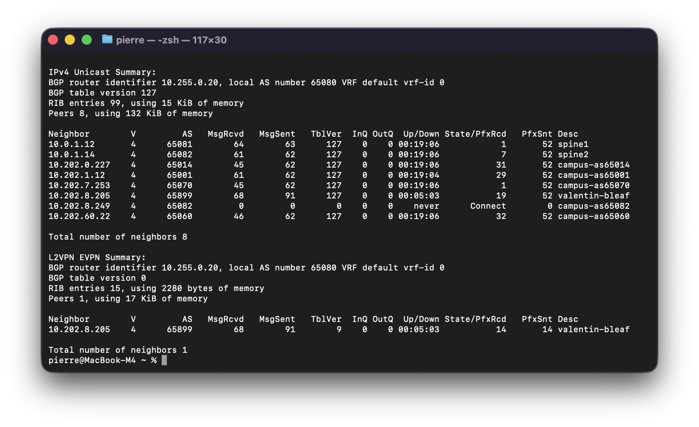{ width=100% }

{ width=100% }

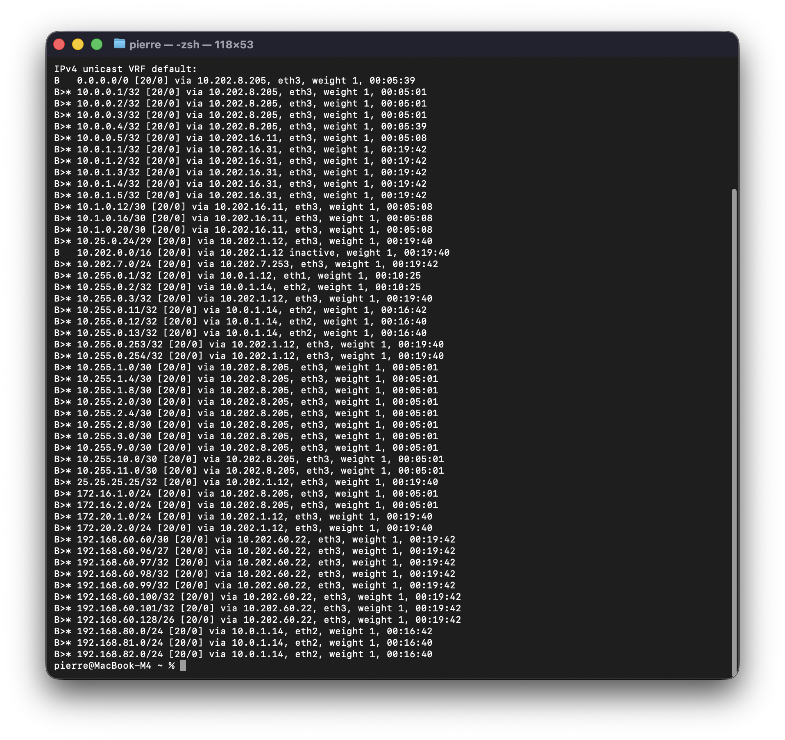{ width=100% }

### État final — deux VLAN étendus (mise à jour 2026-06-22)

L'extension a été portée de **un** à **deux** VLAN, alignés sur le plan d'adressage final de Valentin
(il a re-numéroté ses plages `172.16.1/2.0/24` → `172.16.30/31.0/24` ; le bleaf a été ré-aligné en
conséquence) :

| VNI | VLAN | Plage L2 étendue | Passerelle anycast (Valentin) | Host de preuve côté bleaf |
|-----|------|------------------|-------------------------------|---------------------------|
| `560100` | web | `172.16.30.0/24` | `172.16.30.254` | `veth-h0` = `172.16.30.253` |
| `570100` | machines | `172.16.31.0/24` | `172.16.31.254` | `veth-h2` = `172.16.31.253` |

Côté FRR bleaf, chaque `vni` exporte un **double route-target** (`65080:5x0` *et* `65899:5x0`) : la
patte `65899` est obligatoire car les leaves Arista de Valentin n'importent que le RT de leur propre AS.
Le host de preuve est monté en **modèle veth** (IP hors-bridge sur `veth-h0`, pair `veth-h1` dans `br-val`,
entrée ARP permanente) — un host avec IP directement sur le SVI génère un type-2 portant le flag
*Default Gateway* que l'Arista refuse d'installer en FDB.

Hosts Valentin joignables par-dessus le tunnel (VNI 560100) :

| IP | Service | VTEP distant |
|----|---------|--------------|
| `172.16.30.1` | nginx1 | `10.0.0.1` (leaf1) |
| `172.16.30.2` | nginx2 | `10.0.0.1` (leaf1) |
| `172.16.30.3` | librespeed | `10.0.0.2` (leaf2) |
| `172.16.30.4` | networkutils1 | `10.0.0.2` (leaf2) |
| `172.16.31.1` | networkutils2 | `10.0.0.3` (leaf3) |

### Preuve Wireshark — capture de l'encapsulation VXLAN inter-DC

La preuve qu'il s'agit bien d'EVPN/VXLAN (et non d'un simple routage L3 par le campus) se fait en
capturant le trafic sur l'uplink campus du bleaf (`eth3`) pendant un ping, puis en le disséquant.

Capture (sur VM220) — `tcpdump` dans la netns du bleaf, filtre port VXLAN `4789` :

```bash
PID=$(docker inspect -f '{{.State.Pid}}' clab-topo-ebgp-bleaf)
nsenter -t $PID -n tcpdump -ni eth3 -w evpn-vxlan-interdc.pcap udp port 4789 &
for h in 1 2 3 4; do docker exec clab-topo-ebgp-bleaf ping -c2 -I 172.16.30.253 172.16.30.$h; done
docker exec clab-topo-ebgp-bleaf ping -c2 -I 172.16.31.253 172.16.31.1
```

> Le bleaf est aussi monté en capture live via l'extension *containerlab* de VS Code
> (conteneur `wireshark-vnc` attaché à `bleaf:eth3`) — même capture, en GUI dans le navigateur.

Liste des paquets (dissection Wireshark/tshark, filtre `vxlan`) — chaque requête ICMP et sa réponse
sont encapsulées dans de l'UDP 4789, avec le **VNI dans l'en-tête VXLAN** :

| # | VTEP src → dst (outer) | UDP dport | VXLAN VNI | Trame interne (inner) | ICMP |
|---|------------------------|-----------|-----------|-----------------------|------|
| 1 | `10.202.8.253` → `10.0.0.1` | 4789 | **560100** | `172.16.30.253` → `172.16.30.1` (nginx1) | request |
| 2 | `10.0.0.1` → `10.202.8.253` | 4789 | **560100** | `172.16.30.1` → `172.16.30.253` | reply |
| 9 | `10.202.8.253` → `10.0.0.2` | 4789 | **560100** | `172.16.30.253` → `172.16.30.3` (librespeed) | request |
| … | `10.202.8.253` → `10.0.0.3` | 4789 | **570100** | `172.16.31.253` → `172.16.31.1` (networkutils2) | request |

Dissection complète d'un paquet (couches empilées — c'est l'encapsulation qui prouve le L2-over-L3) :

```
Frame 1: 148 bytes on wire
Ethernet II        Src aa:c1:ab:56:b2:44 (bleaf eth3)   Dst ca:f0:00:06:00:03      ← L2 campus (outer)
Internet Protocol  Src 10.202.8.253   Dst 10.0.0.1   TTL 64                        ← VTEP Pierre → VTEP Valentin
User Datagram Prot Src Port 60970   Dst Port 4789                                  ← port VXLAN (IANA 4789)
Virtual eXtensible Local Area Network
    Flags: 0x0800 (VNI présent)
    VXLAN Network Identifier (VNI): 560100                                         ← le VLAN « web » étendu
Ethernet II        Src 46:a4:04:20:4f:a0 (host Pierre)  Dst aa:c1:ab:eb:c2:79 (nginx1)  ← trame L2 D'ORIGINE (inner)
Internet Protocol  Src 172.16.30.253  Dst 172.16.30.1   TTL 64
Internet Control Message Protocol   Type: 8 (Echo request)
```

Lecture : la trame Ethernet d'origine (`172.16.30.253` → `172.16.30.1`, deux hosts du *même* sous-réseau
mais physiquement dans deux datacenters distincts) voyage **intacte à l'intérieur** d'un paquet UDP/IP
entre les deux VTEP. Le champ **VNI 560100** identifie le VLAN. C'est la définition même d'un domaine de
broadcast L2 étendu : les deux fabrics partagent un seul réseau logique, sans tunnel manuel — le
control-plane BGP EVPN a distribué les adresses MAC/IP, le data-plane VXLAN les transporte.

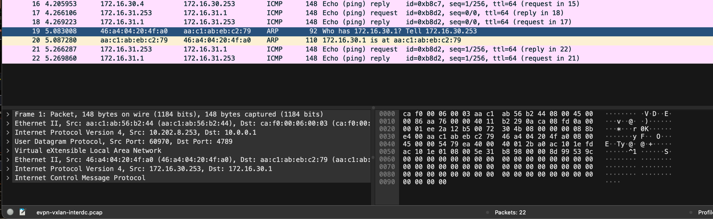{ width=100% }

> Capture brute reproductible : `docs/captures/evpn-vxlan-interdc.pcap` (ouvrable dans Wireshark,
> filtre d'affichage `vxlan`).

### Config à fournir à Valentin

```
neighbor 10.202.8.253 remote-as 65080
neighbor 10.202.8.253 send-community extended
address-family evpn
 neighbor 10.202.8.253 activate
```

VNI : `560100` / `570100` — RT côté Valentin : `65899:5x0` — VTEP Valentin : leaves `10.0.0.1/.2/.3` (hosts), border-leaf `10.0.0.4`.

> Note : l'IP 10.202.8.253 est l'ancienne IP du Cisco C8000v, reprise par le bleaf. Les pairs campus
> qui avaient déjà `neighbor 10.202.8.253 remote-as 65080` reconnectent automatiquement.

### Difficultés rencontrées & erreurs commises

Cette implémentation n'a pas été linéaire. Les erreurs documentées ci-dessous font partie du
processus d'apprentissage et ont conduit aux choix finaux.

**1. Cisco C8000v — EVPN non supporté (IOS XE 17.4.1a)**

Première tentative : utiliser le Cisco déjà en place comme VTEP/RR EVPN.

```
c8000v(config-router)# address-family l2vpn evpn
% BGP: Error initializing topology
```

La commande est syntaxiquement valide mais le moteur BGP d'IOS XE 17.4.1a refuse d'initialiser
la topologie EVPN. Temps perdu avant de confirmer que c'est une limitation de version/licence, pas
une erreur de config. Conclusion : Cisco abandonné pour EVPN.

**2. `frrinit.sh restart` détruit les interfaces veth**

Après modification d'un `frr.conf` à chaud, tentative de rechargement via :
```bash
docker exec clab-topo-ebgp-leaf2 /usr/lib/frr/frrinit.sh restart
```
→ Redémarre le container Docker entier. Les veth eth1/eth2/eth3 créés par containerlab sont dans
l'ancien namespace réseau du container, pas dans le nouveau → interfaces perdues, topo cassée.
Fix : ne jamais utiliser `frrinit.sh restart`. Pour un reload à chaud : `vtysh -c "reload"` ou
redeploy containerlab complet.

**3. Exec containerlab — shell non invoqué**

Commandes d'exec dans `topology.clab.yml` :
```yaml
exec:
  - ip link add vxlan560100 ... 2>/dev/null || true   # ÉCHOUE
```
Containerlab passe les arguments directement à l'exécutable sans shell → `2>/dev/null` et `|| true`
sont interprétés comme des arguments, pas comme de la syntaxe shell → erreur silencieuse, VXLAN
non créé.
Fix : envelopper dans `/bin/sh -c '...'`.

**4. SCP vers la mauvaise VM**

VM220 = 10.202.8.220 (topo-ebgp), VM221 = 10.202.8.221 (autres labs). Plusieurs configs envoyées
vers VM221 au lieu de VM220. Aucune erreur apparente (scp réussit) mais les fichiers n'étaient pas
au bon endroit → confusion lors des vérifications suivantes.

**5. Bloc `vni` hors du contexte `router bgp`**

Premier essai de config EVPN FRR :
```
vni 560100              ← niveau global → FAUX
 rd ...
 route-target ...
```
→ FRR retourne `processing failure: 11` silencieusement. La commande `vni` doit être à l'intérieur
de `address-family l2vpn evpn` dans le bloc `router bgp`.

**6. Changement d'AS du bleaf (initial 65086 → final 65080) — mismatch spines**

Pour reprendre l'IP et l'AS du Cisco (AS65080), bleaf passe de AS65086 à AS65080. Les spines
avaient encore `remote-as 65086` dans leurs fichiers frr.conf mis à jour APRÈS le premier deploy.
Résultat : sessions BGP en `Idle`/`Active` — AS mismatch, bleaf rejeté par les spines.

Tentative de fix à chaud via vtysh :
```
no neighbor 10.0.1.13 remote-as 65086
```
→ FRR supprime l'intégralité du neighbor quand on retire son AS (pas seulement l'AS). Re-ajout
complet nécessaire : `neighbor 10.0.1.13 remote-as 65080` + `activate` dans l'AF unicast.
Fix définitif : mettre à jour les frr.conf des spines (eth4 → remote-as 65080) puis `--reconfigure`.

**7. Conflit ARP — même IP sur deux machines simultanément**

Le bleaf reçoit `10.202.8.253/16` (ancienne IP Cisco). Cisco toujours allumé sur le réseau campus
→ deux machines répondent à l'ARP pour `10.202.8.253` → comportement non-déterministe, gateway
injoignable depuis bleaf (100% loss), LXC inaccessibles.

```
# VM220 ARP table (pendant le conflit) :
10.202.8.253  ether  52:54:00:b3:df:5a  ← MAC Cisco, pas bleaf
```

Fix : éteindre le Cisco via l'API NFVIS avant d'assigner l'IP au bleaf.
```bash
curl -sk -u admin:<REDACTED> -X POST https://10.202.8.254/api/operations/vmlc:vmAction \
  -H "Content-Type: application/vnd.yang.data+json" \
  -d '{"vmAction":{"actionType":"STOP","vmName":"c8000v.c8000v"}}'
```

### Choix technique justifié

| Critère | Cisco C8000v | bleaf FRR dédié |
|---------|-------------|-----------------|
| Support EVPN | Non (IOS XE 17.4.1a) | Oui (FRR 10.6.1) |
| Rôle dans la topo | Mutualisé (IPv4 + autres AS) | Dédié border inter-DC |
| Séparation des rôles | Non | Oui |
| Reproductibilité | Config IOS statique | Déclaratif YAML + frr.conf |
| IP campus directe | Non (via VM220 ens22) | Oui (ens23 → br-campus → eth3) |

Le bleaf est le modèle standard des datacenters modernes (border leaf = rôle dédié à l'interconnexion
inter-DC, distinct des leaves d'accès).

---

---

## 16. Infrastructure-as-Code & automatisation

- Objectif : rendre le lab **reproductible** — recréer une VM containerlab et redéployer les 5 topologies sans configuration manuelle, le tout versionné dans Git (repo privé `Pierre3474/SAE4D01-DevCloud`).
- Principe : la chaîne est volontairement **légère**. Provisioning de la VM via un helper interactif (`pve-helper.sh`, whiptail) ou bootstrap direct sur Debian nue (`setup.sh`) ; configuration/pilotage des topos via **Ansible en push SSH** (5 playbooks) ; garde-fou CI en GitHub Actions (lint, sans déploiement live).

### 16.1 Du tout-Terraform à l'Ansible-only

La première itération suivait le modèle classique **Terraform (provisioning Proxmox) + Ansible (configuration)**. Terraform créait la VM lab via le provider `bpg/proxmox` (image cloud Debian 12, disque, 4 NICs, cloud-init), avec un garde-fou `vm_id != 220` pour ne jamais toucher la VM de prod. Cette partie a été **abandonnée** (commit `ae54e5c` *« Abandon de Terraform, provisioning via pve-helper »*, qui supprime `terraform/`, `terraform.yml` et 431 lignes).

Raisons documentées :

| Problème Terraform | Conséquence |
|--------------------|-------------|
| Provider `bpg/proxmox` à configurer (API token, datastore `local-zfs`, image cloud) | lourd pour créer **une seule** VM lab |
| Secrets (`terraform.tfvars` : password PVE + clé SSH pub) à gérer hors Git | friction + risque de fuite |
| `terraform apply` doit tourner **sur le PVE** (réseau `10.202.0.0/16`) | les runners GitHub ne joignent pas ce réseau → pas de CD possible, le `validate` CI ne testait rien de réel |
| State Terraform à maintenir pour un objet quasi statique | sur-ingénierie |

Le besoin réel (créer ponctuellement une VM Debian sur Proxmox) est couvert plus simplement par un script whiptail. **Aujourd'hui Terraform ne tourne plus** : le provisioning est manuel/assisté, la valeur IaC est concentrée sur Ansible (configuration reproductible) + Git (versionnement des topos).

### 16.2 Provisioning — `pve-helper.sh` et `setup.sh`

Deux entrées selon le contexte :

- **`pve-helper.sh`** (whiptail) : depuis une machine avec Ansible + accès SSH, demande l'IP cible et la clé SSH, génère un inventaire temporaire et lance le bootstrap Ansible sur la VM.
  ```bash
  IP=$(whiptail --inputbox "IP de la VM cible" 10 60 "10.202.8.221" ...)
  KEY=$(whiptail --inputbox "Clé SSH privée" 10 60 "~/.ssh/id_ed25519" ...)
  # inventaire éphémère mktemp → ansible-playbook playbooks/bootstrap.yml
  ```
- **`setup.sh fabric|bench`** : bootstrap d'une **Debian nue** (idempotent : teste `command -v docker/containerlab`), installe Docker + containerlab `0.76.1` + images `quay.io/frrouting/frr:10.6.1` et `alpine:latest`, puis :
  - rôle `fabric` → `containerlab deploy` de `topo-ebgp`, attente 25 s, affiche `show bgp summary` du spine1 ;
  - rôle `bench` → symlinks des 4 topos routing + `benchmark.sh` dans `/root`.

### 16.3 Ansible — 5 playbooks (push SSH)

Inventaire `inventory/hosts.yml` : groupe `containerlab_hosts` = **vm220** (`10.202.8.220`) + **vm221** (`10.202.8.221`), `ansible_user: root`, clé `~/.ssh/id_ed25519`. Config `ansible.cfg` : `host_key_checking = False`, `pipelining = True`, sortie `yaml`. Variables centralisées dans `group_vars/all.yml` (version containerlab, images, liste des 5 topos). Une seule dépendance Galaxy : `community.docker >=3.0.0`.

| Playbook | Cible | Rôle |
|----------|-------|------|
| `bootstrap.yml` | `containerlab_hosts` | apt deps, install Docker + containerlab, `docker_image` pull FRR + Alpine (idempotent via `creates:`) |
| `sync-topologies.yml` | `vm220` | copie les 5 dossiers `topo-*` + `benchmark.sh` du repo vers `/root` |
| `deploy-topo.yml` | `vm220` | `containerlab deploy -t /root/{{ topo }}/topology.clab.yml` (var `topo`) |
| `destroy-topo.yml` | `vm220` | `containerlab destroy ... --cleanup` |
| `benchmark.yml` | `vm220` | lance `benchmark.sh` en `async: 900 / poll: 15`, puis `fetch` des 8 JSON (tcp/udp × 4 topos) dans `../results/`, `failed_when: false` |

Extrait `bootstrap.yml` (idempotence) :
```yaml
- name: Install containerlab
  ansible.builtin.shell:
    cmd: set -o pipefail && curl -sL https://containerlab.dev/setup | bash -s "{{ containerlab_version }}"
    creates: /usr/bin/containerlab
    executable: /bin/bash
```

- Vérification (depuis le Mac) :
  ```bash
  cd ansible
  ansible-galaxy collection install -r requirements.yml
  ansible-playbook playbooks/bootstrap.yml
  ansible-playbook playbooks/sync-topologies.yml
  ansible-playbook playbooks/deploy-topo.yml  -e "topo=topo-ebgp"
  ansible-playbook playbooks/benchmark.yml      # ~15 min, JSON fetchés dans ../results/
  ```

### 16.4 CI/CD — GitHub Actions

Trois workflows (runners `ubuntu-latest`, aucun accès au réseau `10.202.x`) :

| Workflow | Déclencheur | Jobs |
|----------|-------------|------|
| `ansible.yml` | push/PR sur `ansible/**` | `ansible-playbook --syntax-check` + `ansible-lint` |
| `ci.yml` | push/PR sur `containerlab/**`, `*.sh` | **frr-validate** (`vtysh -C` sur les 26 `frr.conf` dans un conteneur FRR) · **yaml-lint** (topologies) · **shellcheck** (`-S error`, ne vérifie que les vrais scripts shell) |
| `deploy.yml` | **manuel** (`workflow_dispatch`) | CD : `sync-topologies` + `deploy-topo` + benchmark optionnel |

Le job `terraform validate` de l'ancienne CI a été supprimé avec Terraform. Le CI valide désormais
**la couche réseau elle-même** (configs FRR + topologies containerlab + scripts), pas seulement Ansible.

### Perspectives CI/CD

Le **CI** valide statiquement tout le lab (configs FRR, topologies YAML, scripts, playbooks Ansible) sur des runners GitHub hébergés — sans jamais toucher au réseau `10.202.x`. Le **CD** (`deploy.yml`) est fourni en template : `workflow_dispatch` **manuel uniquement** (jamais sur push, le lab étant en prod), ciblant un runner `self-hosted` à placer dans le réseau du lab (via **Tailscale**), car les runners GitHub hébergés ne joignent pas `10.202.0.0/16`. Tant qu'aucun runner self-hosted n'est enregistré, le CD reste inerte — le déclenchement manuel est volontairement gardé comme garde-fou sur les VM de prod.

- Leçon : l'IaC « lourde » (Terraform + state + provider Proxmox) était **disproportionnée** pour une poignée de VM lab. La combinaison Git (versionnement des topos déclaratives) + Ansible (configuration idempotente en push SSH) + un helper whiptail couvre le besoin de reproductibilité avec beaucoup moins de friction. Savoir **retirer** un outil fait partie de la démarche IaC.

---

## 17. Conclusion & limites

Démontré :
- Fabric leaf-spine en 5 technos validées de bout en bout (eBGP, iBGP-RR, OSPF, mixed, EVPN/VXLAN)
- VXLAN avancé : IRB (routage inter-VLAN multi-VTEP) et Anycast Gateway (même IP/MAC partout)
- Le protocole de routage n'impacte pas le débit : **~39 Gbit/s en agrégat (4 flux, VM221)**, quasi identique pour les 4 technos (38,2–38,9 G) ; ~10 G par flux unique (plafond veth) ; ~9,7 G EVPN — chiffré
- Observabilité réelle : exporter maison + Prometheus + Grafana (ECMP prouvé visuellement)
- 8 bugs réseau diagnostiqués et corrigés : 7 côté lab (next-hop-self force, OSPF /31, ECMP hash L4, MTU VXLAN, module kernel VXLAN, FDB timing, ARP asymétrique anycast — §10) + le blackhole Null0 du Cisco (§3)
- Intégration physique : VM220 routeur de bordure BGP, peering Cisco C8000v Established, annonces
  lab reçues par le campus, Valentin connecté via BGP inter-AS

Limites : environnement virtuel (pas d'ASIC, débits non représentatifs d'un hardware réel) ; 1 run
par techno ; fixes ECMP/MTU/ARP appliqués en runtime (à intégrer dans les `exec` des topologies et les playbooks Ansible — cf. §16).

Perspectives : EVPN Type 5 (routage inter-VNI / symmetric IRB), BGP unnumbered, test de convergence
chiffré (panne de spine en live).

---

## 18. Annexe — Configurations & reproduction

> Tout le lab containerlab est versionné dans le repo privé `Pierre3474/SAE4D01-DevCloud` : le projet
> se rejoue intégralement en clonant le repo. Cette annexe embarque les configurations de référence
> (`topo-ebgp`) pour rendre le CR auto-suffisant ; les 4 autres topologies suivent exactement le même
> schéma (`containerlab/topo-*/`). Les équipements physiques (Cisco C8000v, Mikrotik) sont configurés
> aux §3.2/§3.3/§3.5.

### 18.1 Reproduire en quelques commandes

```bash
git clone https://github.com/Pierre3474/SAE4D01-DevCloud.git
cd SAE4D01-DevCloud

# Option A — bootstrap direct d'une Debian nue (Docker + containerlab 0.76.1 + images FRR/Alpine)
sudo bash setup.sh fabric          # installe tout, déploie topo-ebgp, affiche le BGP summary
#   (role 'bench' : prépare les 4 topos routing + benchmark.sh)

# Option B — via Ansible (push SSH vers vm220 / vm221)
cd ansible
ansible-galaxy collection install -r requirements.yml
ansible-playbook playbooks/bootstrap.yml          # install Docker + containerlab + pull images
ansible-playbook playbooks/sync-topologies.yml    # copie les topos vers /root
ansible-playbook playbooks/deploy-topo.yml -e "topo=topo-ebgp"
ansible-playbook playbooks/benchmark.yml          # iperf3 TCP/UDP -> résultats JSON

# Déploiement / destruction manuels d'une topologie
cd containerlab/topo-ebgp && containerlab deploy  -t topology.clab.yml
containerlab destroy -t topology.clab.yml --cleanup
```

### 18.2 Organisation du repo

```
containerlab/
  topo-ebgp/  topo-ibgp-rr/  topo-ospf/  topo-mixed/  topo-evpn/
    topology.clab.yml
    configs/<noeud>/frr.conf + daemons
  benchmark.sh  benchmark-ramp.sh  benchmark-push.sh  bench-reps.sh  convergence.py
ansible/   playbooks/ (bootstrap, sync-topologies, deploy-topo, destroy-topo, benchmark)
setup.sh   pve-helper.sh   .github/workflows/ansible.yml
```

Daemons FRR activés par nœud (`configs/<noeud>/daemons`) : `zebra` + `bgpd` (et `ospfd` pour les
topologies OSPF / mixed / evpn).

### 18.3 `topo-ebgp/topology.clab.yml` (topologie de référence)

```yaml
name: topo-ebgp

topology:
  nodes:
    spine1:
      kind: linux
      image: quay.io/frrouting/frr:10.6.1
      binds:
        - configs/spine1/frr.conf:/etc/frr/frr.conf
        - configs/spine1/daemons:/etc/frr/daemons
      exec:
        - sysctl -w net.ipv4.ip_forward=1
        - sysctl -w net.ipv6.conf.all.forwarding=1
        - /bin/sh -c 'ip route del default via 172.20.20.1 dev eth0 2>/dev/null || true'

    spine2:
      kind: linux
      image: quay.io/frrouting/frr:10.6.1
      binds:
        - configs/spine2/frr.conf:/etc/frr/frr.conf
        - configs/spine2/daemons:/etc/frr/daemons
      exec:
        - sysctl -w net.ipv4.ip_forward=1
        - sysctl -w net.ipv6.conf.all.forwarding=1
        - /bin/sh -c 'ip route del default via 172.20.20.1 dev eth0 2>/dev/null || true'

    leaf1:
      kind: linux
      image: quay.io/frrouting/frr:10.6.1
      binds:
        - configs/leaf1/frr.conf:/etc/frr/frr.conf
        - configs/leaf1/daemons:/etc/frr/daemons
      exec:
        - sysctl -w net.ipv4.ip_forward=1
        - sysctl -w net.ipv6.conf.all.forwarding=1
        - /bin/sh -c 'ip route del default via 172.20.20.1 dev eth0 2>/dev/null || true'

    leaf2:
      kind: linux
      image: quay.io/frrouting/frr:10.6.1
      binds:
        - configs/leaf2/frr.conf:/etc/frr/frr.conf
        - configs/leaf2/daemons:/etc/frr/daemons
      exec:
        - sysctl -w net.ipv4.ip_forward=1
        - sysctl -w net.ipv6.conf.all.forwarding=1
        - /bin/sh -c 'ip route del default via 172.20.20.1 dev eth0 2>/dev/null || true'

    leaf3:
      kind: linux
      image: quay.io/frrouting/frr:10.6.1
      binds:
        - configs/leaf3/frr.conf:/etc/frr/frr.conf
        - configs/leaf3/daemons:/etc/frr/daemons
      exec:
        - sysctl -w net.ipv4.ip_forward=1
        - sysctl -w net.ipv6.conf.all.forwarding=1
        - /bin/sh -c 'ip route del default via 172.20.20.1 dev eth0 2>/dev/null || true'

    bleaf:
      kind: linux
      image: quay.io/frrouting/frr:10.6.1
      binds:
        - configs/bleaf/frr.conf:/etc/frr/frr.conf
        - configs/bleaf/daemons:/etc/frr/daemons
      exec:
        - sysctl -w net.ipv4.ip_forward=1
        - sysctl -w net.ipv6.conf.all.forwarding=1
        - /bin/sh -c 'ip route del default via 172.20.20.1 dev eth0 2>/dev/null || true'
        - /bin/sh -c 'apk add --no-cache iptables 2>/dev/null; iptables -t nat -A POSTROUTING -s 192.168.80.0/22 -o eth3 -j MASQUERADE; true'
        - /bin/sh -c 'ip link add vxlan560100 type vxlan id 560100 local 10.202.8.253 dstport 4789 nolearning 2>/dev/null || true; ip link set vxlan560100 mtu 1450 up; ip link add br-val type bridge 2>/dev/null || true; ip link set br-val mtu 1450 up; ip link set vxlan560100 master br-val 2>/dev/null || true; ip link add vxlan570100 type vxlan id 570100 local 10.202.8.253 dstport 4789 nolearning 2>/dev/null || true; ip link set vxlan570100 mtu 1450 up; ip link add br-val2 type bridge 2>/dev/null || true; ip link set br-val2 mtu 1450 up; ip link set vxlan570100 master br-val2 2>/dev/null || true; true'
        - /bin/sh -c 'ip link add veth-h0 type veth peer name veth-h1 2>/dev/null || true; ip addr add 172.16.30.253/24 dev veth-h0 2>/dev/null || true; ip link set veth-h0 up; ip link set veth-h1 master br-val; ip link set veth-h1 up; MAC=$(ip link show veth-h1 | awk "/link.ether/ {print \$2}"); ip neigh replace 172.16.30.253 lladdr $MAC dev br-val nud permanent; true'
        - /bin/sh -c 'ip link add veth-h2 type veth peer name veth-h3 2>/dev/null || true; ip addr add 172.16.31.253/24 dev veth-h2 2>/dev/null || true; ip link set veth-h2 up; ip link set veth-h3 master br-val2; ip link set veth-h3 up; MAC=$(ip link show veth-h3 | awk "/link.ether/ {print \$2}"); ip neigh replace 172.16.31.253 lladdr $MAC dev br-val2 nud permanent; true'

    br-lxc1:
      kind: bridge

    br-lxc2:
      kind: bridge

    br-lxc3:
      kind: bridge

    br-campus:
      kind: bridge

  links:
    - endpoints: [spine1:eth1, leaf1:eth1]
    - endpoints: [spine1:eth2, leaf2:eth1]
    - endpoints: [spine1:eth3, leaf3:eth1]
    - endpoints: [spine1:eth4, bleaf:eth1]
    - endpoints: [spine2:eth1, leaf1:eth2]
    - endpoints: [spine2:eth2, leaf2:eth2]
    - endpoints: [spine2:eth3, leaf3:eth2]
    - endpoints: [spine2:eth4, bleaf:eth2]
    - endpoints: [leaf1:eth3, br-lxc1:lxc1]
    - endpoints: [leaf2:eth3, br-lxc2:lxc2]
    - endpoints: [leaf3:eth3, br-lxc3:lxc3]
    - endpoints: [bleaf:eth3, br-campus:campus1]
```

### 18.4 frr.conf — spine (spine1, AS 65081)

```
frr version 10.6.1_git
frr defaults traditional
hostname spine1
log syslog informational
no ipv6 forwarding
!
ip prefix-list DENY-UNDERLAY seq 5 deny 10.0.1.0/24 le 32
ip prefix-list DENY-UNDERLAY seq 10 permit 0.0.0.0/0 le 32
!
interface eth1
 description to-leaf1
 ip address 10.0.1.0/31
exit
!
interface eth2
 description to-leaf2
 ip address 10.0.1.2/31
exit
!
interface eth3
 description to-leaf3
 ip address 10.0.1.4/31
exit
!
interface eth4
 description to-bleaf
 ip address 10.0.1.12/31
exit
!
interface lo
 ip address 10.255.0.1/32
exit
!
router bgp 65081
 bgp router-id 10.255.0.1
 bgp log-neighbor-changes
 no bgp ebgp-requires-policy
 no bgp default ipv4-unicast
 neighbor 10.0.1.1 remote-as 65083
 neighbor 10.0.1.1 description leaf1
 neighbor 10.0.1.1 bfd
 neighbor 10.0.1.3 remote-as 65084
 neighbor 10.0.1.3 description leaf2
 neighbor 10.0.1.3 bfd
 neighbor 10.0.1.5 remote-as 65085
 neighbor 10.0.1.5 description leaf3
 neighbor 10.0.1.5 bfd
 neighbor 10.0.1.13 remote-as 65080
 neighbor 10.0.1.13 description bleaf
 neighbor 10.0.1.13 bfd
 !
 address-family ipv4 unicast
  network 10.255.0.1/32
  neighbor 10.0.1.1 activate
  neighbor 10.0.1.3 activate
  neighbor 10.0.1.5 activate
  neighbor 10.0.1.13 activate
  neighbor 10.0.1.13 prefix-list DENY-UNDERLAY in
 exit-address-family
exit
!
```

### 18.5 frr.conf — leaf (leaf1, AS 65083)

```
frr version 10.6.1_git
frr defaults traditional
hostname leaf1
log syslog informational
no ipv6 forwarding
!
interface eth1
 description to-spine1
 ip address 10.0.1.1/31
exit
!
interface eth2
 description to-spine2
 ip address 10.0.1.7/31
exit
!
interface eth3
 description to-host1
 ip address 192.168.80.1/24
exit
!
interface lo
 ip address 10.255.0.11/32
exit
!
router bgp 65083
 bgp router-id 10.255.0.11
 bgp log-neighbor-changes
 no bgp ebgp-requires-policy
 no bgp default ipv4-unicast
 neighbor 10.0.1.0 remote-as 65081
 neighbor 10.0.1.0 description spine1
 neighbor 10.0.1.0 bfd
 neighbor 10.0.1.6 remote-as 65082
 neighbor 10.0.1.6 description spine2
 neighbor 10.0.1.6 bfd
 !
 address-family ipv4 unicast
  network 10.255.0.11/32
  network 192.168.80.0/24
  neighbor 10.0.1.0 activate
  neighbor 10.0.1.6 activate
 exit-address-family
exit
!
```

### 18.6 frr.conf — border leaf (bleaf, AS 65080 — EVPN inter-DC)

```
frr version 10.6.1_git
frr defaults traditional
hostname bleaf
log syslog informational
no ipv6 forwarding
!
ip route 0.0.0.0/0 10.202.255.254
!
interface eth1
 description to-spine1
 ip address 10.0.1.13/31
exit
!
interface eth2
 description to-spine2
 ip address 10.0.1.15/31
exit
!
interface eth3
 description to-campus
 ip address 10.202.8.253/16
exit
!
interface lo
 ip address 10.255.0.20/32
exit
!
router bgp 65080
 bgp router-id 10.255.0.20
 bgp log-neighbor-changes
 no bgp ebgp-requires-policy
 no bgp default ipv4-unicast
 neighbor 10.0.1.12 remote-as 65081
 neighbor 10.0.1.12 description spine1
 neighbor 10.0.1.14 remote-as 65082
 neighbor 10.0.1.14 description spine2
 neighbor 10.202.0.227 remote-as 65014
 neighbor 10.202.0.227 description campus-as65014
 neighbor 10.202.1.12 remote-as 65001
 neighbor 10.202.1.12 description campus-as65001
 neighbor 10.202.7.253 remote-as 65070
 neighbor 10.202.7.253 description campus-as65070
 neighbor 10.202.8.205 remote-as 65899
 neighbor 10.202.8.205 description valentin-bleaf
 neighbor 10.202.60.22 remote-as 65060
 neighbor 10.202.60.22 description campus-as65060
 !
 address-family ipv4 unicast
  network 10.255.0.20/32
  neighbor 10.0.1.12 activate
  neighbor 10.0.1.12 default-originate
  neighbor 10.0.1.14 activate
  neighbor 10.0.1.14 default-originate
  neighbor 10.202.0.227 activate
  neighbor 10.202.1.12 activate
  neighbor 10.202.7.253 activate
  neighbor 10.202.8.205 activate
  neighbor 10.202.60.22 activate
 exit-address-family
 !
 address-family l2vpn evpn
  neighbor 10.202.8.205 activate
  advertise-all-vni
  vni 570100
   rd 10.255.0.20:570
   route-target import 65899:570
   route-target export 65080:570
   route-target export 65899:570
  exit-vni
  vni 560100
   rd 10.255.0.20:560
   route-target import 65899:560
   route-target export 65080:560
   route-target export 65899:560
  exit-vni
  advertise-default-gw
  advertise-svi-ip
 exit-address-family
exit
!
```

### 18.7 Autres topologies & équipements physiques

- **4 autres topos routing** : `containerlab/{topo-ibgp-rr,topo-ospf,topo-mixed,topo-evpn}/` — même
  structure (`topology.clab.yml` + `configs/<noeud>/frr.conf`). Les points clés de chacune sont dans
  les §6 à §9 (RR, OSPF point-to-point, overlay iBGP, EVPN VNI 100).
- **Équipements physiques** (hors containerlab) : config Cisco C8000v = §3.5, config Mikrotik RouterOS 7
  = §3.3, déploiement NFVIS via API REST + Day-0 = §3.2.
- **Labs VXLAN VM221** (IRB = §9 TP5, Anycast = §9 TP6) et **netlab EVPN** (§4.3) : les `exec` de
  création VXLAN et les flood lists sont détaillés dans ces sections.
- **Observabilité & benchmark** : stack et exporter maison = §11 ; scripts de charge
  (`benchmark-ramp.sh`, `benchmark-push.sh`, `bench-reps.sh`, `convergence.py`) = §13.
