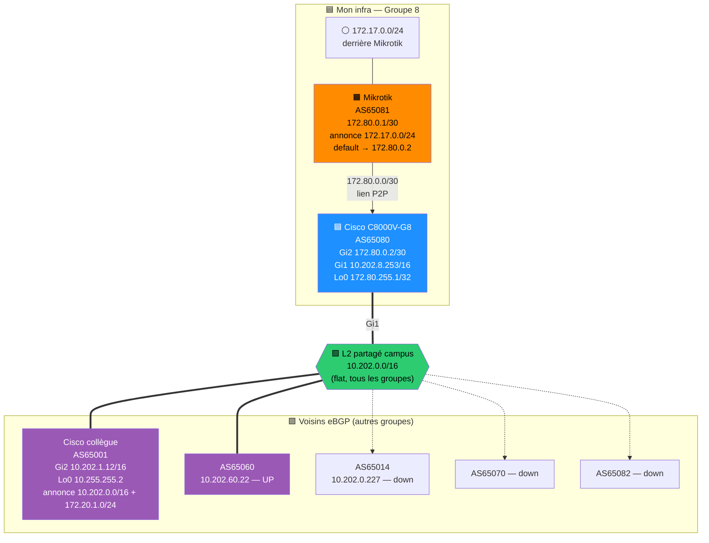

# Infra Physique — Cisco + Mikrotik + eBGP

> [!info] Groupe 8 — URTADO Pierre · SAE4D01 · état au 2026-06-17
> Routeur perso C8000V-G8 (AS65080) + Mikrotik (AS65081) en leaf.
> Tout le monde sur le L2 partagé campus `10.202.0.0/16`. eBGP entre groupes.

---

## Topologie physique

---

## Sessions eBGP — mon Cisco (AS65080)

| Voisin | AS | IP peer | État | Préfixes reçus |
|--------|----|---------|------|----------------|
| Collègue | 65001 | 10.202.1.12 | Established | 10.202.0.0/16, 172.20.1.0/24 |
| — | 65060 | 10.202.60.22 | Established | — |
| Mikrotik | 65081 | 172.80.0.1 | Established | 172.17.0.0/24 |
| — | 65014 | 10.202.0.227 | ❌ down | — |
| — | 65070 | — | ❌ down | — |
| — | 65082 | — | ❌ down | — |

---

## Ce que j'annonce (AS65080)

| Préfixe | Origine | Poussé aux peers UP |
|---------|---------|---------------------|
| `172.80.0.0/30` | lien Cisco↔Mikrotik | |
| `172.80.255.1/32` | ma Loopback0 | |
| `172.17.0.0/24` | appris du Mikrotik (AS65081) | |

---

## Plan d'adressage

| Élément | IP | Rôle |
|---------|-----|------|
| Cisco Gi1 | `10.202.8.253/16` | uplink campus (L2 partagé) |
| Cisco Gi2 | `172.80.0.2/30` | lien vers Mikrotik |
| Cisco Lo0 | `172.80.255.1/32` | IP stable hors zone partagée |
| Mikrotik | `172.80.0.1/30` | leaf |
| Derrière Mikrotik | `172.17.0.0/24` | services |

---

## Notes routage

- Lien renuméroté `172.20.0.0/30` → `172.80.0.0/30` (Mikrotik = `.1`, Cisco = `.2`).
- Mikrotik a une default route `0.0.0.0/0 → 172.80.0.2` = chemin retour vers tout l'extérieur.
- Loopback `172.80.255.1/32` hors `10.202.0.0/16` → pas shadowée par le /16 connecté de tout le monde → joignable de partout (longest-match /32 bat /16).
- Piège du /16 partagé : sourcer un ping depuis une IP `10.202.x.x` = shadowée par le connecté → préférer IP annoncée hors zone (loopback) ou interface du L2 partagé directement joignable.

---

*Généré 2026-06-17 — données live depuis Cisco 10.202.8.253*
