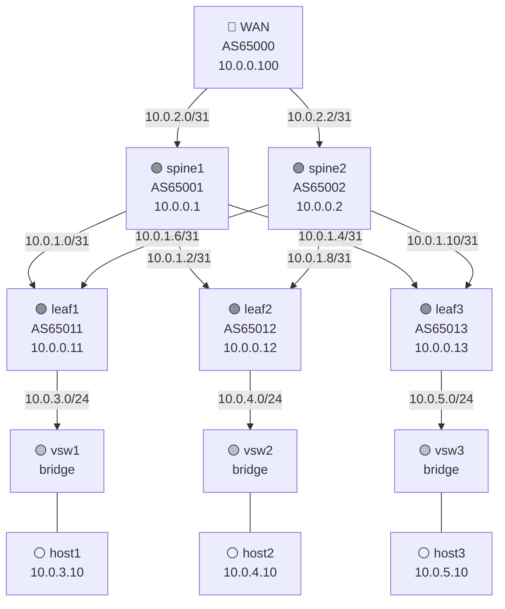

# Leaf-Spine Fabric — Compte rendu

> [!info] Contexte
> **Groupe 8 — URTADO Pierre** · SAE4D01 Datacenters · 2026-06-16
> **VMs Proxmox** : `leaf-spine-lab1` (10.202.8.220) · `leaf-spine-lab2` (10.202.8.221)
> **Outil** : containerlab · **Routage** : FRR 10.6.1 · **Protocol** : eBGP underlay

---

## Objectif

Déployer sur 2 VMs Debian indépendantes une infrastructure **leaf-spine** complète avec :
- 2 spines + 3 leaves en eBGP (chaque nœud = AS distinct)
- Un routeur WAN connecté aux deux spines
- Des virtual switches Linux (bridges) par leaf pour accueillir des services
- Un hôte de test (HTTP) derrière chaque virtual switch
- Connectivité end-to-end entre tous les hôtes via le fabric BGP

---

## Infrastructure Proxmox

| Ressource | Valeur |
|-----------|--------|
| Nœud Proxmox | `pvepierre` — 10.202.8.101 |
| OS image | Debian 12 (`debian-12-genericcloud-amd64.qcow2`) |
| VM 220 | `leaf-spine-lab1` — 8 vCPU, 16 GB RAM, 60 GB ZFS |
| VM 221 | `leaf-spine-lab2` — 8 vCPU, 16 GB RAM, 60 GB ZFS |
| Réseau | vmbr0 — 10.202.8.220/16 / 10.202.8.221/16 |

Les deux VMs sont identiques et indépendantes. Chacune héberge la même topologie containerlab.

---

## Topologie



### Plan d'adressage

| Lien | Subnet | IP gauche | IP droite |
|------|--------|-----------|-----------|
| spine1 ↔ leaf1 | 10.0.1.0/31 | spine1: .0 | leaf1: .1 |
| spine1 ↔ leaf2 | 10.0.1.2/31 | spine1: .2 | leaf2: .3 |
| spine1 ↔ leaf3 | 10.0.1.4/31 | spine1: .4 | leaf3: .5 |
| spine2 ↔ leaf1 | 10.0.1.6/31 | spine2: .6 | leaf1: .7 |
| spine2 ↔ leaf2 | 10.0.1.8/31 | spine2: .8 | leaf2: .9 |
| spine2 ↔ leaf3 | 10.0.1.10/31 | spine2: .10 | leaf3: .11 |
| spine1 ↔ WAN | 10.0.2.0/31 | spine1: .0 | wan: .1 |
| spine2 ↔ WAN | 10.0.2.2/31 | spine2: .2 | wan: .3 |
| leaf1 → services | 10.0.3.0/24 | leaf1: .1 | vsw1/host1 |
| leaf2 → services | 10.0.4.0/24 | leaf2: .1 | vsw2/host2 |
| leaf3 → services | 10.0.5.0/24 | leaf3: .1 | vsw3/host3 |

### ASNs eBGP

| Nœud | AS | Router-ID |
|------|----|-----------|
| wan | 65000 | 10.0.0.100 |
| spine1 | 65001 | 10.0.0.1 |
| spine2 | 65002 | 10.0.0.2 |
| leaf1 | 65011 | 10.0.0.11 |
| leaf2 | 65012 | 10.0.0.12 |
| leaf3 | 65013 | 10.0.0.13 |

---

## Déploiement

### Prérequis VMs

```bash
# Installé automatiquement sur chaque VM
apt-get install -y curl git iproute2 net-tools tcpdump iputils-ping
curl -fsSL https://get.docker.com | sh
bash -c "$(curl -sL https://get.containerlab.dev)"
```

### Lancer le lab

```bash
ssh root@10.202.8.220   # ou .221
cd ~/leaf-spine
containerlab deploy -t topology.clab.yml
```

### Arrêter le lab

```bash
containerlab destroy -t topology.clab.yml --cleanup
```

### Fichiers

```
SAE-DevCloud/infra/containerlab/leaf-spine/
├── topology.clab.yml          # topologie containerlab
├── topology-map.html          # cartographie web interactive
└── configs/
    ├── spine1/frr.conf + daemons
    ├── spine2/frr.conf + daemons
    ├── leaf1/frr.conf  + daemons
    ├── leaf2/frr.conf  + daemons
    ├── leaf3/frr.conf  + daemons
    └── wan/frr.conf    + daemons
```

---

## Vérifications

### BGP sessions — spine1

```
IPv4 Unicast Summary:
BGP router identifier 10.0.0.1, local AS number 65001

Neighbor        V         AS   MsgRcvd   MsgSent   TblVer  InQ OutQ  Up/Down State/PfxRcd   PfxSnt Desc
10.0.1.1        4      65011        16        15       10    0    0 00:06:57            3       10 leaf1
10.0.1.3        4      65012        15        15       10    0    0 00:06:57            3       10 leaf2
10.0.1.5        4      65013        15        15       10    0    0 00:06:57            3       10 leaf3
10.0.2.1        4      65000        15        15       10    0    0 00:06:57            3       10 wan

Total number of neighbors 4
```

> [!success] 4/4 sessions BGP Established sur spine1

### BGP sessions — leaf1

```
Neighbor        V         AS   MsgRcvd   MsgSent   TblVer  InQ OutQ  Up/Down State/PfxRcd   PfxSnt Desc
10.0.1.0        4      65001        15        17       11    0    0 00:06:57            8       10 spine1
10.0.1.6        4      65002        15        17       11    0    0 00:06:55            7       10 spine2

Total number of neighbors 2
```

> [!success] leaf1 reçoit 8 préfixes de spine1 (full table fabric + WAN)

### Routes BGP spine1

```
B>* 10.0.0.2/32   via 10.0.1.3, eth2    ← loopback spine2 (via leaf2)
B>* 10.0.0.11/32  via 10.0.1.1, eth1    ← loopback leaf1
B>* 10.0.0.12/32  via 10.0.1.3, eth2    ← loopback leaf2
B>* 10.0.0.13/32  via 10.0.1.5, eth3    ← loopback leaf3
B>* 10.0.0.100/32 via 10.0.2.1, eth4    ← loopback WAN
B>* 10.0.3.0/24   via 10.0.1.1, eth1    ← services leaf1
B>* 10.0.4.0/24   via 10.0.1.3, eth2    ← services leaf2
B>* 10.0.5.0/24   via 10.0.1.5, eth3    ← services leaf3
B>* 100.64.0.0/24 via 10.0.2.1, eth4    ← préfixe WAN
```

### Connectivité end-to-end

```bash
# host1 (10.0.3.10) → host2 (10.0.4.10) : path host1→vsw1→leaf1→spine1→leaf2→vsw2→host2
docker exec clab-leaf-spine-host1 ping -c 3 10.0.4.10
# 3 packets transmitted, 3 received, 0% packet loss, avg 0.206 ms

# host1 → WAN (100.64.0.1)
docker exec clab-leaf-spine-host1 ping -c 3 100.64.0.1
# 3 packets transmitted, 3 received, 0% packet loss, avg 0.168 ms
```

> [!success] Connectivité inter-leaves et vers WAN : 0% packet loss

---

## Cartographie interactive

Ouvrir `SAE-DevCloud/infra/containerlab/leaf-spine/topology-map.html` dans un navigateur.
Topologie vis.js avec hiérarchie WAN → Spines → Leaves → vSwitches → Hosts, color-coded par rôle.

---

## Commandes utiles

```bash
# Se connecter à un nœud FRR
docker exec -it clab-leaf-spine-spine1 vtysh

# Voir les routes BGP
vtysh -c "show ip route bgp"
vtysh -c "show bgp summary"
vtysh -c "show bgp ipv4 unicast"

# Ping entre hôtes (depuis la VM)
docker exec clab-leaf-spine-host1 ping 10.0.4.10
docker exec clab-leaf-spine-host1 ping 100.64.0.1

# Voir tous les containers
docker ps --filter name=clab-leaf-spine

# Détruire et recréer
cd ~/leaf-spine
containerlab destroy -t topology.clab.yml --cleanup
containerlab deploy  -t topology.clab.yml
```

---

## Architecture — choix techniques

| Choix | Raison |
|-------|--------|
| eBGP pur (pas d'iBGP) | Standard datacenter modern ; chaque nœud = AS distinct, pas de route reflector nécessaire |
| FRR 10.6.1 | Image frrouting officielle, même stack que les labs EVPN/VXLAN du projet |
| /31 sur les P2P | RFC 3021 — économie d'adresses, standard spine-leaf |
| Virtual switch Linux bridge | Simule un ToR access switch sans overhead supplémentaire |
| python:3.13-alpine host | Léger, HTTP server natif `python3 -m http.server` pour tests |
| 2 VMs identiques | Isolation complète entre instances ; labs parallèles possibles |

---

*Généré le 2026-06-16 — Proxmox pvepierre — containerlab leaf-spine*
