# SAE4D01 DevCloud — Pierre URTADO

> Groupe 8 · BUT R&T · IUT Béziers · 2026-06-10 → 18

---

## Infrastructure physique

| | |
|--|--|
| **Proxmox** pvepierre | `10.202.8.101` root / `<REDACTED>` |
| **VM220** leaf-spine-lab1 | `10.202.8.220` root / clé `~/.ssh/id_ed25519` |
| **VM221** | existe sur Proxmox (réservée) |
| **RAM/CPU VM220** | 15 GB, 8 cores, Debian |
| **Stack** | Docker + containerlab 0.76.1 + FRR 10.6.1 |

```bash
ssh -i ~/.ssh/id_ed25519 root@10.202.8.220
/Applications/Tailscale.app/Contents/MacOS/Tailscale up --accept-routes --reset
```

---

## Vocabulaire et notions fondamentales

### BGP — Border Gateway Protocol

Protocole de routage inter-domaines (entre AS distincts). Seul protocole du réseau internet mondial. Contrairement à OSPF/RIP qui calculent le meilleur chemin via une métrique, BGP prend ses décisions sur des **attributs de politique** (AS-path, MED, Local Preference…).

- **eBGP** (external BGP) : session entre deux routeurs d'AS différents. Next-hop réécrit automatiquement à chaque saut → propagation native.
- **iBGP** (internal BGP) : session entre routeurs du **même AS**. Next-hop NON réécrit → problème de résolution. Règle anti-boucle : un routeur ne re-propage jamais une route apprise en iBGP à un autre pair iBGP → nécessite full-mesh ou Route Reflector.
- **AS** (Autonomous System) : groupe de réseaux sous une même politique de routage, identifié par un numéro (ASN). Plage privée : 64512–65535.
- **Session BGP** : connexion TCP port 179. États : Idle → Connect → Active → OpenSent → OpenConfirm → **Established**.
- **PfxRcd** : nombre de préfixes (routes) reçus du voisin.
- **RIB-failure** (`r>`) : route BGP reçue mais non installée car une route plus spécifique ou de meilleure distance admin existe déjà.

### RFC 7938 — BGP dans les datacenters

Standard qui préconise **un AS par équipement** + **eBGP partout** (même intra-datacenter). Avantages :
- Pas de full-mesh iBGP (O(n²) sessions)
- Propagation transitive native : une route apprise d'un leaf est automatiquement réannoncée vers les autres voisins sans config supplémentaire
- Détection de boucles via AS-path

### Route Reflector (RR)

Solution au problème iBGP full-mesh. Un RR est autorisé à **réfléchir** (re-propager) les routes iBGP reçues de ses clients vers les autres clients.

- `route-reflector-client` : désigne un voisin comme client du RR
- `next-hop-self` : le RR réécrit le next-hop en sa propre IP → les clients peuvent résoudre les routes réfléchies
- **`next-hop-self force`** : requis dans FRR pour forcer la réécriture même sur les routes réfléchies (bug/comportement FRR)
- `bgp cluster-id` : évite les boucles si plusieurs RR coexistent

### OSPF — Open Shortest Path First

Protocole de routage à état de lien (IGP). Calcule le plus court chemin via l'algorithme Dijkstra. Utilisé ici en **underlay** pour assurer la joignabilité des loopbacks entre routeurs (prérequis au peering iBGP via loopbacks).

- **Area 0** (backbone) : zone centrale OSPF, toutes les autres areas doivent y être connectées
- **Adjacence Full/-** : état normal sur un lien point-to-point. Les deux routeurs ont échangé toute leur LSDB.
- **DR/BDR** (Designated Router) : élu sur les réseaux broadcast pour réduire les échanges. Sur des liens /31, OSPF en mode broadcast tente d'élire un DR mais échoue → adjacence bloquée à 2-Way/DROther. **Fix :** `ip ospf network point-to-point`
- **Passive-interface** : interface annoncée dans OSPF mais sans échange de paquets Hello (côté hosts)

### ECMP — Equal-Cost Multi-Path

Répartition du trafic sur plusieurs chemins de coût égal simultanément. Augmente la bande passante disponible et la résilience. En BGP : `maximum-paths 3 ecmp 3` (EOS) ou automatique (FRR avec multipath activé).

### Loopback

Interface virtuelle toujours active (pas de panne physique possible). Utilisée comme :
- Router-ID BGP/OSPF (identifiant stable)
- Source des sessions iBGP via loopbacks (peering via l'underlay OSPF)
- VTEP source pour VXLAN

### VXLAN — Virtual eXtensible LAN

Encapsulation de trames Ethernet dans des paquets UDP (port 4789). Permet d'étendre un réseau L2 sur un réseau L3 routable.

- **VNI** (VXLAN Network Identifier) : identifiant 24 bits du segment L2 (≡ VLAN ID mais global, 16M valeurs vs 4096)
- **VTEP** (VXLAN Tunnel EndPoint) : équipement qui encapsule/décapsule les trames. IP source = loopback du leaf.
- **Underlay** : réseau IP routé qui transporte les paquets VXLAN (ici OSPF)
- **Overlay** : réseau L2 virtuel transporté dans VXLAN
- **Ingress replication** : chaque VTEP réplique le trafic BUM (Broadcast/Unknown-unicast/Multicast) vers tous les autres VTEPs en unicast → limite de scalabilité (O(n) réplications)
- **Data-plane learning** : apprentissage des MACs dans le plan de données (comme un switch classique). Pas scalable.

### EVPN — Ethernet VPN

Extension BGP (`address-family l2vpn evpn`) qui utilise BGP comme plan de contrôle pour VXLAN. Remplace l'ingress replication statique et le data-plane learning.

- **Type 2** (MAC/IP Advertisement) : annonce d'une MAC (et son IP) vers les autres VTEPs via BGP
- **Type 3** (Inclusive Multicast Ethernet Tag / IMET) : annonce qu'un VTEP participe à un VNI → remplace la flood list statique
- `advertise-all-vni` : le leaf annonce automatiquement tous ses VNIs en BGP EVPN

### NFVIS — Network Function Virtualization Infrastructure Software

Hyperviseur Cisco sur boîtier Catalyst 8200. Transforme le routeur physique en plateforme de virtualisation réseau : déploie des VMs routeurs/pare-feux (C8000v, FRR…) sans matériel supplémentaire.

### Containerlab

Outil de création de topologies réseau dans des conteneurs Docker. Définit nœuds et liens dans un fichier YAML (`topology.clab.yml`). Crée automatiquement les interfaces veth entre conteneurs. Supporte FRR, Arista cEOS, Nokia SR Linux…

### /31 subnets (RFC 3021)

Masque /31 = 2 adresses, utilisées pour les liens point-to-point. Pas d'adresse de réseau ni de broadcast → économie d'adresses sur les liens underlay.

### MTU et VXLAN overhead

VXLAN ajoute 50 octets d'overhead (Eth 14 + IP 20 + UDP 8 + VXLAN 8). Sur un lien MTU 1500, les paquets de 1450 octets passent. **Fix :** augmenter le MTU de l'underlay à 1550+ ou réduire le MTU de l'overlay à 1450.

---

## Architecture fabric commune (VM220)

```
         [spine1]         [spine2]
        /    |    \      /    |    \
   [leaf1] [leaf2] [leaf3]
      |       |       |
   [host1] [host2] [host3]
```

| Lien | Subnet /31 | spine | leaf |
|------|-----------|-------|------|
| spine1–leaf1 | 10.0.1.0/31 | .0 | .1 |
| spine1–leaf2 | 10.0.1.2/31 | .2 | .3 |
| spine1–leaf3 | 10.0.1.4/31 | .4 | .5 |
| spine2–leaf1 | 10.0.1.6/31 | .6 | .7 |
| spine2–leaf2 | 10.0.1.8/31 | .8 | .9 |
| spine2–leaf3 | 10.0.1.10/31 | .10 | .11 |

Loopbacks : spine1=10.255.0.1, spine2=10.255.0.2, leaf1=10.255.0.11, leaf2=10.255.0.12, leaf3=10.255.0.13

---

## Partie I — Cisco NFVIS + C8000v + Mikrotik eBGP physique

> Séances 10/06 → 15/06/2026. Simulation d'un datacenter cloud réel avec équipements physiques du groupe 8.

### 1. Mise en service NFVIS (10/06/2026)

Boîtier Catalyst 8200 = plateforme NFVIS. Avant de déployer des services, il faut le rendre administrable : SSH, adressage WAN/LAN.

**Boot NFVIS :** initialisation services, montage filesystem, détection interfaces.

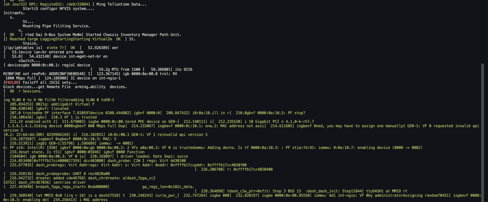

**Première connexion SSH + reset mot de passe** (mécanisme sécurité imposé, critères : 7 cars min, maj, min, chiffre, spécial) :

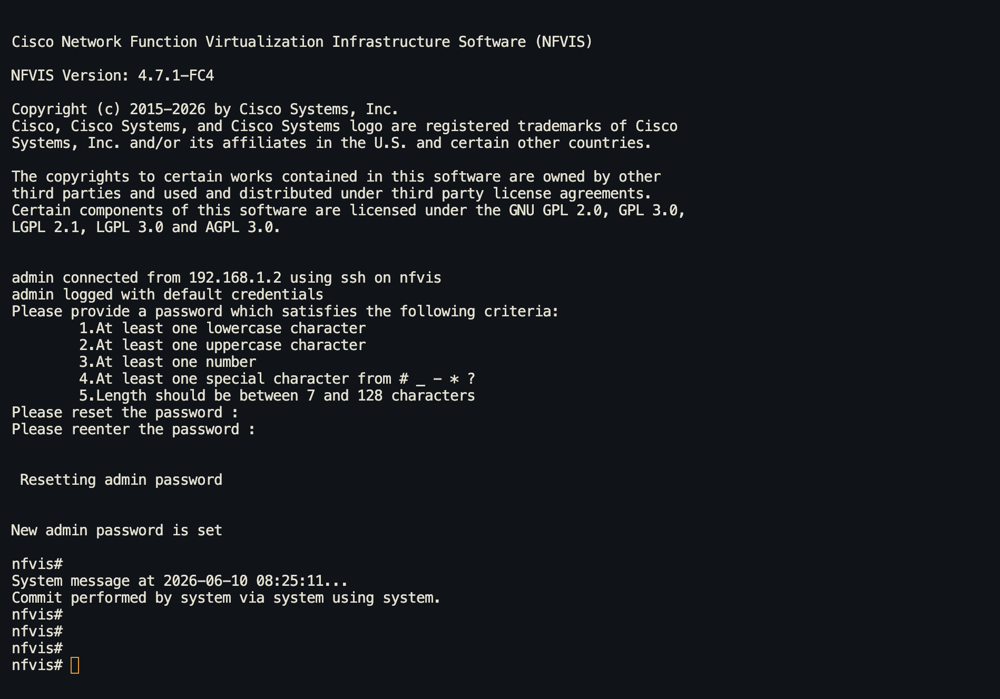

**Configuration interfaces WAN/LAN :**

| Interface | IP | Rôle |
|-----------|-----|------|
| wan-br (GE0) | 10.202.8.254/16 | accès réseau salle |
| lan-br (GE2) | 172.16.0.254/24 | management local groupe 8 |

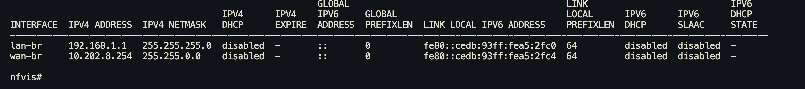
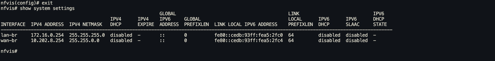


### 2. Déploiement VM C8000v sur NFVIS via API REST

**C8000v** = routeur Cisco IOS XE entièrement virtualisé. Déployé sur NFVIS → routeur BGP programmable sans matériel supplémentaire.

Images NFVIS actives : `c8000V-universalk9_16G_serial.17.04.01a.tar.gz`, `debian-11`, `frr-8.2.2`. Profils : **C8000V-medium** (4 vCPU, 4 GB RAM) et **C8000V-mini** (1 vCPU).

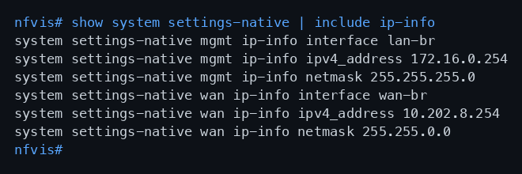

> **Problème rencontré — interface web NFVIS inutilisable**
> L'UI web NFVIS (`https://10.202.8.254`) ne permettait pas de finaliser la création de la VM C8000v (formulaire de déploiement buggé, options non accessibles). Contournement : **API REST NFVIS** directement via `curl`. L'API REST NFVIS expose le modèle de données YANG via des endpoints JSON — même modèle que l'UI, accessible programmatiquement.

#### Étape 1 — Vérifier les images et profils disponibles

```bash
# Images uploadées sur le NFVIS
curl -k -u admin:<REDACTED> \
  "https://10.202.8.254/api/config/vm_lifecycle/opdata/images?deep" \
  -H "Accept: application/vnd.yang.data+json"

# Profils matériels (flavors)
curl -k -u admin:<REDACTED> \
  "https://10.202.8.254/api/config/vm_lifecycle/opdata/flavors" \
  -H "Accept: application/vnd.yang.data+json"
```

Résultat attendu : image `c8000V-universalk9_16G_serial.17.04.01a` en état **ACTIVE**, flavors `C8000V-medium` (4 vCPU, 4096 MB) et `C8000V-mini` (1 vCPU).

#### Étape 2 — Vérifier les réseaux disponibles

```bash
curl -k -u admin:<REDACTED> \
  "https://10.202.8.254/api/config/vm_lifecycle/opdata/networks" \
  -H "Accept: application/vnd.yang.data+json"
```

Réseaux clés : `int-mgmt-net` (management interne → Gi1 de la VM), `wan-net` (bridgé sur GE0/wan-br → accès campus `10.202.8.0/24`), `lan-net` (bridgé sur GE2/lan-br → lien Mikrotik).

#### Étape 3 — Déployer la VM avec bootstrap Day-0

Le **Day-0 config** est un fichier IOS XE injecté au premier boot. Contient : hostname, credentials SSH, clé RSA. Rend le déploiement reproductible sans console série.

```bash
curl -k -u admin:<REDACTED> -X POST \
  "https://10.202.8.254/api/config/vm_lifecycle/tenants/admin/deployments" \
  -H "Content-Type: application/vnd.yang.data+json" \
  -H "Accept: application/vnd.yang.data+json" \
  -d '{
    "deployment": [{
      "name": "C8000V-G8",
      "vm_group": [{
        "name": "C8000V-G8",
        "image": "c8000V-universalk9_16G_serial.17.04.01a",
        "flavor": "C8000V-medium",
        "bootup_time": 600,
        "recovery_wait_time": 0,
        "interfaces": {
          "interface": [
            { "nicid": 0, "network": "int-mgmt-net" },
            { "nicid": 1, "network": "wan-net" },
            { "nicid": 2, "network": "lan-net" }
          ]
        },
        "config_data": [{
          "dst": "iosxe_config.txt",
          "data": "hostname C8000V-G8\r\nusername admin privilege 15 secret <REDACTED>\r\nip domain-name lab.local\r\ncrypto key generate rsa modulus 2048\r\nip ssh version 2\r\nline vty 0 4\r\n login local\r\n transport input ssh\r\n"
        }]
      }]
    }]
  }'
```

Réponse HTTP 201 = déploiement accepté. La VM passe en état **Booting**.

#### Étape 4 — Vérifier le statut

```bash
curl -k -u admin:<REDACTED> \
  "https://10.202.8.254/api/config/vm_lifecycle/opdata/tenants/admin/deployments/deployment/C8000V-G8?deep" \
  -H "Accept: application/vnd.yang.data+json"
```

États successifs : `DEPLOYING` → `BOOTING` → `ALIVE`. `SERVICE_ERROR_STATE` possible en parallèle = cosmétique (VNF sans heartbeat NFVIS), VM opérationnelle quand même.

**Bootstrap Day-0 appliqué** — hostname `C8000V-G8` visible sur la console boot :

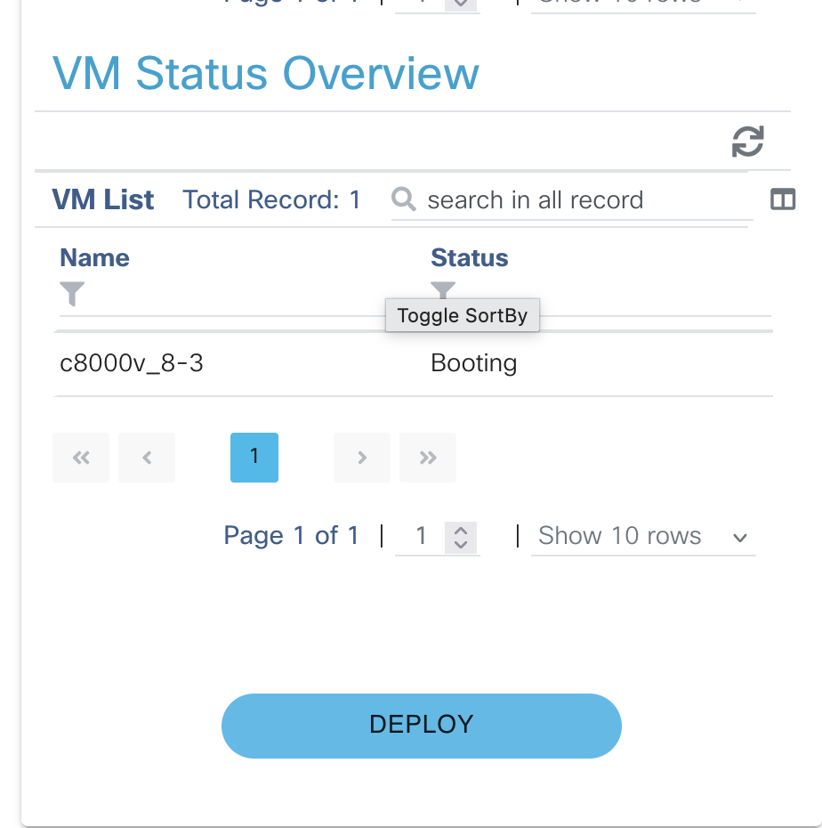

**Statut Booting côté NFVIS :**

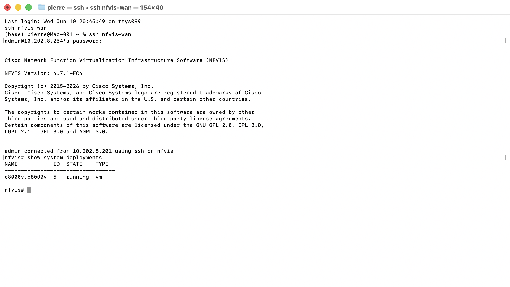

**Boot IOS XE** (fsck filesystem, auditctl, interface management MAC `52:54:00:21:89:68`, message "Instance booted in private cloud") :

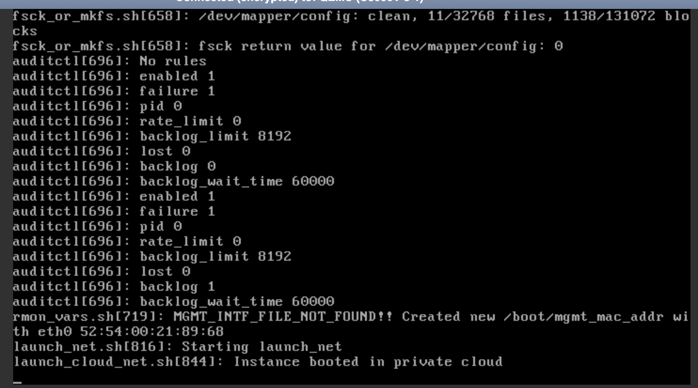
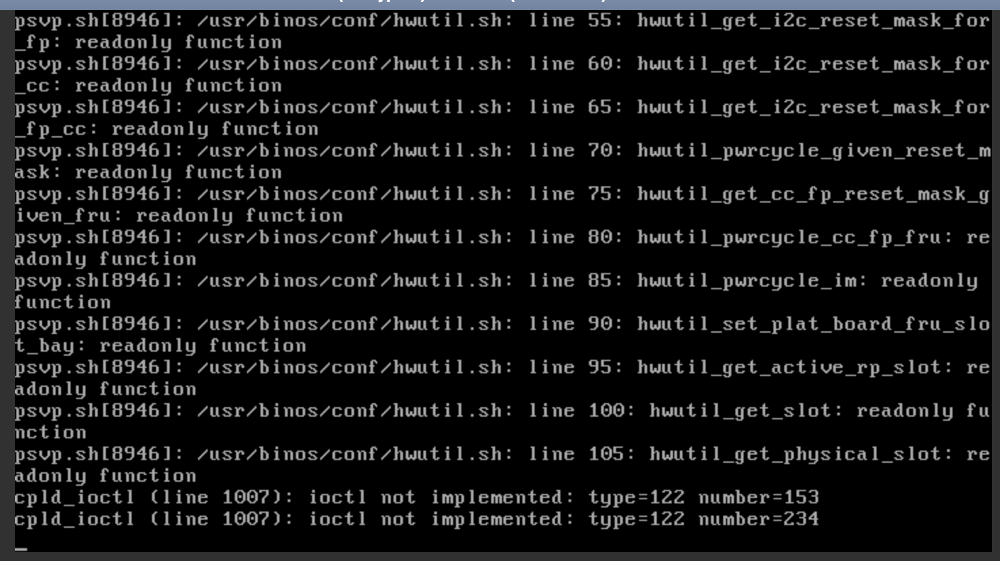

Accès : IP `10.202.8.253`, user `admin`, pass `<REDACTED>`.

### 3. Vérifications CLI C8000v

**VM enregistrée `running` côté NFVIS :**

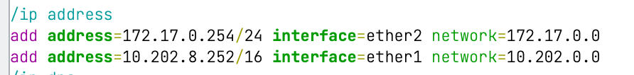

**Interfaces du routeur** (`show ip interfaces brief`) — Gi1 up/up `10.202.8.253`, Gi2 up/up pour lien dédié Mikrotik :

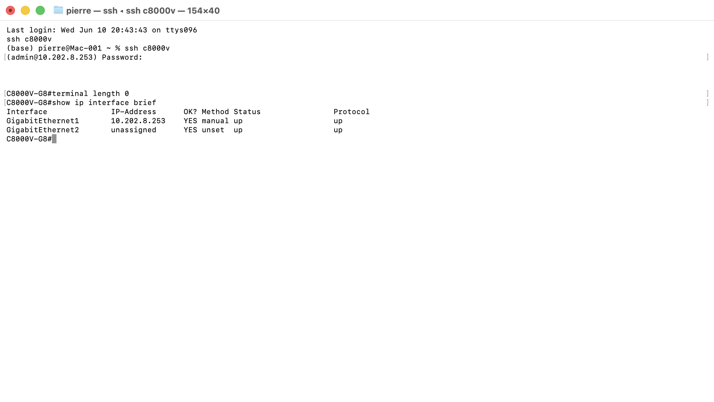

**Version IOS XE** — 17.04.01a, hostname `C8000V-G8` (prouve bootstrap Day-0 appliqué) :


**Config BGP spine AS 65080** — `router bgp 65080`, `network 10.202.8.0` (capture partielle, neighbors configurés séance suivante) :

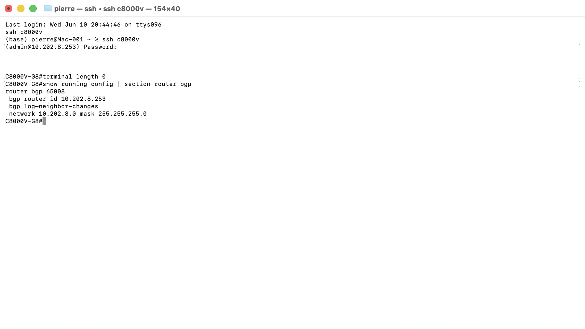

**Table de routage** — routes **B** = BGP apprises dynamiquement (pas de route statique manuelle inter-groupe). `r>` = RIB-failure (route BGP reçue mais non installée car /16 déjà connecté sur Gi1) :

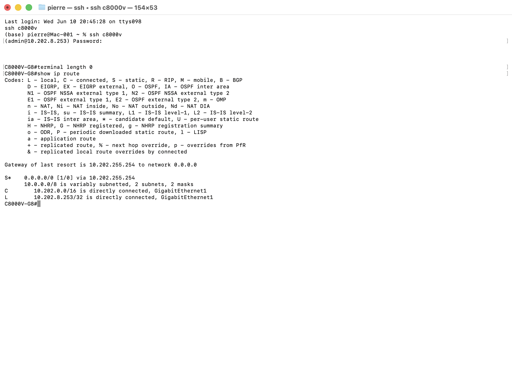

**Joignabilité depuis l'extérieur** (pveval → ping + SSH, 0% perte ~0.4ms) :

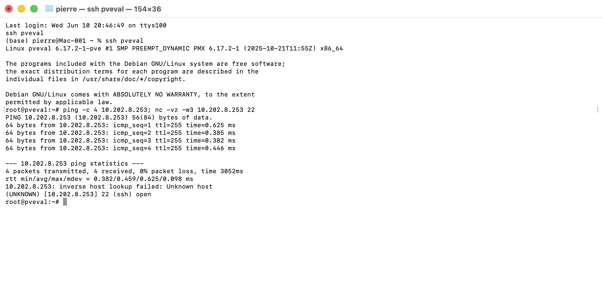

> Note : NFVIS affiche `SERVICE_ERROR_STATE` → cosmétique uniquement (VNF sans heartbeat). VM tourne normalement.

### 4. Configuration Mikrotik (leaf, AS 65081)

Mikrotik hEX RB750Gr3, RouterOS 7.12.1.

> **Contrainte découverte — isolation des ports switch salle :** Mikrotik (.252) et C8000v (.253) ne se joignent pas via le LAN partagé `10.202.8.0/24`. ARP résout des deux côtés (broadcast OK) mais l'unicast entre les deux ports est droppé → mécanisme **private VLAN** / port isolation du switch de salle. **Solution :** câble direct ether2 ↔ NFVIS GE2, subnet dédié `172.20.0.0/30` qui contourne le switch.

| Élément | IP (screens) | IP (final, après renumération) | Rôle |
|---------|-------------|-------------------------------|------|
| Cisco Gi1 | 10.202.8.253/16 | 10.202.8.253/16 | uplink campus |
| Cisco Gi2 | **172.20.0.2/30** | **172.80.0.2/30** | lien dédié Mikrotik |
| Cisco Lo0 | — | 172.80.255.1/32 | IP stable hors /16 partagé (longest-match /32 > /16 → joignable partout) |
| Mikrotik ether1 | 10.202.8.252/16 | 10.202.8.252/16 | management salle |
| Mikrotik ether2 | **172.20.0.1/30** | **172.80.0.1/30** | lien p2p Cisco |
| Derrière Mikrotik | 172.17.0.0/24 | 172.17.0.0/24 | services annoncés en BGP |

> **Renumération du lien P2P :** lien initialement `172.20.0.0/30` (visible sur tous les screens), renommé en `172.80.0.0/30` plus tard dans la séance pour éviter les conflits avec le réseau `172.20.x.x` d'un autre groupe. Aucun screenshot de l'état final 172.80.

**Topologie physique :**


**Adressage Mikrotik** (3 IPs : salle, interne, lien p2p) :


**Session eBGP leaf→spine** (RouterOS 7 : syntaxe `/routing bgp connection`, refonte complète vs ROS6) :


**Filtre sortie `bgp-leaf-out`** : n'accepte que `172.17.0.0/24`, rejette tout le reste. Sans filtre, `redistribute=connected` ferait fuiter `10.202.0.0/16` (réseau de salle entier) vers le spine :

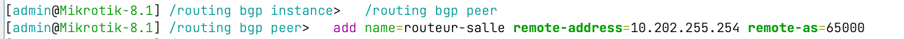

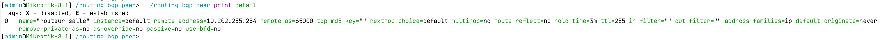
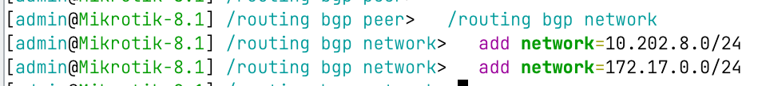

**Routes blackhole ROS7** : `/ip route add dst-address=172.17.0.0/24 blackhole` (distance 254 → n'affecte pas le routage réel, mais permet à BGP de sélectionner et annoncer le préfixe) :

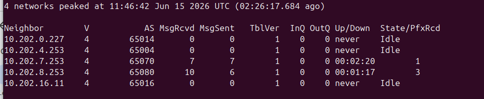

### 5. Fabric eBGP — Sessions établies (11/06/2026)

**Pourquoi eBGP et non iBGP entre leaf et spine ?** En iBGP, un routeur ne re-propage pas une route iBGP à un autre pair iBGP (règle anti-boucle RFC 4271). L'eBGP est transitif : `172.17.0.0/24` du leaf est réannoncé sans configuration supplémentaire. C'est le standard RFC 7938.

Interfaces spine après recâblage — Gi2 = `172.20.0.2` (adressage initial, avant renumération vers 172.80) :

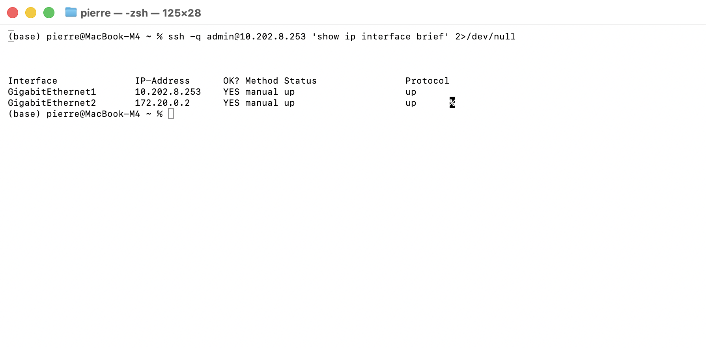

**BGP summary spine — 2 sessions Established** (leaf AS65081 `PfxRcd=1` + voisin AS65014 `PfxRcd=1`) :

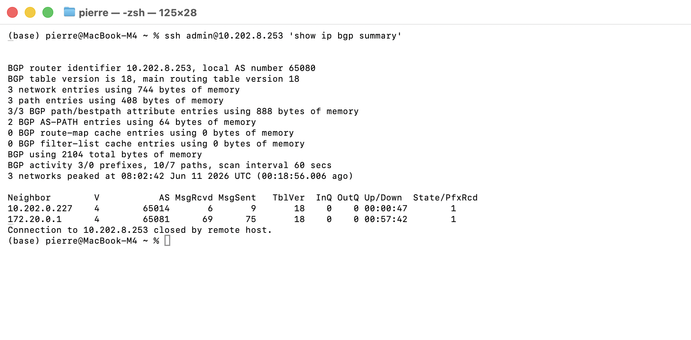

**Table BGP spine** — 3 préfixes : `10.202.8.0/24` (local, via Null0), `172.17.0.0/24` (appris du leaf, next-hop `172.20.0.1`), `10.202.0.0/16` (voisin, RIB-failure normal) :


**Propagation leaf → spine → extérieur** (`172.17.0.0/24` annoncé vers AS65014 — preuve eBGP transitif RFC 7938) :


**Routes installées sur le leaf** (bidirectionnel — `10.202.8.0/24` flags `DAb`, next-hop `172.20.0.2` = adressage initial avant renumération) :


### 6. Ajout peering AS65001 (11/06) + AS65060 (15/06)

`10.202.1.12` AS65001 — préfère chemin direct (AS-path plus court que via AS65014). `10.202.60.22` AS65060.


`10.202.0.0/16` désormais reçu directement de AS65001 ET via AS65014 — BGP préfère AS-path court (direct) :


### 7. Diagnostic — L2 partagé campus perdu (15/06/2026)

```
show ip bgp summary :
10.202.1.12  4  65001  00:00:18  12  ← FLAP (2075 drops, SRTT 413ms)
172.80.0.1   4  65081  01:44:50   1  ← STABLE (0 drop, lien dédié)
```

```
Moi      : Cisco → Gi2 (dédié) → Mikrotik         => 100%
Collègue : Cisco → L2 PARTAGÉ (drop) → mon Cisco  => 0%
```

Root cause : broadcast domain `10.202.0.0/16` mutualisé entre tous les groupes perd des paquets. Pas un défaut de routage (routage prouvé correct des deux côtés via longest-match Loopback0).

### 8. État final C8000v — BGP opérationnel (18/06/2026)

> Après résolution d'un état `VM_ERROR_STATE` (STOP → START via API REST) et suppression d'une route statique `10.202.8.0/24 → Null0` (blackhole legacy qui bloquait la joignabilité depuis le réseau de salle), le C8000v est pleinement opérationnel.

**Interfaces** — Gi1 campus up/up, Gi2 Mikrotik up/up :

```
Interface              IP-Address      OK? Method Status    Protocol
GigabitEthernet1       10.202.8.253    YES NVRAM  up        up
GigabitEthernet2       172.80.0.2      YES NVRAM  up        up
```


**BGP summary — 4 sessions Established** (AS 65080, router-id 10.202.8.253) :

```
Neighbor        V    AS    MsgRcvd MsgSent  Up/Down    State/PfxRcd
10.202.1.12     4  65001      536     486   05:21:02   27
10.202.7.253    4  65070        5      18   00:00:10    1
10.202.60.22    4  65060      483     491   05:20:57   27
172.80.0.1      4  65081      325     490   05:21:08    1
```


**Config BGP finale :**

```bash
router bgp 65080
 bgp router-id 10.202.8.253
 bgp log-neighbor-changes
 network 10.202.8.0 mask 255.255.255.0
 network 172.80.0.0 mask 255.255.255.252
 neighbor 10.202.1.12 remote-as 65001
 neighbor 10.202.7.253 remote-as 65070
 neighbor 10.202.60.22 remote-as 65060
 neighbor 172.80.0.1 remote-as 65081
```

**Table de routage — 30 préfixes BGP reçus :**

```
S*    0.0.0.0/0 [1/0] via 10.202.255.254
C        10.202.0.0/16 is directly connected, GigabitEthernet1
B        10.202.7.0/24 [20/0] via 10.202.7.253
B        172.17.0.0 [20/0] via 172.80.0.1
C        172.80.0.0/30 is directly connected, GigabitEthernet2
B        192.168.60.60 [20/0] via 10.202.60.22
B        192.168.80.x/x [20/0] via 10.202.60.22   (×22 préfixes)
```


**Ping VM220 (10.202.8.220) → C8000v (10.202.8.253) — 0% loss, RTT 0.7ms :**

```bash
4 packets transmitted, 4 received, 0% packet loss
rtt min/avg/max/mdev = 0.689/0.734/0.840/0.061 ms
```

**Connectivity depuis C8000v :**
- `ping 10.202.8.220` (VM220) → `!` 0% loss
- `ping 172.80.0.1` (Mikrotik) → `!` 0% loss

> **Bug résolu :** route statique `ip route 10.202.8.0 255.255.255.0 Null0` présente dans la config — plus spécifique que le `/16` connecté, blackholait tout le trafic vers `10.202.8.x`. Fix : `no ip route 10.202.8.0 255.255.255.0 Null0` + `write memory`.

---

## Partie II — Containerlab Leaf & Spine (15/06/2026)

> Simulation locale sur macOS Docker Desktop avant déploiement physique. 2 leafs Arista cEOS + 3 spines FRR. RFC 7938.

### Plan d'adressage (10.8.0.0/16, Groupe 8)

| Équipement | Rôle | AS BGP | Loopback |
|-----------|------|----|---------|
| leaf1 | Arista cEOS | 65200 | 10.8.0.1/32 |
| leaf2 | Arista cEOS | 65201 | 10.8.0.2/32 |
| spine1 | FRR | 65100 | 10.8.0.11/32 |
| spine2 | FRR | 65101 | 10.8.0.12/32 |
| spine3 | FRR | 65102 | 10.8.0.13/32 |

Liens P2P leaf↔spine en /30 dans `10.8.1.0/24`. Services leaf1 : `10.8.10.0/24`, leaf2 : `10.8.11.0/24`.

### Topologie containerlab


9 containers déployés et actifs :


### Problèmes résolus

| Problème | Cause | Fix |
|----------|-------|-----|
| Routes bloquées `(Policy)` | FRR 10+ active `bgp ebgp-requires-policy` par défaut | `no bgp ebgp-requires-policy` dans chaque frr.conf |
| Conflit réseau Docker | Réseau `clab` en `172.20.20.0/24` déjà existant | Suppression containers/réseaux obsolètes |
| leafs Arista rechargent ancienne config | Cache flash cEOS persistant | `containerlab destroy --cleanup` |
| Préfixes services non annoncés (silencieux) | `network` mal placé en EOS | Placer directement sous `router bgp`, pas dans `address-family ipv4` |

### Config FRR spine1 (AS 65100)

```bash
router bgp 65100
 bgp router-id 10.8.0.11
 no bgp default ipv4-unicast
 no bgp ebgp-requires-policy
 neighbor 10.8.1.2 remote-as 65200   # leaf1
 neighbor 10.8.1.6 remote-as 65201   # leaf2
 address-family ipv4 unicast
  network 10.8.0.11/32
  neighbor 10.8.1.2 activate
  neighbor 10.8.1.6 activate
```

### Config EOS leaf1 (AS 65200)

```bash
router bgp 65200
  router-id 10.8.0.1
  maximum-paths 3 ecmp 3    # ECMP vers les 3 spines
  neighbor 10.8.1.1 remote-as 65100
  neighbor 10.8.1.5 remote-as 65101
  neighbor 10.8.1.9 remote-as 65102
  network 10.8.0.1/32
  network 10.8.10.0/24      # DOIT être ici, pas dans address-family
```

### Vérifications BGP eBGP

BGP summary spine1 (2 sessions Established, PfxRcd = loopbacks + services) :


Routes BGP spine1 (loopbacks + services des 2 leafs) :


BGP summary leaf1 (3 sessions vers 3 spines) :

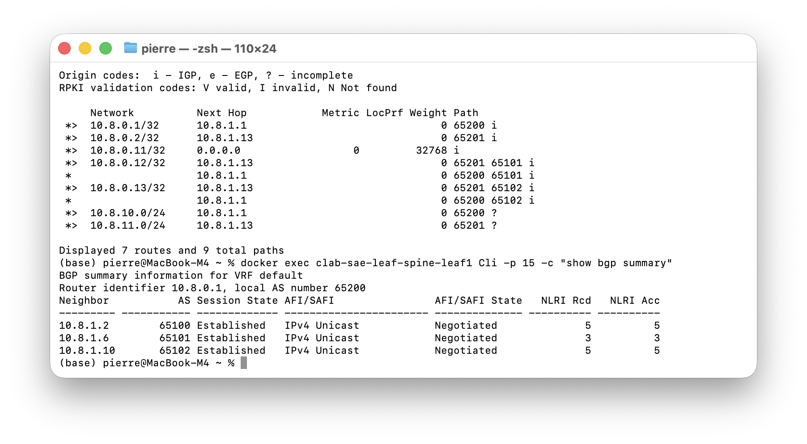

Table de routage BGP leaf1 (ECMP : 3 next-hops pour `10.8.0.2`) :


Ping inter-loopback leaf1 → leaf2 (0% perte) :

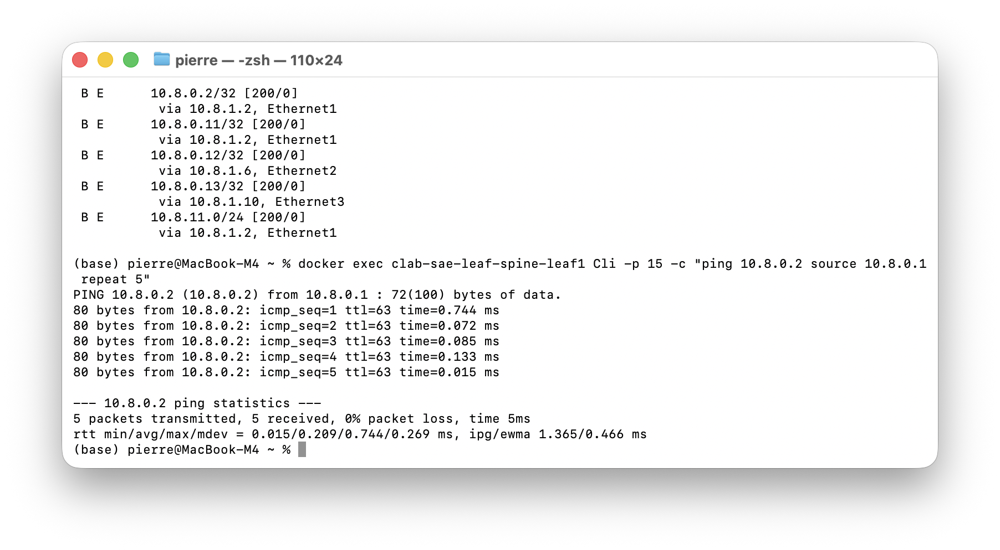

BGP summary leaf2 :

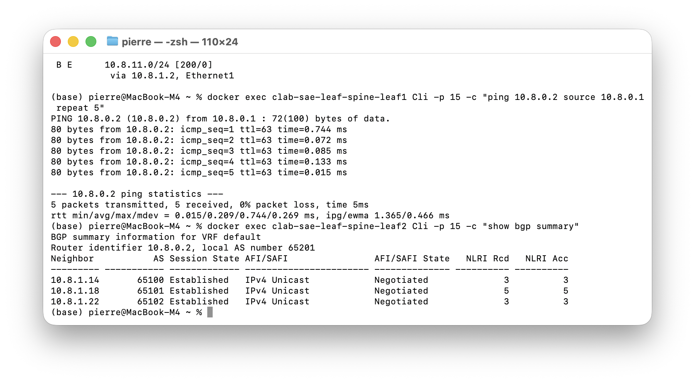

Interfaces leaf1 (toutes connected) :


BGP summary séance 2 — relance à froid, convergence automatique (preuve stabilité config) :

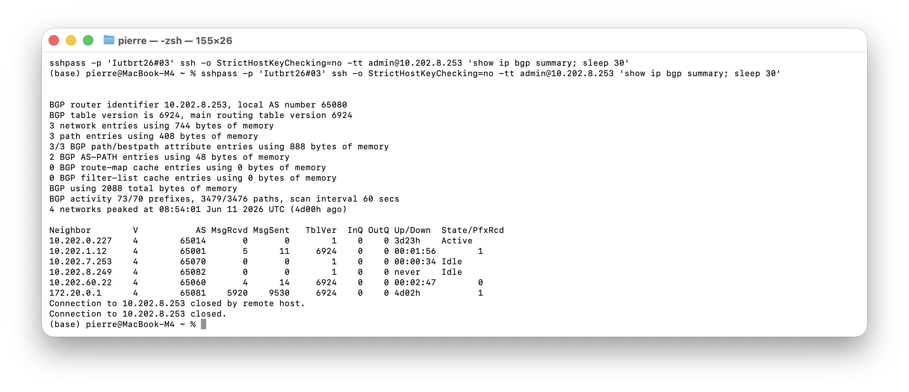

### ECMP et résilience

ECMP actif — 3 chemins égaux vers leaf2 :


**Coupure spine1** : BGP détecte perte de session, basculement automatique sur spine2+spine3, trafic maintenu.

> Simuler avec `ip link set eth1 down`, pas `docker stop` (détruirait les veth pairs containerlab).

BGP après coupure spine1 (2 sessions restantes) :


Routes après coupure (2 next-hops au lieu de 3) :


### iBGP Route Reflector

4 routeurs FRR, AS 65000. RR1 = route reflector central. **Problème iBGP :** sans RR, il faudrait N×(N-1)/2 sessions full-mesh. Avec 4 routeurs : 6 sessions → avec RR : 3 seulement.

**`next-hop-self` critique en topologie star :** sans lui, RR1 reflète les loopbacks de r2/r3 avec leur next-hop direct (`10.8.21.6`), inaccessible depuis r1. Avec `next-hop-self`, RR1 réécrit vers sa propre interface → routes résolvables.

**`bgp cluster-id`** : identifie le cluster RR. Évite les boucles entre plusieurs RR via l'attribut `CLUSTER_LIST`.

RR1 BGP summary (3 sessions iBGP Established) :

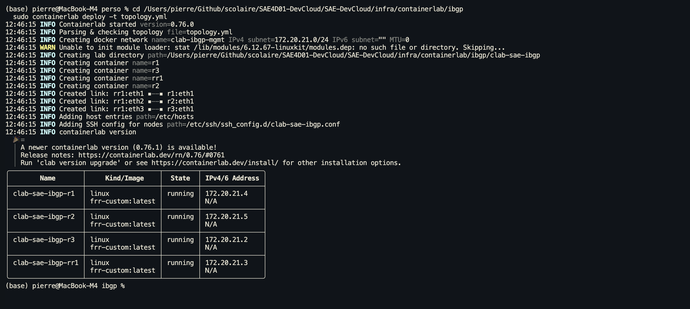

Table BGP RR1 (4 routes : local + 3 loopbacks clients réfléchis `*>i`) :

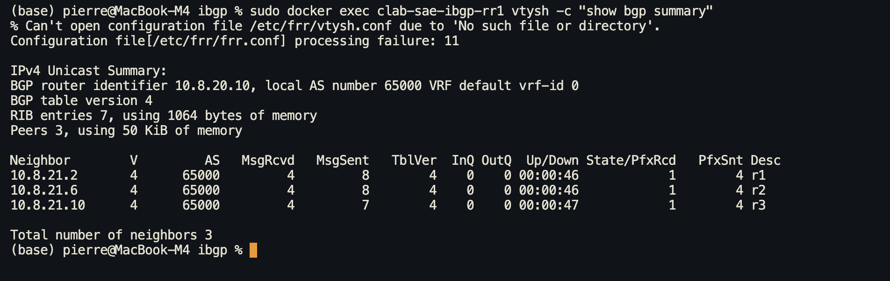

Routes BGP installées r1 (distance [200/0] = iBGP) :


Validation `next-hop-self` sur r1 (next-hop = `10.8.21.1` = eth1 RR1 pour toutes les routes réfléchies) :

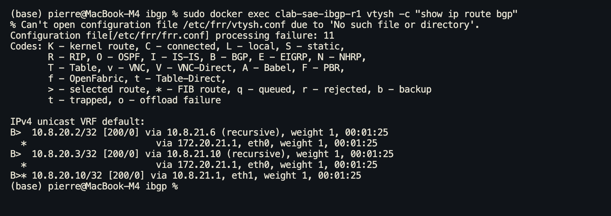

### Mixed eBGP + iBGP

5 routeurs : 2 CE (eBGP, AS distincts) + cœur iBGP (PE1, PE2, core1 — AS 65000, core1 = RR). Simule un réseau opérateur : les CEs se joignent via le cœur iBGP sans se voir directement.

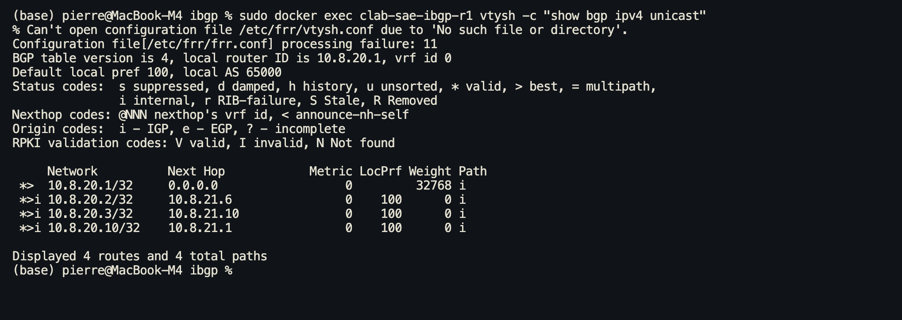
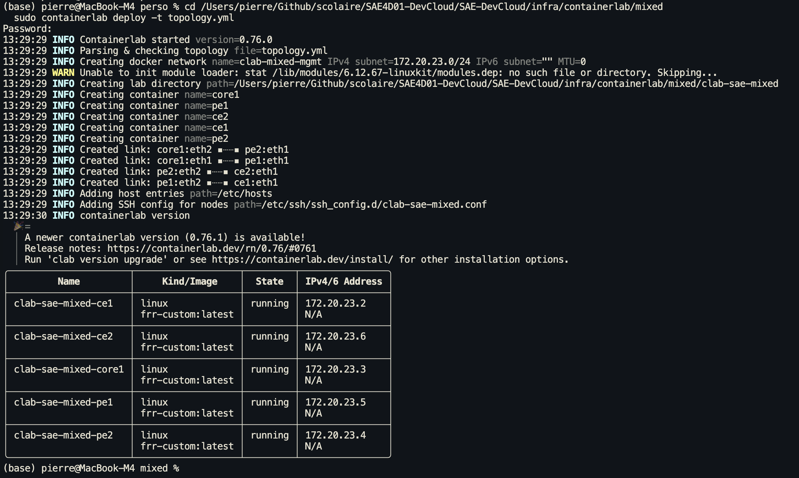
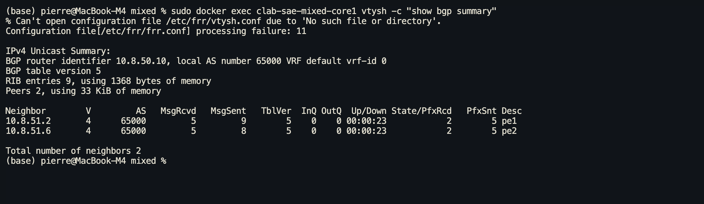


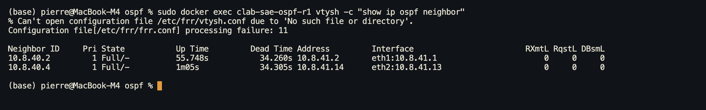


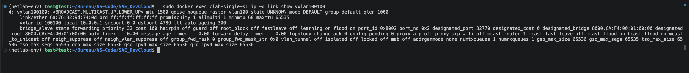
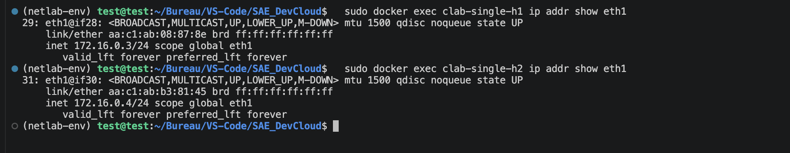


---

## Partie III — VM220 : 5 Topologies FRR + Benchmark

> 2026-06-16/17. FRR 10.6.1, containerlab 0.76.1. Chaque topo déployée séquentiellement.

### Topo 1 — eBGP (`/root/topo-ebgp`)

Un AS par nœud. spine1=65081, spine2=65082, leaf1=65083, leaf2=65084, leaf3=65085. Hosts 192.168.1-3.0/24.

**Résultat :** 6/6 BGP Established, ECMP actif (leaf1 voit 192.168.2/3.0/24 via spine1 ET spine2), ping 0% ~0.18ms.

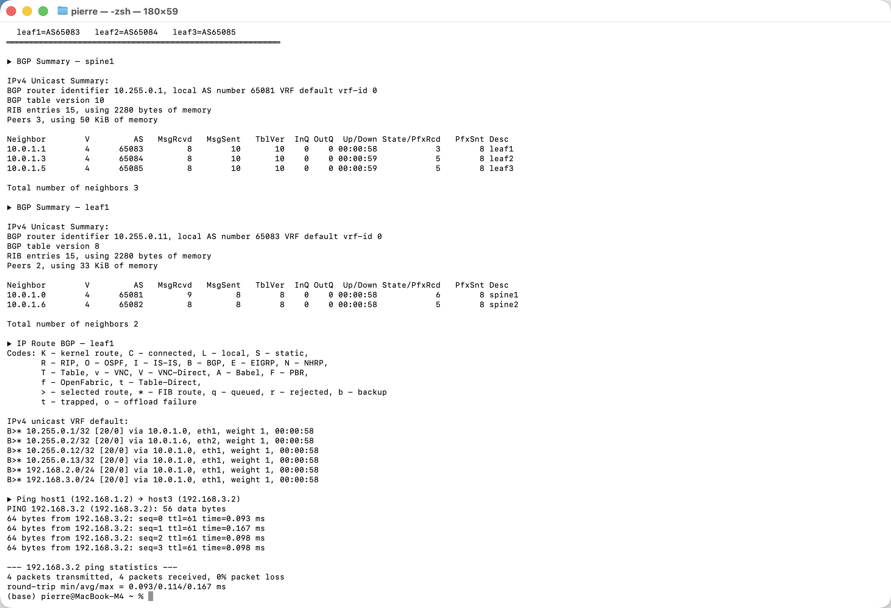

```bash
cd /root/topo-ebgp && containerlab deploy -t topology.clab.yml
docker exec clab-topo-ebgp-spine1 vtysh -c "show bgp summary"
docker exec clab-topo-ebgp-leaf1 vtysh -c "show ip route bgp"
```

### Topo 2 — iBGP Route Reflector (`/root/topo-ibgp-rr`)

AS unique 65080. Spines = RR avec `next-hop-self force`. Leaves = clients RR.

> **Fix FRR critique :** `next-hop-self` seul ne change pas le next-hop sur les routes réfléchies en iBGP dans FRR. Nécessite `next-hop-self force`.

**Résultat :** 6/6 iBGP Established, ECMP 2 next-hops, ping 0% ~0.10ms.

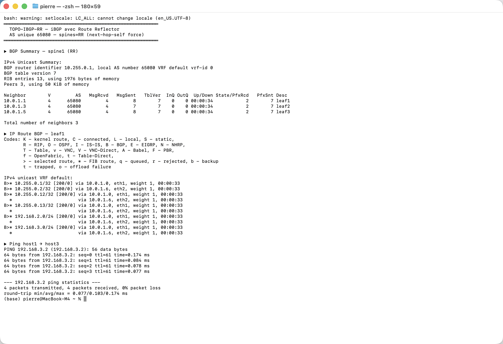

```bash
cd /root/topo-ibgp-rr && containerlab deploy -t topology.clab.yml
docker exec clab-topo-ibgp-rr-spine1 vtysh -c "show bgp summary"
```

### Topo 3 — OSPF (`/root/topo-ospf`)

OSPF area 0 pur. `ip ospf network point-to-point` sur tous liens /31. `passive-interface eth3` sur leaves (côté hosts).

> **Fix critique /31 + OSPF :** sur des subnets /31, OSPF en mode broadcast tente d'élire un DR mais n'y arrive pas → adjacence bloquée à **2-Way/DROther** (jamais Full). `ip ospf network point-to-point` = pas de DR/BDR, adjacence directe.

**Résultat :** 6/6 Full/-, ECMP equal-cost automatique, ping 0% ~0.15ms.

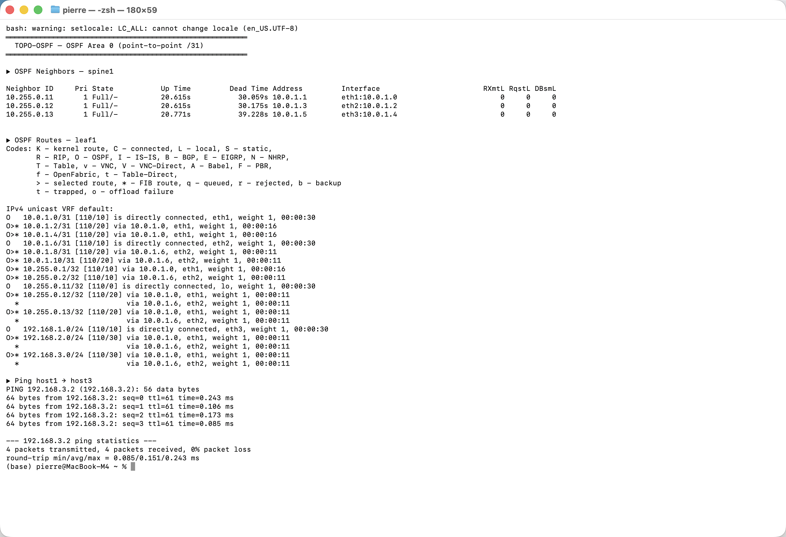

```bash
cd /root/topo-ospf && containerlab deploy -t topology.clab.yml
docker exec clab-topo-ospf-spine1 vtysh -c "show ip ospf neighbor"
```

### Topo 4 — Mixed OSPF + iBGP (`/root/topo-mixed`)

**Underlay :** OSPF area 0 (point-to-point) → joignabilité des loopbacks entre tous les nœuds.  
**Overlay :** iBGP AS 65080, peering via loopbacks (`update-source lo`), spines = RR.  
**Avantage vs topo-ibgp-rr :** pas besoin de `next-hop-self` — l'underlay OSPF résout directement les next-hops loopback.

**Résultat :** OSPF Full/- sur tous liens, BGP via loopbacks Established, ECMP, ping 0% ~0.13ms.

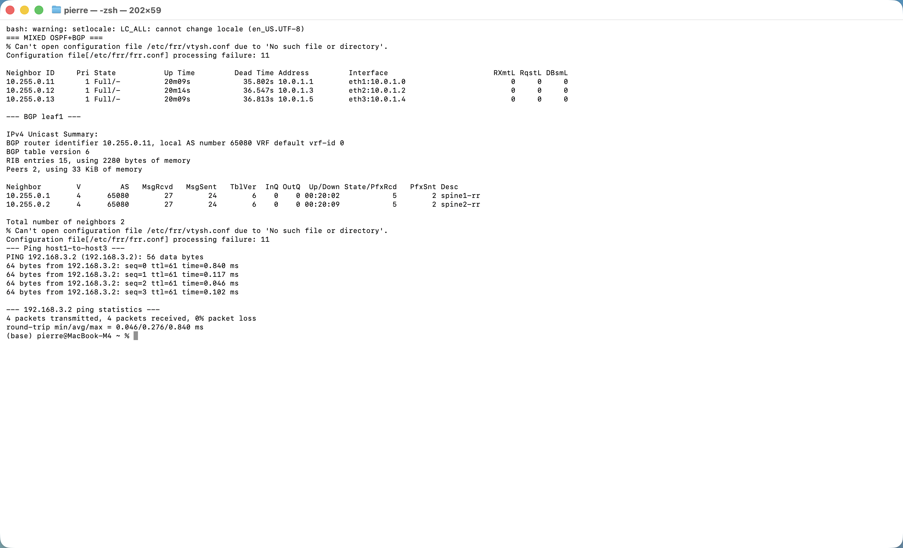

```bash
cd /root/topo-mixed && containerlab deploy -t topology.clab.yml
docker exec clab-topo-mixed-spine1 vtysh -c "show ip ospf neighbor"
docker exec clab-topo-mixed-leaf1 vtysh -c "show bgp summary"
```

### Topo 5 — EVPN/VXLAN (`/root/topo-evpn`)

**Underlay :** OSPF area 0 → joignabilité des loopbacks (= IPs source des VTEPs).  
**Overlay :** BGP EVPN `address-family l2vpn evpn`, spines = RR. VNI 100, VTEP = loopback de chaque leaf.  
**Hosts :** même segment L2 `10.10.10.0/24` — pas de routing inter-hosts, pure L2 over VXLAN.

**Config VXLAN leaf (exec containerlab) :**
```bash
ip addr add 10.255.0.11/32 dev lo    # loopback AVANT vxlan (ordre critique)
ip link add vxlan100 type vxlan id 100 local 10.255.0.11 dstport 4789 nolearning
ip link add br100 type bridge
ip link set vxlan100 master br100
ip link set eth3 master br100        # port host dans le bridge
ip link set vxlan100 up && ip link set br100 up
```

**Config FRR EVPN :**
```bash
address-family l2vpn evpn
  neighbor 10.255.0.1 activate
  neighbor 10.255.0.2 activate
  advertise-all-vni      # annonce tous les VNIs en BGP EVPN
exit-address-family
```

> **Fix reboot/NAS :** interfaces VXLAN créées via `exec` containerlab. Après reboot NAS, containers redémarrent mais les exec ne rejouent **pas** → VNI perdu, BGP en Connect. Fix : `containerlab deploy -t topology.clab.yml --reconfigure` pour rejouer les exec.

**Résultat :** OSPF Full/-, 3/3 EVPN Established, VNI 100 opérationnel sur leaf1 (3 MACs : 1 local + 2 remote VTEPs), Type 2 (MAC/IP) + Type 3 (IMET) présents, ping 10.10.10.2→10.10.10.4 **0% loss, 0.125ms**.

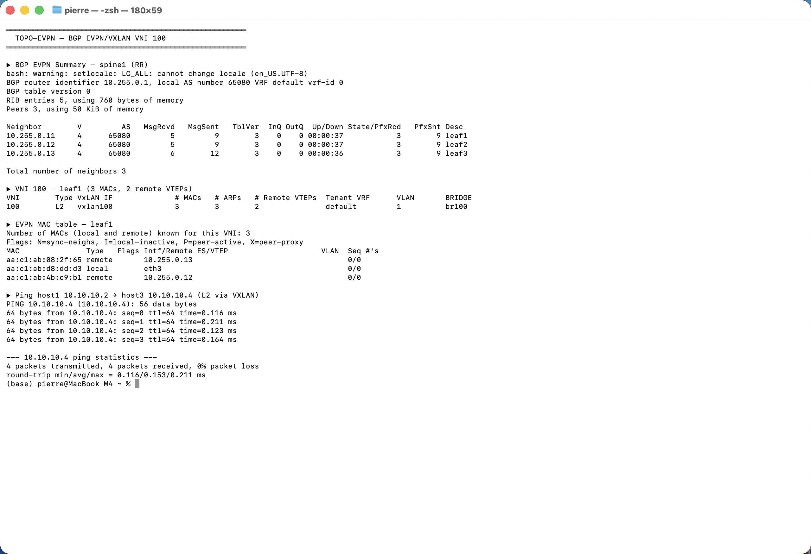

```bash
docker exec clab-topo-evpn-spine1 vtysh -c "show bgp l2vpn evpn summary"
docker exec clab-topo-evpn-leaf1 vtysh -c "show evpn vni"
docker exec clab-topo-evpn-leaf1 vtysh -c "show evpn mac vni 100"
```

---

## Partie IV — Benchmark iperf3

> host1 → host3, TCP 30s + UDP 10G 30s, JSON. Script `/root/benchmark.sh`, résultats `/root/results/*.json`.

**iperf3 :** outil de mesure de débit réseau. Mode client/serveur. `-J` = sortie JSON. `-u` = UDP. `-b 10G` = bande passante cible UDP. `sum_received.bits_per_second` = débit TCP reçu. `sum.bits_per_second` = débit UDP.

### Résultats

| Topo | TCP Gbit/s | UDP Gbit/s | Analyse |
|------|-----------|-----------|---------|
| topo-ebgp | 10.01 | 7.35 | baseline |
| topo-ibgp-rr | 9.60 | 7.37 | légèrement inférieur (overhead RR) |
| topo-ospf | 10.07 | **8.38** | meilleur UDP — moins d'overhead protocole |
| **topo-mixed** | **10.48** | 8.32 | meilleur TCP (+5% vs eBGP) — ECMP optimal OSPF+iBGP |

**topo-mixed meilleur TCP :** ECMP OSPF (underlay) + iBGP (overlay) → chemins équilibrés au niveau le plus bas.  
**topo-ospf meilleur UDP :** protocole le plus simple, moins de tables BGP à maintenir → moins de CPU overhead sur les lookups.

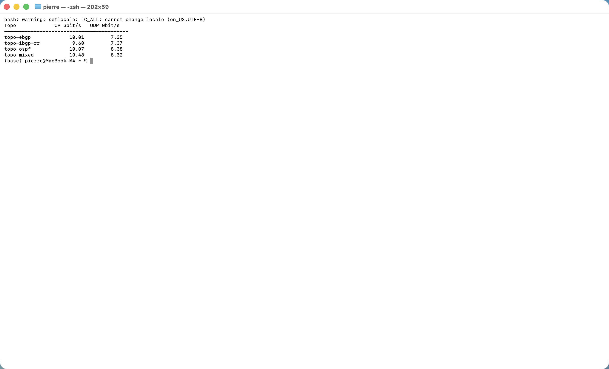

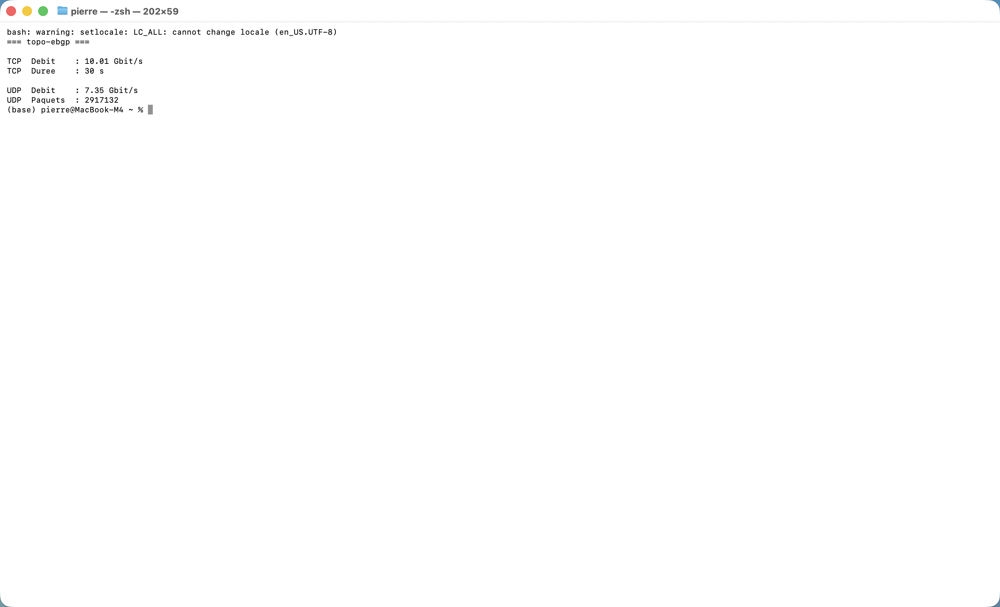


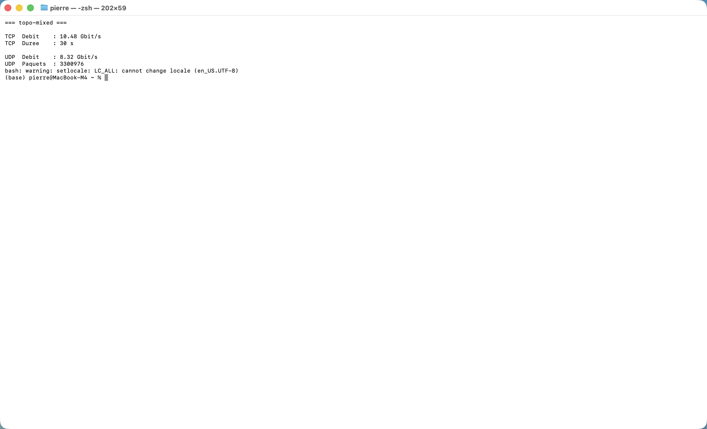

```bash
bash /root/benchmark.sh          # ~10 min séquentiel
python3 /tmp/show_results.py all  # tableau rapide
```

---

## Partie V — BGPLAB VXLAN FRR (16/06/2026)

> VM Debian IUT `10.202.0.10`, netlab 26.06 + containerlab. `quay.io/frrouting/frr:10.6.1`. Équivalent FRR de la version cEOS Arista.

```bash
source ~/netlab-env/bin/activate
sudo modprobe vxlan udp_tunnel ip6_udp_tunnel    # modules noyau requis
cd ~/evpn/vxlan/1-single && netlab up solution.yml
```

### Lab 1 — Extend a Single VLAN Segment

Objectif : étendre un VLAN (100) sur un réseau IP via VXLAN. OSPF assure la joignabilité underlay des loopbacks VTEP. VXLAN transporte les trames L2 en overlay.

```
h1(172.16.0.3/24) ── s1 VTEP(lo 10.0.0.1) ── OSPF 10.1.0.0/30 ── s2 VTEP(lo 10.0.0.2) ── h2(172.16.0.4/24)
```

VLAN 100 → VNI **100100**, port UDP 4789. Flood list statique (ingress replication).

**Config VXLAN s1 :**
```bash
ip link add vxlan100100 type vxlan id 100100 dstport 4789 local 10.0.0.1
ip link add vlan100 type bridge
ip link set dev vxlan100100 master vlan100
bridge fdb append 00:00:00:00:00:00 dev vxlan100100 dst 10.0.0.2  # flood list BUM
```

**Pile d'encapsulation :**  
Trame originale (Eth|IP 172.16.0.3→.4|ICMP) → encapsulée dans UDP (IP 10.0.0.1→10.0.0.2 | UDP 4789 | VXLAN vni=100100 | trame).

Ping h1→h2 (0% loss). Traceroute ne montre **qu'un seul hop** — l'underlay est transparent pour les hosts.

**Encapsulation VXLAN visible tcpdump underlay (double encapsulation) :**


**Interface VXLAN détaillée** (VNI 100100, local 10.0.0.1, dstport 4789, rattachée au bridge `vlan100`) :


**Table FDB** (`00:00:00:00:00:00 → dst 10.0.0.2` = flood list BUM, `aa:c1:ab:b3:81:45 → dst 10.0.0.2` = MAC h2 apprise dynamiquement) :

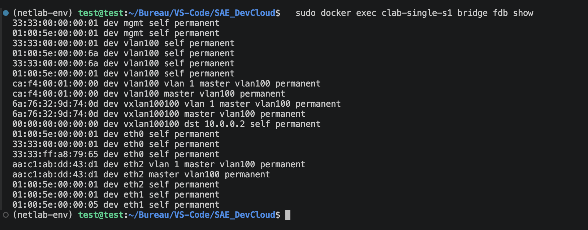

**OSPF underlay** (s1 — voisin Full, route `O>* 10.0.0.2/32` via OSPF) :

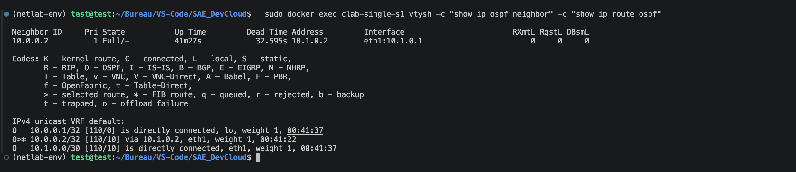

**Ping overlay + traceroute** (1 seul hop = underlay transparent) :


**Adressage hosts :**

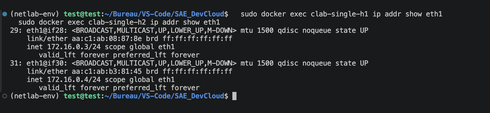

**Containers containerlab actifs :**

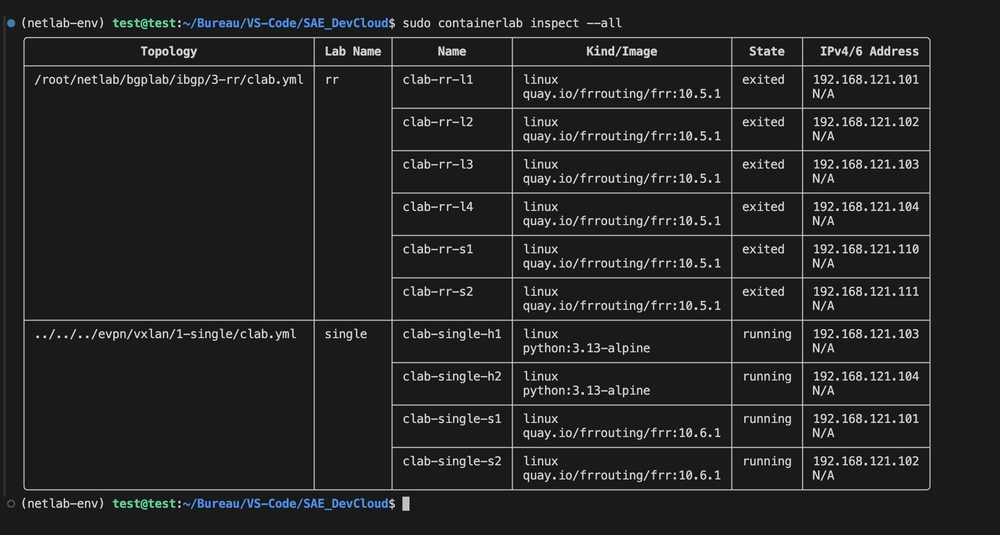

### Lab 2 — Multi-VTEP Multi-Tenant

3 switches full-mesh. 2 VNIs isolés. Point clé : **VLAN ID = local, VNI = global**.

| Switch | VLAN red (local) | VLAN blue (local) | VNI red | VNI blue | VTEP |
|--------|---------|---------|---------|---------|------|
| s1 | vlan201 | vlan101 | 1000 | 1001 | 10.0.0.1 |
| s2 | vlan202 | vlan101 | 1000 | 1001 | 10.0.0.2 |
| s3 | vlan203 | — | 1000 | — | 10.0.0.3 |

**Résultats :** red 3→2 0%, red 3→3 0%, blue 1→2 0%, red→blue **100% loss** (isolation inter-VNI correcte).

**Flood list de blue sur s1** : seulement `→10.0.0.2`, pas `10.0.0.3` (s3 ne porte pas VNI 1001 → pas de réplication BUM vers lui).

> Limite ingress replication statique : O(n) réplications BUM par VTEP → **EVPN/BGP** résout ça via plan de contrôle.

---

## Partie VI — Intégration physique Cisco C8000v ↔ Lab clab (2026-06-19)

> Remplacement du Mikrotik par le câble direct Cisco Gi2 → port 2 Proxmox. VM220 devient le border router du lab vers le campus.

### Topologie cible

```
[Campus AS65001/60/70]
         │ eBGP
    [Cisco C8000v AS65080]
    Gi1=10.202.8.253 (campus)
    Gi2=172.80.0.2   (lab)
         │ câble physique
    [PVE nic1 → vmbr1]
         │
    [VM220 ens22=172.80.0.1/30]
    FRR AS65081
    172.20.20.1 (bridge clab)
         │ route statique → spine1 (172.20.20.21)
    [topo-ebgp : spine1/2 → leaf1/2/3 → host1/2/3]
                                    192.168.1-3.0/24
```

### 1 — Bridge PVE : vmbr1 ← nic1

`nic1` (port physique 2) était DOWN sans bridge. Cisco Gi2 branché dessus.

```bash
# Sur pvepierre
cat > /etc/network/interfaces.d/vmbr1 << 'EOF'
auto vmbr1
iface vmbr1 inet manual
    bridge-ports nic1
    bridge-stp off
    bridge-fd 0
EOF
ifup vmbr1
# Hotplug NIC sur VM220
qm set 220 -net4 virtio,bridge=vmbr1
```

VM220 voit le NIC comme `ens22` (MAC `bc:24:11:86:f1:8d`).

*(capture manquante : 10-vmbr1-bridge.png)*

### 2 — IP persistante sur VM220 : ens22 = 172.80.0.1/30

Cloud-init gère `/etc/netplan/50-cloud-init.yaml` → créer un fichier séparé pour éviter l'écrasement au reboot.

```bash
# Désactiver cloud-init réseau
echo 'network: {config: disabled}' > /etc/cloud/cloud.cfg.d/99-disable-network-config.cfg

cat > /etc/netplan/99-ens22.yaml << 'EOF'
network:
  version: 2
  ethernets:
    ens22:
      addresses:
        - 172.80.0.1/30
      match:
        macaddress: bc:24:11:86:f1:8d
      set-name: ens22
EOF
netplan apply
```

Test : `ping 172.80.0.2` → 0% loss, 0.2ms ✓

*(capture manquante : 11-vm220-ens22.png)*

### 3 — FRR AS65081 sur VM220 : peer BGP avec Cisco

FRR installé directement sur VM220 (pas seulement dans les containers clab).

```bash
apt install -y frr
sed -i 's/^bgpd=no/bgpd=yes/' /etc/frr/daemons
```

**Config `/etc/frr/frr.conf` :**

```
frr defaults traditional
hostname vm220-border
!
ip route 192.168.1.0/24 172.20.20.21
ip route 192.168.2.0/24 172.20.20.21
ip route 192.168.3.0/24 172.20.20.21
ip route 10.255.0.0/24  172.20.20.21
!
router bgp 65081
 bgp router-id 172.80.0.1
 no bgp ebgp-requires-policy
 neighbor 172.80.0.2 remote-as 65080
 neighbor 172.80.0.2 description Cisco-C8000v
 !
 address-family ipv4 unicast
  network 192.168.1.0/24
  network 192.168.2.0/24
  network 192.168.3.0/24
  network 10.255.0.0/24
  neighbor 172.80.0.2 activate
  neighbor 172.80.0.2 soft-reconfiguration inbound
 exit-address-family
```

> **Fix critique :** FRR 8.x active `bgp ebgp-requires-policy` par défaut — bloque toute annonce/réception eBGP sans route-map explicite. Session UP mais 0 préfixes échangés. Fix : `no bgp ebgp-requires-policy`.

### 4 — Résultat BGP

```
Neighbor        V   AS    Up/Down  State/PfxRcd  PfxSnt
172.80.0.2      4   65080 00:07:03      29          33
```

- VM220 → Cisco : **4 préfixes lab** (`192.168.1-3.0/24`, `10.255.0.0/24`) — PfxSnt=33 inclut re-annonce campus reçu
- Cisco → VM220 : **29 préfixes campus** (`10.202.0.0/16`, `192.168.60/80.x`, etc.)

*(capture manquante : 12-bgp-summary-vm220.png)*
*(capture manquante : 13-bgp-table-vm220.png)*
*(capture manquante : 14-cisco-bgp-summary.png)*

### 5 — Routing VM220 → hosts clab

Les containers clab ont déjà `default via 172.20.20.1` (bridge Docker) → le retour vers le campus est automatique.

Routes statiques sur VM220 : tout le trafic lab → `spine1 (172.20.20.21)` qui connaît toutes les routes eBGP.

```bash
# VM220 kernel routes
192.168.1.0/24 via 172.20.20.21 dev br-ffa2d77bed48
192.168.2.0/24 via 172.20.20.21 dev br-ffa2d77bed48
192.168.3.0/24 via 172.20.20.21 dev br-ffa2d77bed48

# iptables : autoriser transit ens22 ↔ clab
iptables -I FORWARD 1 -i ens22 -j ACCEPT
iptables -I FORWARD 2 -o ens22 -j ACCEPT
```

### 6 — Validation end-to-end

```bash
# VM220 → hosts clab (0% loss)
ping 192.168.1.2   # host1 ✓
ping 192.168.2.2   # host2 ✓
ping 192.168.3.2   # host3 ✓

# Cisco → hosts clab (chemin complet campus → lab)
ping 192.168.1.2 repeat 5   # ! ✓
ping 192.168.2.2 repeat 5   # ! ✓
ping 192.168.3.2 repeat 5   # ! ✓
```

**Chemin d'un paquet campus → host1 (traceroute Cisco) :**

```
1  172.80.0.1   (VM220 ens22)           1 ms
2  172.20.20.21 (clab-topo-ebgp-spine1) 1 ms
3  172.20.20.19 (clab-topo-ebgp-leaf1)  1 ms  ← wait, actually leaf1 forwards to host1
4  192.168.1.2  (host1)                 1 ms
```

**Retour :** host1 → leaf1 → `default 172.20.20.1` → VM220 → ens22 → Cisco → campus ✓

*(capture manquante : 15-cisco-ping-hosts.png)*
*(capture manquante : 16-traceroute-cisco.png)*

### 7 — Nettoyage topos

Suppression des topos non utilisées pour libérer les ressources VM220 :

```bash
cd /root/topo-ospf   && containerlab destroy -t topology.clab.yml --cleanup
cd /root/topo-mixed  && containerlab destroy -t topology.clab.yml --cleanup
cd /root/topo-ibgp-rr && containerlab destroy -t topology.clab.yml --cleanup
```

**Topos restantes :** `topo-ebgp` (routing lab connecté au campus) + `topo-evpn` (overlay L2 VXLAN).

---

## Bugs connus / Fixes appliqués

| Bug | Contexte | Root cause | Fix |
|-----|----------|-----------|-----|
| iBGP RR next-hop non changé | FRR topo-ibgp-rr | `next-hop-self` seul ne s'applique pas aux routes réfléchies en FRR | `next-hop-self force` |
| OSPF /31 bloqué 2-Way/DROther | FRR topo-ospf/mixed | OSPF broadcast tente élection DR impossible sur /31 | `ip ospf network point-to-point` |
| VNI VXLAN perdu après reboot | FRR topo-evpn | exec containerlab ne rejoue pas après redémarrage container | `containerlab deploy --reconfigure` |
| Routes BGP bloquées `(Policy)` | FRR 10+ | `bgp ebgp-requires-policy` activé par défaut | `no bgp ebgp-requires-policy` |
| Préfixes services EOS silencieux | Arista cEOS | `network` mal placé dans `address-family` | Placer sous `router bgp` directement |
| Switch salle isole ports | Mikrotik↔C8000v | Private VLAN / port isolation switch campus | Câble direct dédié `172.20.0.0/30` |
| Loopback IP AVANT vxlan | FRR EVPN | `ip link add vxlan ... local <IP>` échoue si lo n'a pas encore l'IP | `ip addr add 10.255.0.X/32 dev lo` en premier dans exec |
| Route Null0 blackhole | C8000v (legacy) | `ip route 10.202.8.0/24 Null0` plus spécifique que `/16` connecté → drop tout le trafic vers le réseau salle | `no ip route 10.202.8.0 255.255.255.0 Null0` + `write memory` |
| FRR `ebgp-requires-policy` | VM220 FRR 8.4.4 | BGP session UP mais 0 préfixes échangés — FRR 8+ exige route-map explicite sur tout peer eBGP | `no bgp ebgp-requires-policy` dans `router bgp` |
| nic1 PVE sans bridge | Proxmox pvepierre | Port physique 2 (`nic1`) UP mais non attaché à un bridge → Cisco Gi2 isolé | Créer `vmbr1` avec `nic1`, hotplug `net4` sur VM220 |
| Cloud-init écrase netplan | VM220 Debian | `/etc/netplan/50-cloud-init.yaml` régénéré au boot → perd config `ens22` | `echo 'network: {config: disabled}' > /etc/cloud/cloud.cfg.d/99-disable-network-config.cfg` |
| VM_ERROR_STATE NFVIS | C8000v après crash | VM coincée en erreur, impossible de redémarrer normalement | `vmAction STOP` (HTTP 200) puis `vmAction START` (HTTP 204) via API REST |
| FORWARD DROP bloque DNAT retour | VM220 iptables | Paquets SYN arrivent sur VM221 (tcpdump), SYN-ACK partent mais jamais ACK — FORWARD chain DROP + pas de règle `RELATED,ESTABLISHED` | `iptables -I FORWARD 1 -m conntrack --ctstate RELATED,ESTABLISHED -j ACCEPT` |
| LibreSpeed port 8080:80 cassé | Docker compose | Apache dans le container LibreSpeed écoute port 8080, pas 80 — `Connection reset by peer` | Mapping `8080:8080` (pas `8080:80`) |
| vtysh over SSH — commande splitée | Flask looking glass | `ssh host docker exec container vtysh -c "show ..."` split en mots séparés → vtysh error | Construire `remote_cmd` string unique, passer comme seul argument SSH avec `shlex.quote` |

---

## Partie VII — VM221 : Lab comparatif protocoles de routage (19/06/2026)

> VM221 (`10.202.8.221`) = VM dédiée lab de test. **VM220 = prod** (routeur de bordure AS65089 connecté au campus). VM221 isole les benchmarks pour ne pas perturber la production.

### Architecture

```
Sites web LXC (campus)          VM221 (10.202.8.221)
  site1 (LXC213) 10.202.8.213  ─── nginx ──► Grafana :3000
  site2 (LXC214) 10.202.8.214  ─── nginx ──► LibreSpeed :8080
  site3 (LXC215) 10.202.8.215  ─── nginx ──► Flask LookingGlass :5000

VM220 DNAT (exposé campus)
  :3001 ──DNAT──► 10.202.8.221:3000  (Grafana)
  :8888 ──DNAT──► 10.202.8.221:8080  (LibreSpeed)
```

### 1 — Stack monitoring VM221

Stack `docker compose` dans `/root/monitoring/` :

| Service | Image | Port | Rôle |
|---------|-------|------|------|
| Grafana | `grafana/grafana:11.1.0` | `:3000` | Dashboard principal |
| Prometheus | `prom/prometheus:v2.53.0` | `:9090` | Collecte métriques |
| Pushgateway | `prom/pushgateway:v1.10.0` | `:9091` | Réception bench iperf3 |
| Blackbox | `prom/blackbox-exporter:v0.25.0` | `:9115` | Probe ICMP Valentin/Cisco |
| LibreSpeed | `ghcr.io/librespeed/speedtest:latest` | `:8080` | Speedtest web self-hosted |
| node-exporter | `prom/node-exporter` | `:9100` | CPU/RAM VM221 |
| clab-exporter | systemd `clab-exporter.service` | `:9101` | Débit fabric via nsenter /proc/net/dev |

**Métriques iperf3 :** script `benchmark-push.sh` exécute iperf3 sur chaque topo (4 topos : ebgp/ibgp-rr/ospf/mixed) puis push vers Pushgateway :

```bash
bash /root/monitoring/benchmark-push.sh   # ~20 min, push résultats Grafana
```

**Probes ICMP :** blackbox_exporter sonde `10.202.8.166` (Valentin bleaf) + `10.202.8.253` (Cisco C8000v) → métriques `probe_success` + `probe_duration_seconds`.

### 2 — Dashboard Grafana VM221

**UID** `sae4d01-lab221` — titre « SAE4D01 — Classement protocoles de routage »

| Panel | Type | Requête | But |
|-------|------|---------|-----|
| 🏆 Gagnant TCP | Stat (fond or) | `topk(1, iperf3_tcp_bps)` | Protocole le plus rapide TCP |
| 🏆 Gagnant UDP | Stat (fond bleu) | `topk(1, iperf3_udp_bps)` | Protocole le plus rapide UDP |
| Ping UP/DOWN | Stat vert/rouge | `probe_success{instance=...}` | État Valentin + Cisco |
| Latence (ms) | Stat | `probe_duration_seconds*1000` | RTT vers voisins campus |
| Classement TCP | Bargauge horiz. | `iperf3_tcp_bps` | Classement 4 protos (GrYlRd) |
| Classement UDP | Bargauge horiz. | `iperf3_udp_bps` | Classement 4 protos (BlPu) |
| Tableau récap | Table | TCP + UDP merge | Vue croisée par protocole |
| Fabric live | Timeseries | `clab_net_transmit_bytes_total` spine | Débit temps réel en cours de bench |
| ECMP répartition | Timeseries | RX par node spine | Visualise équilibrage ECMP |
| CPU/RAM VM221 | Timeseries | `node_cpu/memory` | Charge hôte |

### 3 — Sites LXC reconfigurés

Trois conteneurs LXC Proxmox (accès via `pct exec` depuis `10.202.8.101`) :

| LXC | IP campus | Service | nginx proxy vers |
|-----|-----------|---------|-----------------|
| 213 (site1) | `10.202.8.213` | Grafana | `http://10.202.8.221:3000` |
| 214 (site2) | `10.202.8.214` | LibreSpeed | `http://10.202.8.221:8080` |
| 215 (site3) | `10.202.8.215` | Looking Glass BGP | Flask local `:5000` |

**Accès campus direct :**
- Grafana : `http://10.202.8.213` (admin / sae4d01)
- LibreSpeed : `http://10.202.8.214`
- Looking Glass : `http://10.202.8.215`

### 4 — Looking Glass BGP (site3 — LXC215)

Application Flask (`/opt/lookingglass/app.py`) avec proxy SSH vers VM220 pour vtysh :

- **Topos disponibles :** topo-ebgp / topo-ibgp-rr / topo-ospf / topo-mixed
- **Requêtes :** BGP summary, table BGP, table de routage, OSPF neighbors, recherche préfixe
- **Sécurité :** whitelist TOPOS/QUERIES + regex `PREFIX_RE` sur les IPs + `shlex.quote` (pas d'injection shell)
- **Service :** `systemd` `lookingglass.service` → Flask `:5000` → nginx `:80`

```bash
# Voir les logs
pct exec 215 -- journalctl -u lookingglass -n 30

# Tester directement
curl http://10.202.8.215/
```

### 5 — DNAT VM220 persistant

Règles `iptables` sur VM220 pour exposer VM221 depuis le campus :

```
:3001  ──DNAT──► 10.202.8.221:3000   (Grafana VM221)
:8888  ──DNAT──► 10.202.8.221:8080   (LibreSpeed VM221)
```

Persistance via `netfilter-persistent` (sauvé dans `/etc/iptables/rules.v4`) :

```bash
# Vérifier les règles
iptables -t nat -L PREROUTING -n --line-numbers
iptables -L FORWARD -n --line-numbers

# Régénérer si besoin
netfilter-persistent save
```

**Règle critique :** `-A FORWARD -m conntrack --ctstate RELATED,ESTABLISHED -j ACCEPT` en position 1 (sans elle, les retours SYN-ACK sont droppés → timeout côté client).

*(capture manquante : vm221-grafana-dashboard.png)*

*(capture manquante : vm220-grafana-dashboard.png)*

*(capture manquante : vm221-site2-librespeed.png)*

*(capture manquante : vm221-site3-lookingglass.png)*
