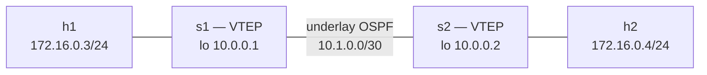
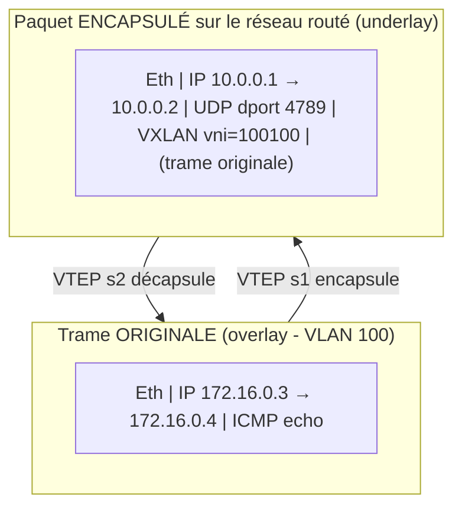
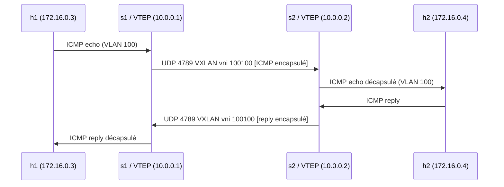
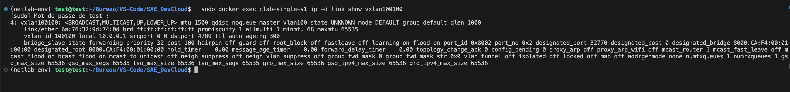
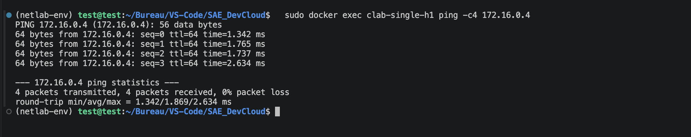
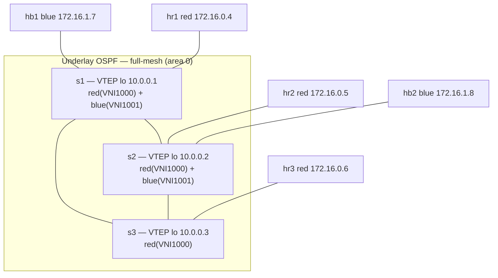

# Pierre — BGPLAB EVPN/VXLAN · Lab 1 Single (FRR)

> Source : page Notion (groupe 8, SAE4D01). Réalisé le 16/06/2026 sur la VM Debian 13 (`10.202.0.10`), netlab 26.06 + containerlab.
> Variante **FRR** (image `quay.io/frrouting/frr:10.6.1`, provider `clab`) — équivalent fonctionnel de la version cEOS de Valentin.

# BGPLAB — EVPN / VXLAN

## Préparation de l'environnement

L'install native sur macOS (Apple Silicon) échoue : `netlab install` ne supporte que Debian/Ubuntu, `libvirt`/containerlab exigent un noyau Linux, et le daemon Docker n'était pas lancé. Le lab tourne donc sur la **VM Debian 13 de l'IUT** via `Remote-SSH`.

```bash
source ~/netlab-env/bin/activate          # netlab 26.06
sudo modprobe vxlan udp_tunnel ip6_udp_tunnel   # modules noyau requis par le module vxlan
cd ~/evpn/vxlan/1-single
netlab up solution.yml                     # déploie clab + pousse la config
```

Images utilisées : `quay.io/frrouting/frr:10.6.1` (switches), `python:3.13-alpine` (hosts).

## LAB N°1 : Extend a Single VLAN Segment with VXLAN

Objectif : étendre **un seul VLAN (100)** à travers un réseau IP routé en utilisant **VXLAN**. OSPF assure la connectivité *underlay* entre les loopbacks des deux VTEP, VXLAN se superpose en *overlay* pour transporter les trames Ethernet du VLAN 100 entre `s1` et `s2`.

### Topologie



- VLAN 100 ↔ VNI **100100**, port UDP **4789**
- VTEP source = Loopback0 (`10.0.0.1` sur s1, `10.0.0.2` sur s2)
- h1 et h2 sont dans le **même sous-réseau** `172.16.0.0/24` bien que séparés par un réseau routé : c'est tout l'intérêt de VXLAN.

### Configuration appliquée (générée par netlab, FRR)

Contrairement à la version cEOS de Valentin (config `interface Vxlan1` manuelle), netlab génère et pousse automatiquement la config VXLAN. Extrait du script appliqué sur **s1** :

```bash
# Interface VXLAN L2 pour le VNI 100100
ip link add vxlan100100 type vxlan id 100100 dstport 4789 local 10.0.0.1
ip link add vlan100 type bridge
ip link set dev vxlan100100 master vlan100      # rattache le VNI au bridge du VLAN 100
ip link set vlan100 type bridge stp_state 0
ip link set up dev vxlan100100
# Flood list (ingress replication statique) vers le VTEP distant
bridge fdb append 00:00:00:00:00:00 dev vxlan100100 dst 10.0.0.2
```

Config OSPF underlay (s1) : `router ospf` / `router-id 10.0.0.1`, loopback + eth1 en `area 0.0.0.0`.

### Vérifications

**1. Ping overlay h1 → h2 (VLAN 100 étendu via VXLAN) :**

```
PING 172.16.0.4 (172.16.0.4): 56 data bytes
64 bytes from 172.16.0.4: seq=0 ttl=64 time=14.157 ms
64 bytes from 172.16.0.4: seq=1 ttl=64 time=1.262 ms
--- 172.16.0.4 ping statistics ---
4 packets transmitted, 4 packets received, 0% packet loss
```

**2. Voisin OSPF underlay (s1) — état `Full` :**

```
Neighbor ID     Pri State      Up Time   Dead Time Address    Interface
10.0.0.2          1 Full/-     12.877s    36.439s  10.1.0.2   eth1:10.1.0.1
```

**3. Interface VXLAN + flood/learn table (s1) :**

```
vxlan100100   UNKNOWN   6a:76:32:9d:74:0d <BROADCAST,MULTICAST,UP,LOWER_UP>
00:00:00:00:00:00 dev vxlan100100 dst 10.0.0.2 self permanent   # flood list (BUM)
aa:c1:ab:b3:81:45 dev vxlan100100 dst 10.0.0.2 self              # MAC distante apprise
```

### Analyse

Le VLAN 100 est étendu sur le réseau IP grâce au mapping **VLAN → VNI (100100)** et à une **flood list configurée statiquement** (entrée FDB `00:00:00:00:00:00 → dst 10.0.0.2`). On parle d'**ingress replication statique** : simple à mettre en œuvre, mais difficile à scaler car chaque VTEP doit connaître manuellement tous les autres.

Les MAC distantes sont apprises dynamiquement dans le plan de données (data-plane learning). C'est exactement la limite que le protocole **EVPN** (control-plane BGP) viendra résoudre dans les labs suivants.

> Point MTU : l'overhead VXLAN est de 50 octets. Sur cEOS (Valentin) il fallait monter le MTU de l'underlay à 1560. Avec FRR/netlab, le lien underlay est provisionné à `mtu: 1550` dans `solution.yml` et le VNI à 1500, donc le ping passe directement.

### Différence avec la version cEOS (Valentin)

|  | cEOS (Valentin) | FRR (cette page) |
| --- | --- | --- |
| Image | `ceos:4.34.2F` | `frr:10.6.1` |
| Config VXLAN | manuelle (`interface Vxlan1`) | générée par netlab (module `vxlan`) |
| MTU underlay | ajusté à la main (1560) | `mtu: 1550` dans la topologie |
| Flood list | `vxlan vlan 100 flood vtep` | `bridge fdb append … dst` |

Même concept, même résultat (overlay L2 fonctionnel) — seule l'implémentation du data-plane diffère.

---

## Pile d'encapsulation VXLAN



## Flux d'un ping h1 → h2



## Capture 1 — Preuve d'encapsulation VXLAN (tcpdump underlay s1 eth1)

Capture pendant un `ping h1 → h2`. On voit la **double encapsulation** : enveloppe externe `10.0.0.1 → 10.0.0.2` UDP/4789 VXLAN vni 100100, contenant le paquet ICMP original `172.16.0.3 → 172.16.0.4`.

```
14:30:19.090754 IP (ttl 64, proto UDP (17), length 134)
    10.0.0.1.36382 > 10.0.0.2.4789: [udp sum ok] VXLAN, flags [I] (0x08), vni 100100
IP (ttl 64, flags [DF], proto ICMP (1), length 84)
    172.16.0.3 > 172.16.0.4: ICMP echo request, id 39, seq 45, length 64
```


## Capture 2 — Interface VXLAN détaillée (s1)

```
4: vxlan100100: <BROADCAST,MULTICAST,UP,LOWER_UP> mtu 1500 master vlan100 state UNKNOWN
    vxlan id 100100 local 10.0.0.1 srcport 0 0 dstport 4789 ttl auto ageing 300
    bridge_slave state forwarding ... learning on flood on
```

VNI **100100**, VTEP source **10.0.0.1**, port UDP **4789**, rattachée au bridge `vlan100`.



## Capture 3 — Table FDB / VTEP (s1)

```
aa:c1:ab:b3:81:45 master vlan100               # MAC de h2, apprise (data-plane)
00:00:00:00:00:00 dst 10.0.0.2 self permanent  # flood list (BUM) → VTEP distant
aa:c1:ab:b3:81:45 dst 10.0.0.2 self            # MAC h2 ↔ VTEP 10.0.0.2
```

> Corrélation : `aa:c1:ab:b3:81:45` = MAC réelle de l'interface `eth1` de **h2**, joignable derrière le VTEP `10.0.0.2`.


## Capture 4 — OSPF underlay (s1)

Voisinage `Full` + route apprise vers la loopback du VTEP distant :

```
Neighbor ID     Pri State      Up Time   Dead Time Address    Interface
10.0.0.2          1 Full/-     4m01s      38.250s  10.1.0.2   eth1:10.1.0.1

O>* 10.0.0.2/32 [110/10] via 10.1.0.2, eth1   # loopback de s2 (VTEP distant) via OSPF
O   10.1.0.0/30 [110/10] is directly connected, eth1
```


## Capture 5 — Ping overlay & traceroute (h1 → h2)

> Le traceroute ne montre **qu'un seul hop** alors que h1 et h2 sont séparés par un réseau routé : l'underlay est totalement transparent pour les hosts, exactement le but de VXLAN.




## Capture 6 — Adressage des hosts


## Capture 7 — Conteneurs containerlab actifs


> **Captures placées** — les 7 captures terminal (Capture 1 à 7) sont sous leur section respective. Sorties terminal réelles, non simulées.

---

# LAB N°2 : More Complex VXLAN Deployment Scenario

Objectif : passer à une topologie **multi-VTEP / multi-tenant**. Trois switches `s1`, `s2`, `s3` en **full-mesh**, deux segments L2 isolés transportés par VXLAN :

- **VLAN red** → VNI **1000**, présent sur les **3** switches (hôtes `hr1`, `hr2`, `hr3`, réseau `172.16.0.0/24`)
- **VLAN blue** → VNI **1001**, présent sur **s1 et s2 seulement** (hôtes `hb1`, `hb2`, réseau `172.16.1.0/24`)

Toujours **OSPF** en underlay + **VXLAN flood (ingress replication statique)** — pas encore EVPN.

## Topologie



## Mapping VLAN local → VNI global

Point clé : chaque switch utilise un **VLAN ID local différent** pour `red`, mais **le même VNI 1000**. Le VLAN ID n'a de portée que locale ; c'est le **VNI** qui identifie le segment L2 sur le réseau.

| Switch | VLAN red (local) | VLAN blue (local) | VNI red | VNI blue | Loopback (VTEP) |
| --- | --- | --- | --- | --- | --- |
| s1 | vlan201 | vlan101 | 1000 | 1001 | 10.0.0.1 |
| s2 | vlan202 | vlan101 | 1000 | 1001 | 10.0.0.2 |
| s3 | vlan203 | — | 1000 | — | 10.0.0.3 |

## Vérifications

**3. Connectivité overlay (red sur 3 VTEP, blue sur 2 VTEP) :**

```
# RED : hr1 -> hr2 (s1->s2)  => 0% packet loss
# RED : hr1 -> hr3 (s1->s3)  => 0% packet loss
# BLUE : hb1 -> hb2 (s1->s2) => 0% packet loss
```

**4. Isolation inter-VNI (red ne joint pas blue) — comportement attendu :**

```
# hr1 (red 172.16.0.4) -> hb1 (blue 172.16.1.7)
2 packets transmitted, 0 packets received, 100% packet loss
```

**5. Table FDB de s1 — flood lists par VNI + MAC distantes apprises :**

```
# VNI 1000 (red) : flood vers les 2 autres VTEP + MAC apprises
00:00:00:00:00:00 dev vxlan1000 dst 10.0.0.2 self permanent   # flood -> s2
00:00:00:00:00:00 dev vxlan1000 dst 10.0.0.3 self permanent   # flood -> s3
# VNI 1001 (blue) : flood vers s2 UNIQUEMENT (s3 n'a pas blue)
00:00:00:00:00:00 dev vxlan1001 dst 10.0.0.2 self permanent   # flood -> s2 seulement
```

## Analyse

- **VNI = identifiant global du segment**, VLAN ID = local. Les VLAN `201/202/203` mappent tous vers le VNI `1000` : c'est ce découplage VLAN-local / VNI-global qui rend VXLAN scalable (le champ VNI 24 bits ≫ 4096 VLANs).
- **Ingress replication multi-VTEP** : avec 3 VTEP, la flood list de chaque VNI contient une entrée `00:00:00:00:00:00 → dst <VTEP>` par pair distant. Coût en O(n) par VTEP → confirme la limite de scalabilité de l'approche flood statique (que l'EVPN/BGP résoudra).
- **Flood list dépendante du VNI** : la flood list de `blue` (VNI 1001) sur s1 ne contient **que** `10.0.0.2`, pas `10.0.0.3`, car s3 ne porte pas le VNI 1001.
- **Segmentation L2 par VNI** : `red` et `blue` sont deux domaines de broadcast étanches. `hr1` ne joint pas `hb1` (100% loss) — pas de fuite inter-tenant, alors qu'ils transitent le même underlay physique.

> ✅ Lab 2 fonctionnel : VLAN red étendu sur 3 VTEP, VLAN blue sur 2 VTEP, isolation inter-VNI vérifiée. Sorties terminal réelles (maquette `clab-complex-*` sur `10.202.0.10`), non simulées.

## Vues d'ensemble (topologies & benchmark des 4 technos)

> Captures récapitulatives reprises dans le compte rendu complet ([../CR-COMPLET.md](../CR-COMPLET.md)).


