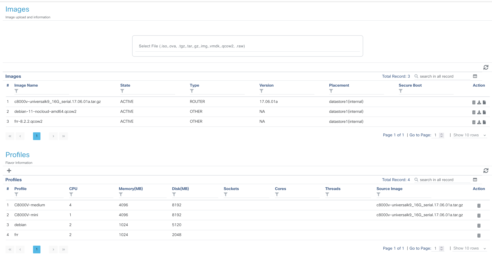
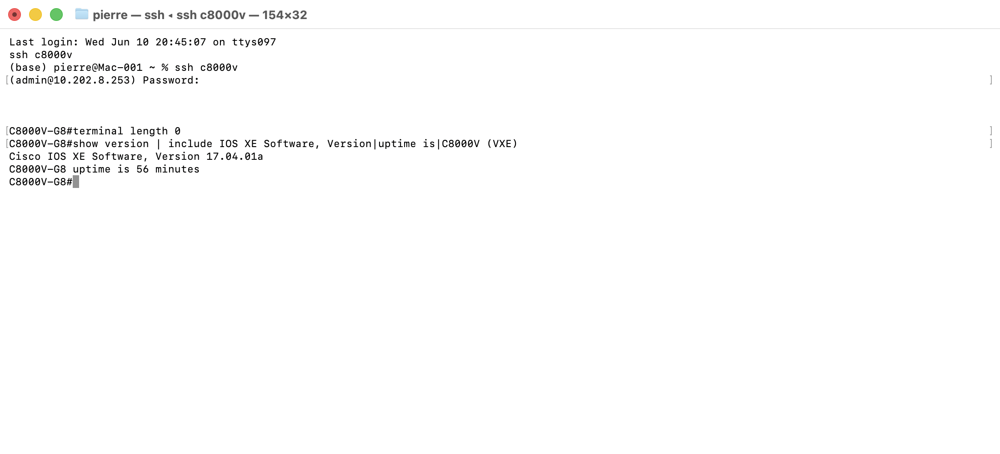
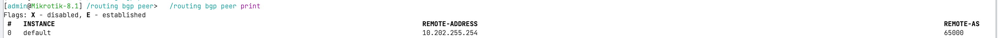
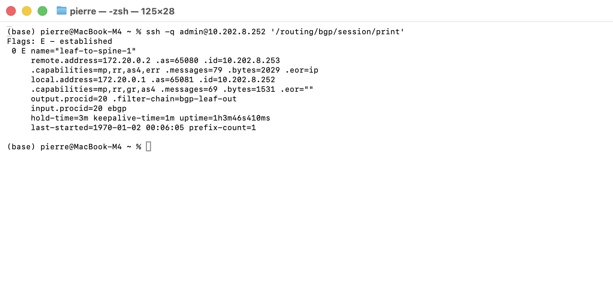
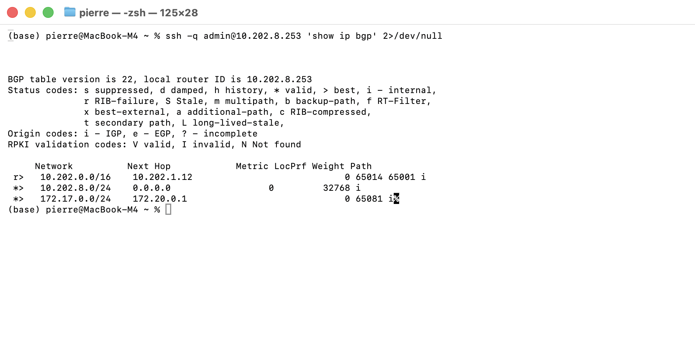
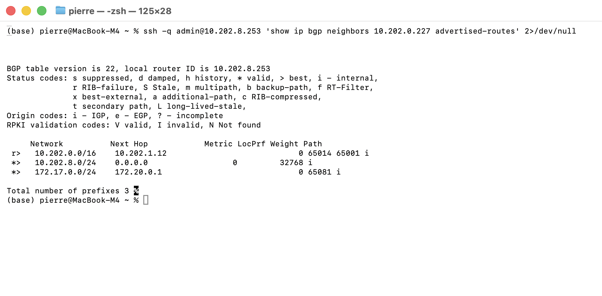
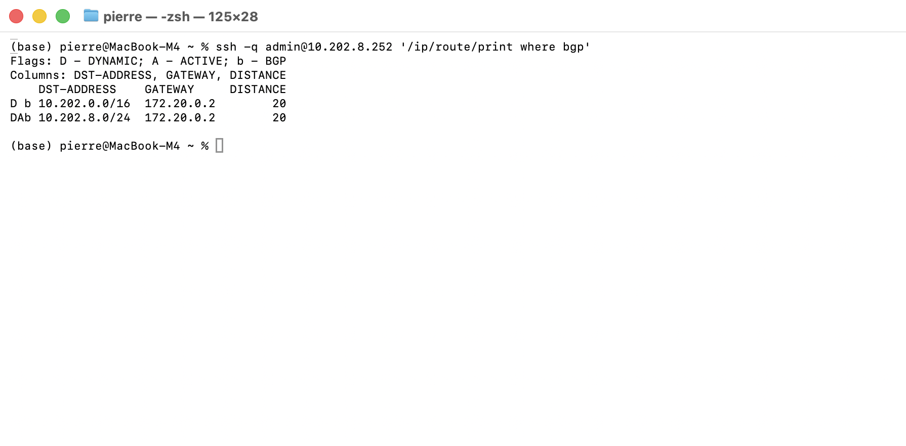
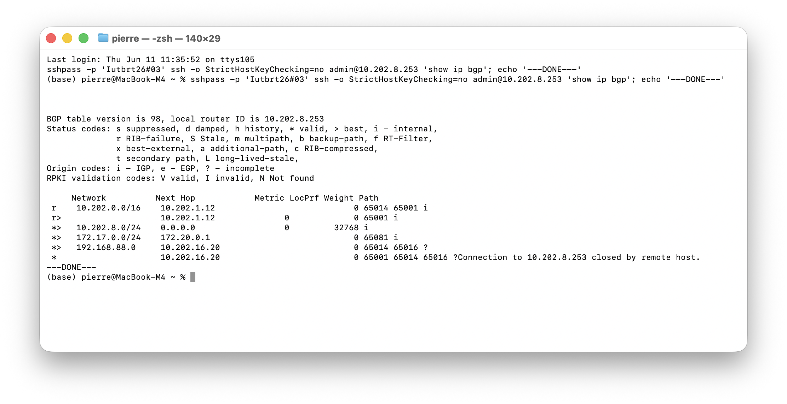
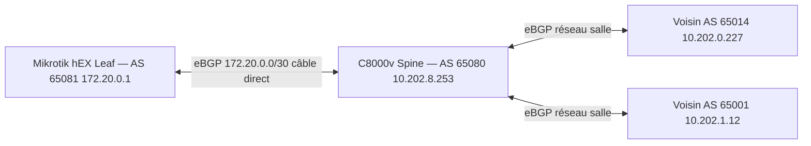
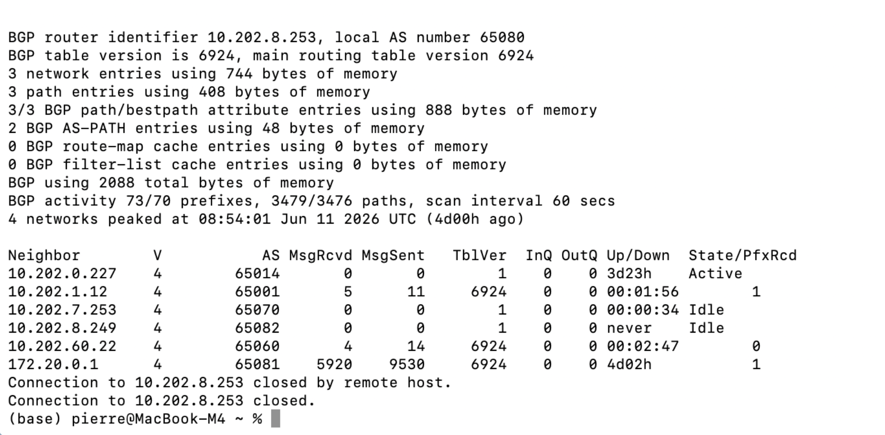

# Pierre C8000v setup

> Source : page Notion (groupe 8, SAE4D01). Import automatique.

> 📌 **Groupe 8 — URTADO Pierre** · SAE4D01 Datacenters · BUT R&T IUT Béziers
> Mise en service du **Cisco NFVIS Catalyst 8200** + déploiement C8000v + routage **eBGP** (AS 65080/65081) avec Mikrotik. Séances 10/06 → 15/06/2026.

| Interface | Adresse IP | Masque | Rôle |
| --- | --- | --- | --- |
| wan-br (GE0) | 10.202.8.254 | 255.255.0.0 | Accès réseau salle (10.202.0.0/16) |
| lan-br (GE2) | 172.16.0.254 | 255.255.255.0 | Management local groupe 8 |

---
## 3. Déploiement de la VM Cisco C8000v sur NFVIS
Le C8000v est un routeur Cisco IOS XE entièrement virtualisé. Le déployer sur le NFVIS nous donne, sur le même boîtier Catalyst 8200, un routeur programmable complet (BGP, SSH, NETCONF/RESTCONF) sans matériel supplémentaire : c'est la brique logicielle qui portera le peering BGP intergroupe du datacenter. Le déploiement se déroule en trois temps — chargement de l'image et des profils matériels (3.1), instanciation de la VM (3.2), puis vérification de son bon fonctionnement en ligne de commande (3.3).
### 3.1 Chargement des images et création des profils

L'interface web NFVIS (`https://10.202.8.254`) liste les images disponibles après upload. Trois images sont présentes en état **ACTIVE** : l'image routeur `c8000V-universalk9_16G_serial.17.04.01a.tar.gz` (IOS XE 17.04.01a), ainsi que `debian-11` et `frr-8.2.2` pour les futurs services et routeurs de la stack leaf & spine. Deux profils matériels sont définis pour le C8000v : **C8000V-medium** (4 vCPU, 4 Go RAM) et **C8000V-mini** (1 vCPU, 4 Go RAM), permettant d'adapter les ressources allouées selon les besoins.
**Fichier bootstrap — configuration Day-0.** Plutôt que de configurer le routeur à la main via la console après le boot, nous fournissons à NFVIS un fichier d'environnement OVF appliqué automatiquement au tout premier démarrage de la VM. Il fixe le hostname, les identifiants d'administration et l'adressage de management — ce qui rend le déploiement reproductible et évite toute saisie manuelle source d'erreurs :
```xml
<?xml version="1.0" encoding="UTF-8"?>
<Environment xmlns="http://schemas.dmtf.org/ovf/environment/1"
  xmlns:oe="http://schemas.dmtf.org/ovf/environment/1"
  xmlns:xsi="http://www.w3.org/2001/XMLSchema-instance">
  <PropertySection>
    <Property oe:key="com.cisco.c8000v.hostname" oe:value="C8000V-G8"/>
    <Property oe:key="com.cisco.c8000v.login-username" oe:value="admin"/>
    <Property oe:key="com.cisco.c8000v.login-password" oe:value="<REDACTED>"/>
    <Property oe:key="com.cisco.c8000v.privilege-password" oe:value="<REDACTED>"/>
    <Property oe:key="com.cisco.c8000v.mgmt-ipv4-addr" oe:value="10.202.8.253/16"/>
    <Property oe:key="com.cisco.c8000v.mgmt-ipv4-gateway" oe:value="10.202.0.1"/>
    <Property oe:key="com.cisco.c8000v.mgmt-ipv4-network" oe:value="10.202.0.0/16"/>
  </PropertySection>
</Environment>
```
### 3.2 Déploiement de la VM C8000v

La VM `c8000v` est instanciée via l'interface web NFVIS. Son statut **Booting** confirme que le processus de démarrage est en cours au moment de la capture. Cette VM joue le rôle de routeur virtuel Cisco IOS XE pour la partie interconnexion datacenter.
La console de boot ci-dessous confirme le démarrage complet de IOS XE dans l'environnement NFVIS :

Les étapes de démarrage visibles :
- `fsck_or_mkfs.sh` : vérification du système de fichiers `/dev/mapper/config` — 11 fichiers, 1138 blocs, code retour 0 (filesystem propre)
- `auditctl` : initialisation du daemon d'audit Linux, sans règles prédéfinies
- `rmon_vars.sh` : création du fichier MAC de management (`eth0 52:54:00:21:89:68`) — première initialisation de l'interface de management virtuelle
- `launch_cloud_net.sh[844]` : message **"Instance booted in private cloud"** — la VM est reconnue et opérationnelle dans l'environnement cloud privé NFVIS
Le profil matériel retenu lors du déploiement est **C8000V-medium**, sélectionné dans le formulaire de création de la VM.
Ce profil (4 vCPU, 4096 Mo RAM, 8192 Mo disque) offre les ressources adaptées à IOS XE 17.04.01a en rôle de routeur BGP intergroupe. Le profil `mini` (1 vCPU) aurait été insuffisant pour le traitement des tables de routage BGP inter-datacenter.

La VM est accessible via :

| Paramètre | Valeur |
| --- | --- |
| Adresse IP | `10.202.8.253` |
| Utilisateur | `admin` |
| Mot de passe | `<REDACTED>` |

### 3.3 Vérification CLI — VM C8000v opérationnelle
Une fois le boot terminé, nous avons ouvert des sessions SSH réelles vers les équipements pour valider l'état de la VM. Chaque sortie ci-dessous provient d'une connexion en direct (invite réelle de l'équipement visible sur la capture associée).
#### 3.3.1 VM enregistrée et active côté NFVIS

Depuis le shell de l'hyperviseur, nous vérifions que NFVIS a bien instancié la VM : le déploiement `c8000v` apparaît à l'état `running`. L'allocation des ressources du profil medium s'est faite sans erreur et la VM est démarrée — prérequis avant toute vérification côté routeur.
#### 3.3.2 Interfaces du routeur

Connectés en SSH sur le routeur lui-même, nous contrôlons l'état de ses interfaces. `GigabitEthernet1` porte l'adresse `10.202.8.253` à l'état up/up : le routeur est joignable depuis tout le réseau de salle. `GigabitEthernet2`, encore sans adresse à ce stade, servira ensuite au lien direct vers le leaf (Partie II).
#### 3.3.3 Version IOS XE et disponibilité

Nous validons ensuite le système : le routeur exécute IOS XE 17.04.01a, conforme à l'image préparée, sous le hostname `C8000V-G8`. Ce hostname provient du fichier bootstrap Day-0 : sa présence prouve que la configuration injectée au premier démarrage a bien été appliquée.
#### 3.3.4 Configuration BGP du spine (AS 65080)

Le C8000v est le **spine** de notre fabric : il porte l'**AS 65080** et concentre les deux sessions eBGP du groupe. Sa configuration déclare le préfixe `10.202.8.0/24` à annoncer, le voisin **leaf** `172.20.0.1` (AS 65081) joint par le lien point-à-point, et le voisin **intergroupe** `10.202.0.227` (AS 65014) sur le réseau de salle. Le choix de ce plan d'AS — un AS par équipement — est justifié en Partie II.
#### 3.3.5 Table de routage

La table de routage synthétise l'état du spine : route par défaut vers le routeur de salle (`10.202.255.254`), réseaux directement connectés (`10.202.0.0/16` sur Gi1, `172.20.0.0/30` sur Gi2), route statique `10.202.8.0/24` vers `Null0` qui sert d'origine à l'annonce BGP, et surtout les routes marquées **B** : le réseau interne du leaf `172.17.0.0/24` et les préfixes annoncés par le groupe voisin. Le routeur apprend et redistribue dynamiquement — aucune route intergroupe n'a été saisie à la main.
#### 3.3.6 Joignabilité depuis le réseau salle

Dernier contrôle, mené depuis une machine extérieure au groupe (le serveur pveval) : le routeur répond au ping sans aucune perte (\~0.4 ms) et son port SSH accepte les connexions. La VM est donc administrable à distance par toute l'équipe — condition indispensable pour travailler sans accès console.
> Note : le NFVIS affiche `SERVICE_ERROR_STATE` pour ce VNF — état purement cosmétique (VNF monitoré sans heartbeat configuré). La VM tourne et répond normalement, comme le confirment les sorties ci-dessus.
---
## 4. Configuration BGP du Mikrotik (leaf, AS 65081)
Le Mikrotik est le **leaf** de la fabric : il héberge le réseau interne du groupe (`172.17.0.0/24`) et n'entretient qu'une seule session BGP, vers le spine. BGP (Border Gateway Protocol) est le protocole de routage inter-AS : chaque équipement annonce ses réseaux et apprend dynamiquement ceux des autres, sans route statique manuelle. Nous vérifions ici les trois briques de sa configuration : l'adressage, la session eBGP vers le spine et le filtre qui contrôle ce que le leaf a le droit d'annoncer.
### 4.1 Adressage des interfaces

Trois adresses structurent le leaf : `ether1` en `10.202.8.252/16` donne l'accès au réseau de salle (management), et `ether2` en porte deux — `172.17.0.254/24`, le réseau interne du groupe qui sera annoncé en BGP, et `172.20.0.1/30`, l'extrémité leaf du lien point-à-point direct vers le spine. Ce lien câblé en direct contourne l'isolation des ports du switch de salle — contrainte découverte en cours de projet et expliquée en Partie II.
### 4.2 Session eBGP vers le spine

La connexion `leaf-to-spine` déclare le pair `172.20.0.2` (le spine, AS 65080) en rôle eBGP, avec l'AS local **65081** et le router-id `10.202.8.252`. La directive `output.redistribute=connected` publie les réseaux connectés du leaf, et tout passe par la chaîne de filtrage `bgp-leaf-out` avant d'être annoncé. À noter : le Mikrotik tourne RouterOS **7.12.1**, où toute la définition du pair tient dans `/routing bgp connection` — la syntaxe a été entièrement refondue par rapport à ROS6.
### 4.3 Filtre d'annonce en sortie

Sans filtre, `redistribute=connected` publierait **tous** les réseaux connectés du leaf — y compris `10.202.0.0/16` (le réseau de salle entier) et le `/30` du lien p2p, des préfixes qui ne nous appartiennent pas ou n'ont rien à faire dans la fabric. La règle de la chaîne `bgp-leaf-out` n'accepte que `172.17.0.0/24` et rejette tout le reste : le leaf annonce exactement son réseau interne, rien d'autre.
### 4.4 Détail de la configuration BGP


La session BGP (`/routing bgp session print`) ne passe pas encore en état **Established** : le peer `10.202.255.254` n'a pas encore accepté la connexion, ce qui est attendu tant que la configuration côté salle n'est pas en place. La configuration locale groupe 8 est complète et le routeur initie activement les tentatives de connexion TCP sur le port 179.
### 4.5 Annonce des réseaux sur AS 65008

En ROS7, `/routing bgp network` n'existe plus. L'annonce de préfixes spécifiques se fait via des routes statiques de type **blackhole** combinées à la redistribution des routes statiques dans la connexion BGP :
```plain text
/ip route
add dst-address=10.202.8.0/24 blackhole
add dst-address=172.17.0.0/24 blackhole

/routing bgp connection
set [find name=peer-intergroupe] output.redistribute=static
```
Les routes blackhole ont une distance administrative élevée (254) : elles n'impactent pas le routage réel (les routes connectées restent prioritaires), mais leur présence dans la table de routage permet au processus BGP de les sélectionner et de les annoncer au peer une fois la session établie.

---
route bgp 


# Partie II — Fabric eBGP leaf & spine simple
---
## 7. Refonte BGP : architecture leaf & spine eBGP
Le plan initial donnait un AS unique (65008) à l'ensemble du groupe. Nous l'avons refondu pour appliquer le modèle standard des datacenters (RFC 7938) : **un AS par équipement et de l'eBGP partout**, y compris à l'intérieur du groupe.

| Équipement | Rôle | AS | IP de peering |
| --- | --- | --- | --- |
| **C8000v** (VM sur NFVIS) | spine | **65080** | `10.202.8.253` (salle) + `172.20.0.2/30` (Gi2, lien p2p) |
| **Mikrotik** hEX RB750Gr3 (RouterOS 7.12.1) | leaf | **65081** | `172.20.0.1/30` (ether2, lien p2p) |
| Cisco voisin (autre groupe) | spine externe | **65014** | `10.202.0.227` (salle) |

**Pourquoi eBGP et non iBGP entre le leaf et le spine ?** En iBGP, un routeur ne réannonce pas à un pair iBGP une route apprise d'un autre pair iBGP (règle anti-boucle) : il aurait fallu un route-reflector et du `next-hop-self` pour que les routes du leaf ressortent vers le voisin. L'eBGP est transitif nativement : le `172.17.0.0/24` du leaf est réannoncé par le spine vers le groupe voisin sans configuration supplémentaire. C'est également le standard des fabrics datacenter décrit par la RFC 7938.
**Modèle leaf & spine respecté** : le leaf (Mikrotik) n'a qu'une seule session BGP, vers le spine. Le spine (C8000v) est le seul point de sortie intergroupe (session vers l'AS 65014). Le leaf ne parle jamais directement au Cisco du voisin — la propagation suit toujours le chemin leaf → spine → extérieur.
---
## 8. Contrainte découverte : isolation des ports du switch de salle
Sur le LAN de salle `10.202.8.0/24`, le Mikrotik (`.252`) et le C8000v (`.253`) **ne se joignent pas** (ping 0 % dans les deux sens), alors que chacun joint la passerelle `.254`, notre poste et le Cisco voisin `.0.227`. Le diagnostic écarte une erreur de configuration : l'ARP résout des deux côtés (le broadcast est bien floodé) et le firewall du Mikrotik est vide. C'est l'**unicast entre deux ports isolés qui est droppé par le switch** (mécanisme de type private VLAN / isolation client).
Conséquence : le peering leaf↔spine intra-groupe est impossible via le switch de salle. Solution retenue : un **câble direct entre Mikrotik ether2 et NFVIS GE2** (bridge `lan-net`, relié à Gi2 du C8000v), avec un sous-réseau point-à-point dédié `172.20.0.0/30` qui contourne le switch. Le peering intergroupe reste lui sur le réseau de salle, le port du voisin n'étant pas isolé vis-à-vis du port NFVIS.

| Lien | Sous-réseau | Usage | État |
| --- | --- | --- | --- |
| Câble direct Mikrotik ether2 → NFVIS GE2 (Gi2) | `172.20.0.0/30` | eBGP **leaf↔spine** intra-groupe | **Established** |
| LAN salle (Gi1 du C8000v) | `10.202.8.0/24` annoncé | eBGP **spine↔voisin** intergroupe | **Established** |


Pour valider le nouveau câblage, nous contrôlons les interfaces du spine : `Gi1` reste sur le réseau de salle (`10.202.8.253`) et `Gi2` porte désormais `172.20.0.2`, l'extrémité spine du lien direct. Les deux sont up/up : le support physique du peering interne est en place.
---
## 9. Configuration appliquée
**C8000v (spine, AS 65080)** :
```plain text
router bgp 65080
 bgp router-id 10.202.8.253
 bgp log-neighbor-changes
 network 10.202.8.0 mask 255.255.255.0
 neighbor 172.20.0.1 remote-as 65081      ! leaf Mikrotik (lien p2p)
 neighbor 10.202.0.227 remote-as 65014    ! spine voisin (salle)
 neighbor 10.202.1.12 remote-as 65001      ! spine voisin 2 (salle) — ajouté 11/06
!
ip route 10.202.8.0 255.255.255.0 Null0
!
interface GigabitEthernet2
 ip address 172.20.0.2 255.255.255.252
 no shutdown
```
La route statique vers `Null0` sert uniquement d'**origine** pour le `network 10.202.8.0/24` : l'interface Gi1 porte un /16, sans cette route le préfixe /24 n'aurait aucune correspondance exacte dans la table de routage et ne serait jamais annoncé. Les routes plus spécifiques (connectées) restent prioritaires, le Null0 n'aspire aucun trafic réel.
**Mikrotik (leaf, AS 65081)** :
```plain text
/ip address add address=172.20.0.1/30 interface=ether2
/routing filter rule add chain=bgp-leaf-out rule="if (dst==172.17.0.0/24) {accept} else {reject}"
/routing bgp connection add name=leaf-to-spine remote.address=172.20.0.2 remote.as=65080 \
  local.role=ebgp as=65081 router-id=10.202.8.252 \
  output.redistribute=connected output.filter-chain=bgp-leaf-out
```
Trois points spécifiques à RouterOS 7 :
- `local.default-address` est en lecture seule (déduit automatiquement de l'interface) — ne pas tenter de le définir.
- Le **filtre de sortie est obligatoire** : sans lui, `output.redistribute=connected` ferait fuiter `10.202.0.0/16` et `172.20.0.0/30` vers le spine. Seul `172.17.0.0/24` (réseau interne du groupe) doit être annoncé.
- L'ancienne route statique blackhole `10.202.8.0/24` a été supprimée : ce préfixe appartient au spine, et sa présence locale masquait la route reçue du C8000v.
**Côté voisin (AS 65014)**, la seule configuration nécessaire sur son Cisco :
```plain text
router bgp 65014
 neighbor 10.202.8.253 remote-as 65080
```
---
## 10. Vérification en direct — sessions établies et propagation
Toutes les sorties ci-dessous proviennent de sessions SSH réelles le 11/06, depuis notre poste câblé directement sur le réseau de salle. Chaque capture prouve l'un des deux objectifs de la séance : la session **leaf↔spine** (AS 65081↔65080, lien p2p `172.20.0.0/30`) et la session **spine↔voisin** (AS 65080↔65014), ainsi que la propagation des préfixes de bout en bout.
### 10.1 Les deux sessions BGP du spine sont Established

**Commande :** `show ip bgp summary` — SSH sur C8000v (spine, AS 65080)
Deux voisins BGP, tous deux **Established** (colonne `State/PfxRcd`) :
- `172.20.0.1` → AS **65081** (Mikrotik leaf, lien p2p `172.20.0.0/30`) — **PfxRcd 1** : route `172.17.0.0/24` reçue du leaf
- `10.202.0.227` → AS **65014** (spine du groupe voisin, réseau salle) — **PfxRcd 1** : route voisin reçue
**Preuve :** les deux sessions eBGP du groupe 8 sont actives simultanément — fabric intra-groupe (leaf↔spine) et interconnexion intergroupe (spine↔voisin) opérationnelles.
### 10.2 Session côté leaf

**Commande :** `/routing bgp session print` — SSH sur Mikrotik (leaf, AS 65081)
Le flag **`E`** (Established) confirme la session côté leaf : `remote-as=65080` (spine C8000v), filtre `bgp-leaf-out` actif en sortie, `prefix-count=1` — un seul préfixe annoncé (`172.17.0.0/24`).
### 10.3 Table BGP du spine

*Le**`ssh admin@10.202.8.253 'show ip bgp'`**.* Trois préfixes : `10.202.8.0/24` originé localement, `172.17.0.0/24` appris du leaf, et `10.202.0.0/16` reçu du voisin avec l'AS-path `65014 65001`. Ce dernier est marqué **`r>`**** (RIB-failure)** : comportement **normal**, le /16 est déjà connecté sur Gi1 avec une meilleure distance administrative — BGP garde la route en table sans l'installer.
**Commande :** `show ip bgp` — SSH sur C8000v (spine, AS 65080)
Trois préfixes dans la table BGP du spine :
- `10.202.8.0/24` — originé localement (via route statique Null0), statut `>`
- `172.17.0.0/24` — **appris du leaf** AS 65081, next-hop `172.20.0.1`, statut `>` 
- `10.202.0.0/16` — reçu du voisin AS 65014, AS-path `65014 65001`, statut `r>` (RIB-failure attendu : /16 déjà connecté sur Gi1, distance admin meilleure)
**Preuve :** le réseau interne du leaf (`172.17.0.0/24`) est présent et actif dans la table BGP du spine avec le bon next-hop. Il est prêt à être réannoncé vers l'extérieur.
### 10.4 Propagation leaf → spine → extérieur

**Commande :** `show ip bgp neighbors 10.202.0.227 advertised-routes` — SSH sur C8000v (spine, AS 65080)
Le spine annonce **deux préfixes** au groupe voisin (AS 65014) :
- `10.202.8.0/24` — réseau local du groupe 8 (salle)
- `172.17.0.0/24` — réseau interne du leaf, **appris de AS 65081 et réannoncé vers AS 65014** 
**Preuve :** démonstration complète de la propagation `leaf → spine → extérieur`. Une route apprise en eBGP depuis AS 65081 est réannoncée nativement vers AS 65014 sans configuration supplémentaire sur le spine — c'est la propriété transitive de l'eBGP et la justification centrale du choix RFC 7938.
### 10.5 Routes installées sur le leaf

**Commande :** `/ip route print` — SSH sur Mikrotik (leaf, AS 65081)
La route `10.202.8.0/24` est installée avec les flags `DAb` (Dynamique, Active, BGP), next-hop `172.20.0.2` (spine). La route `10.202.0.0/16` reçue du voisin apparaît en `D b` (non active) : masquée par la route connectée ether1 plus spécifique — comportement normal, non un défaut.
**Preuve :** l'échange est **bidirectionnel** — le leaf reçoit et installe les routes du spine. Combiné aux §10.3-10.4 (le spine reçoit et réannonce les routes du leaf), la fabric fonctionne dans les deux sens.
---

---
## 11. Récapitulatif des preuves BGP
> **Évaluation — groupe 8, séance du 11/06/2026**
> Deux sessions BGP à prouver : **leaf↔spine** (AS 65081↔65080) et **spine↔voisin** (AS 65080↔65014).

| # | Ce qui est prouvé | Commande | Section | Résultat |
| --- | --- | --- | --- | --- |
| 1 | Sessions leaf↔spine ET spine↔voisin Established (vue spine) | `show ip bgp summary` | §10.1 | Established — PfxRcd 1 chacune |
| 2 | Session leaf↔spine Established (vue leaf) | `/routing bgp session print` | §10.2 | Flag E, prefix-count=1 |
| 3 | Route du leaf (`172.17.0.0/24`) dans la table spine | `show ip bgp` | §10.3 | Préfixe actif, next-hop `172.20.0.1` |
| 4 | Route du leaf réannoncée vers le voisin (propagation complète) | `show ip bgp neighbors ... advertised-routes` | §10.4 | `172.17.0.0/24` annoncé à AS 65014 |
| 5 | Route du spine installée sur le leaf (bidirectionnel) | `/ip route print` | §10.5 | `10.202.8.0/24` flags `DAb` |

La preuve est complète. Les §10.1+10.2 établissent les sessions (preuves bilatérales). Les §10.3+10.4 démontrent la propagation `leaf → spine → voisin`. Le §10.5 confirme que l'échange est bidirectionnel. La fabric leaf & spine eBGP du groupe 8 est entièrement opérationnelle et documentée avec preuves SSH réelles.

---
## 13. Ajout du peering AS 65001 (fin de séance 11/06)
### 13.1 Contexte
La route `10.202.0.0/16` reçue du voisin AS 65014 portait l'AS-path `65014 65001` avec le next-hop `10.202.1.12` — révélant qu'AS 65001 est joignable directement sur le réseau de salle. Un peering direct avec ce groupe supprime le saut AS 65014 et améliore la visibilité des routes.
### 13.2 Configuration appliquée
Commande ajoutée sur le spine (C8000v, AS 65080) :
```plain text
router bgp 65080
neighbor 10.202.1.12 remote-as 65001
end
write memory
```
### 13.3 Résultat — show ip bgp summary
**Commande :** `show ip bgp summary` — SSH sur C8000v (spine, AS 65080)


Trois voisins BGP visibles dont le nouveau `10.202.1.12` (AS 65001) en état **Established** (`Up/Down 00:00:00` = immédiatement), **PfxRcd 2** — deux préfixes reçus dès l'ouverture de la session, le spine a bien accepté et établi la session avec AS 65001 sans intervention supplémentaire — IP `10.202.1.12` joignable et BGP actif.
### 13.4 Table BGP après ajout — show ip bgp


- `10.202.0.0/16` — désormais reçu **directement** de AS 65001 (next-hop `10.202.1.12`, AS-path court `65001 i`, statut `r>`) ET via AS 65014. Le peering direct est préféré (AS-path plus court). Statut `r>` (RIB-failure) : normal, préfixe déjà connecté sur Gi1.
- `192.168.88.0` — nouvelle route apprise via AS 65001 / AS 65014, next-hop `10.202.16.20` — réseau d'un troisième groupe visible via les deux chemins.
**Preuve :** le spine reçoit maintenant des routes de **3 AS distincts** (65081 leaf, 65014 voisin, 65001 nouveau voisin) et sélectionne le meilleur chemin BGP (AS-path le plus court). La fabric est étendue.

---
## 14. Schéma d’architecture — fabric eBGP groupe 8

Le **spine (C8000v, AS 65080)** est le seul point de sortie intergroupe. Le **leaf (Mikrotik, AS 65081)** ne parle qu’au spine via le câble direct `172.20.0.0/30` — les routes du leaf (`172.17.0.0/24`) remontent au spine qui les réannonce vers AS 65014 et AS 65001.

## 15. Ajout du peering AS 65060 (séance 15/06/2026)
### 15.1 Contexte
Ajout d'un nouveau voisin BGP sur le spine **C8000V-G8** (`10.202.8.253`, AS 65080) : peering avec le routeur `10.202.60.22` appartenant à l'AS **65060**.
### 15.2 Configuration appliquée
```javascript
router bgp 65080
 neighbor 10.202.60.22 remote-as 65060
```
Configuration sauvegardée avec `write memory`.
### 15.3 Vérification — show ip bgp summary
La session apparaît en état **Active** — en attente de la configuration côté AS 65060 (`neighbor 10.202.8.253 remote-as 65080`).


---

