# Pierre — Containerlab Leaf & Spine (15/06/2026)

> Source : page Notion (groupe 8, SAE4D01). Import automatique.

> SAÉ DevCloud 4D01 · Groupe 8 · Séance du 15/06/2026
---
## 1. Contexte et objectifs
Simulation locale de la fabric datacenter leaf & spine du groupe 8 à l'aide de **containerlab**, avant déploiement sur les équipements physiques de la salle. Environnement déployé sur macOS via Docker Desktop.
Architecture cible :
- 2 leafs **Arista cEOS** (switchs ToR)
- 3 spines **FRR** (Free Range Routing) sur image custom `quay.io/frrouting/frr:10.6.1`
- 4 services : 2× DNS Unbound, 2× Samba
- Routage **eBGP RFC 7938** — un AS par équipement
---
## 2. Plan d'adressage — 10.8.0.0/16 (Groupe 8)

| Équipement | Rôle | AS BGP | Loopback |
| --- | --- | --- | --- |
| leaf1 | Arista cEOS | 65200 | 10.8.0.1/32 |
| leaf2 | Arista cEOS | 65201 | 10.8.0.2/32 |
| spine1 | FRR | 65100 | 10.8.0.11/32 |
| spine2 | FRR | 65101 | 10.8.0.12/32 |
| spine3 | FRR | 65102 | 10.8.0.13/32 |

Interconnexions P2P leaf↔spine en /30 dans `10.8.1.0/24`. Services leaf1 : `10.8.10.0/24`, services leaf2 : `10.8.11.0/24`.
---
## 3. Topologie containerlab
Le fichier `topology.yml` définit 9 nœuds et 10 liens. Visualisation via l'extension containerlab (VS Code Remote SSH sur VM Linux Ubuntu 24.04) :
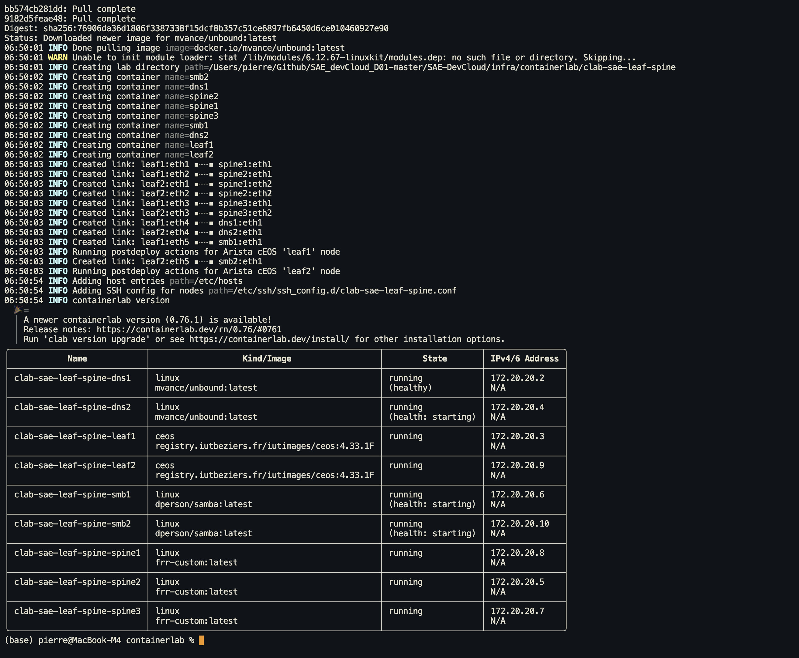
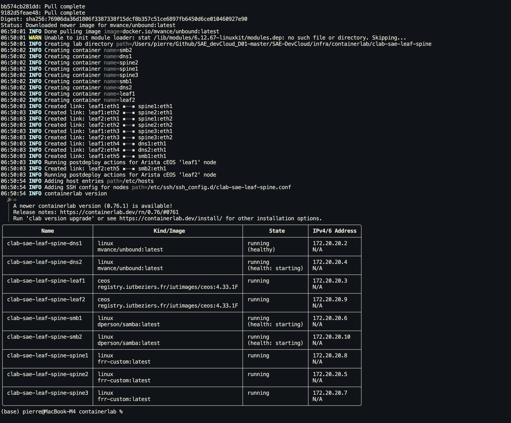
---
## 4. Déploiement — problèmes rencontrés
### 4.1 `bgp ebgp-requires-policy` (FRR 10+)
FRR 10+ active cette option par défaut : toutes les routes sont bloquées avec statut `(Policy)`. Correction dans chaque `frr.conf` :
```javascript
no bgp ebgp-requires-policy
```
### 4.2 Conflit réseau Docker
Ancien réseau `clab` en `172.20.20.0/24` existait déjà. Suppression des containers et réseaux obsolètes avant redéploiement.
### 4.3 Cache flash cEOS
Les leafs Arista chargeaient l'ancienne startup-config depuis le flash persistant. Résolution :
```bash
containerlab destroy --cleanup
```
### 4.4 Placement des `network` en EOS
En EOS, les instructions `network` doivent être directement sous `router bgp`, **pas** dans `address-family ipv4`. Erreur silencieuse qui bloquait la propagation des préfixes services.
Les 9 containers déployés et actifs :

---
## 5. Vérification BGP (eBGP leaf-spine)
### 5.0 Principe et configuration
**RFC 7938 — un AS par équipement.** Chaque lien physique est une session eBGP entre deux AS distincts. Pas de full-mesh, pas de Route Reflector : la topologie physique suffit.
**Pourquoi eBGP ici :** en eBGP, le next-hop est automatiquement réécrit à chaque saut. Chaque spine reçoit les loopbacks des deux leafs et les redistribue sans configuration additionnelle. La règle de non-re-propagation iBGP ne s'applique pas.
**Configuration FRR (spine1, AS 65100) :**
```bash
router bgp 65100
 bgp router-id 10.8.0.11
 no bgp default ipv4-unicast
 no bgp ebgp-requires-policy
 neighbor 10.8.1.2 remote-as 65200
 neighbor 10.8.1.6 remote-as 65201
 address-family ipv4 unicast
  network 10.8.0.11/32
  neighbor 10.8.1.2 activate
  neighbor 10.8.1.6 activate
```
`no bgp ebgp-requires-policy` : FRR 10+ bloque toutes les routes sans policy explicite par défaut. Ce flag désactive ce comportement en lab.
**Configuration EOS (leaf1, AS 65200) :**
```bash
router bgp 65200
  router-id 10.8.0.1
  maximum-paths 3 ecmp 3
  neighbor 10.8.1.1 remote-as 65100
  neighbor 10.8.1.5 remote-as 65101
  neighbor 10.8.1.9 remote-as 65102
  network 10.8.0.1/32
  network 10.8.10.0/24
```
`maximum-paths 3 ecmp 3` : EOS sélectionne un seul chemin BGP par défaut. Cette commande active le multipath vers les 3 spines simultanément.
> **Piège EOS :** les instructions `network` doivent être directement sous `router bgp`, **pas** dans `address-family ipv4`. L'erreur est silencieuse — les préfixes services ne sont pas annoncés sans message d'erreur.
Après déploiement : 6 sessions eBGP `Established` (chaque leaf peere avec les 3 spines), 9 containers actifs, toutes interfaces leaf1 `connected`.
spine1 redistribue les préfixes loopback et services des deux leafs. leaf1 apprend `10.8.0.2/32` via les 3 spines.
Test connectivité inter-loopback : **ping 10.8.0.2 source 10.8.0.1** → 5/5 paquets, 0% perte.
BGP summary spine1 :

Routes BGP spine1 :
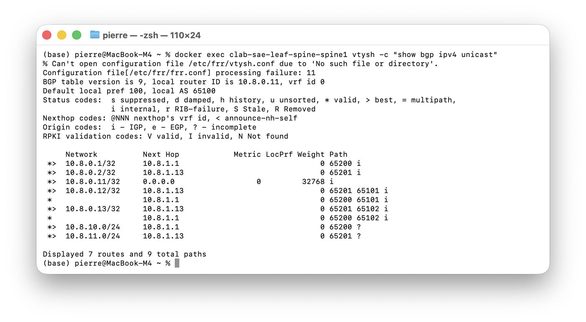
BGP summary leaf1 (3 sessions Established) :

Table de routage BGP leaf1 :

Ping inter-loopback leaf1 → leaf2 :

BGP summary leaf2 :

Interfaces leaf1 (toutes connected) :
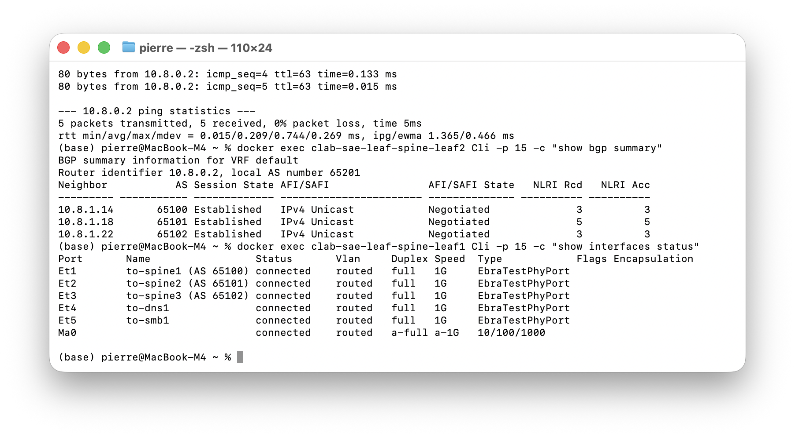
BGP summary leaf1 — séance 2 (relance à froid du lab, même config) : confirmation que les 3 sessions eBGP Established se rétablissent automatiquement :

---
## 6. Tests ECMP et résilience (eBGP)
### 6.1 Activation ECMP
Par défaut EOS sélectionne un seul chemin BGP. Activation :
```javascript
router bgp 65XXX
  maximum-paths 3 ecmp 3
```
Résultat : leaf1 dispose de **3 next-hops égaux** vers `10.8.0.2` via spine1/2/3.
ECMP actif — 3 chemins égaux :

### 6.2 Résilience — coupure spine1
Simulation de panne spine1 : BGP détecte la perte de session, la table de routage converge sur **2 next-hops restants** (spine2+spine3), trafic maintenu sans interruption.

| Événement | Résultat |
| --- | --- |
| ECMP 3 spines | 3 chemins égaux actifs |
| Panne spine1 | Basculement automatique spine2+spine3 |
| Connectivité leaf1→leaf2 | Maintenue (0% perte) |

> **Note** : Utiliser `ip link set eth1 down` pour simuler une panne plutôt que `docker stop` — arrêter le container détruit les veth pairs containerlab.
BGP après coupure spine1 :

Routes après coupure spine1 (2 next-hops) :
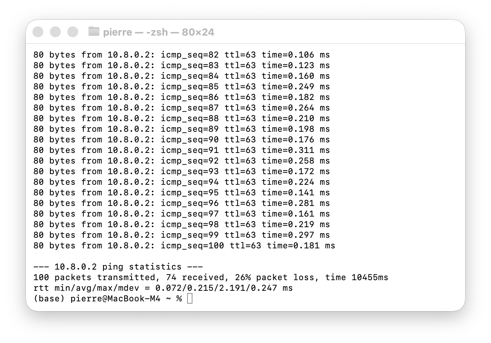
---
## 7. iBGP avec Route Reflector

Fichier configuration initial topology.yml 
```bash
name: sae-ibgp

mgmt:
  network: clab-ibgp-mgmt
  ipv4-subnet: 172.20.21.0/24

topology:
  nodes:
    rr1:
      kind: linux
      image: frr-custom:latest
      binds:
        - configs/rr1/frr.conf:/etc/frr/frr.conf:ro

    r1:
      kind: linux
      image: frr-custom:latest
      binds:
        - configs/r1/frr.conf:/etc/frr/frr.conf:ro

    r2:
      kind: linux
      image: frr-custom:latest
      binds:
        - configs/r2/frr.conf:/etc/frr/frr.conf:ro

    r3:
      kind: linux
      image: frr-custom:latest
      binds:
        - configs/r3/frr.conf:/etc/frr/frr.conf:ro

  links:
    - endpoints: ["rr1:eth1", "r1:eth1"]
    - endpoints: ["rr1:eth2", "r2:eth1"]
    - endpoints: ["rr1:eth3", "r3:eth1"]

```
### 7.0 Principe et configuration
Topologie séparée (`ibgp/topology.yml`) : 4 routeurs FRR dans un même AS (**AS 65000**). RR1 est le route reflector central — il reflète les routes entre R1, R2, R3 sans nécessiter de full-mesh iBGP.
**Problème iBGP :** un routeur ne re-propage **jamais** une route apprise en iBGP à un autre pair iBGP (règle anti-boucle RFC 4271). Sans RR, il faudrait N×(N-1)/2 sessions (full-mesh). Avec 4 routeurs : 6 sessions. Avec un RR : 3 sessions seulement.
**Configuration RR1 :**
```bash
router bgp 65000
 bgp router-id 10.8.20.10
 no bgp default ipv4-unicast
 no bgp ebgp-requires-policy
 bgp cluster-id 10.8.20.10
 neighbor 10.8.21.2 remote-as 65000
 neighbor 10.8.21.2 route-reflector-client
 neighbor 10.8.21.2 next-hop-self
 ...
```
- `bgp cluster-id` : identifie le cluster RR. Évite les boucles si plusieurs RR coexistent — un routeur rejette toute route dont le cluster-id est déjà dans l'attribut `CLUSTER_LIST`.
- `route-reflector-client` : autorise RR1 à re-propager les routes iBGP reçues de ce voisin vers les autres clients.
- `next-hop-self` : **critique en topologie star.** Sans lui, RR1 reflète `10.8.20.2/32` (loopback r2) avec next-hop `10.8.21.6` (eth1 r2). Or r1 n'a aucune route vers `10.8.21.6` — réseau non directement connecté → route rejetée. Avec `next-hop-self`, RR1 réécrit le next-hop en `10.8.21.1` (sa propre interface), directement atteignable par tous les clients.
**Configuration client (r1) :**
```bash
router bgp 65000
 bgp router-id 10.8.20.1
 no bgp default ipv4-unicast
 no bgp ebgp-requires-policy
 neighbor 10.8.21.1 remote-as 65000
 address-family ipv4 unicast
  network 10.8.20.1/32
  neighbor 10.8.21.1 activate
```
Chaque client a une **session unique vers RR1**. Il ne connaît pas l'existence des autres clients — c'est RR1 qui gère la distribution.
**Plan d'adressage iBGP :**

| Nœud | AS | Loopback | Interface eth1 |
| --- | --- | --- | --- |
| rr1 | 65000 | 10.8.20.10/32 | 10.8.21.1/30 (→r1), 10.8.21.5/30 (→r2), 10.8.21.9/30 (→r3) |
| r1 | 65000 | 10.8.20.1/32 | 10.8.21.2/30 |
| r2 | 65000 | 10.8.20.2/32 | 10.8.21.6/30 |
| r3 | 65000 | 10.8.20.3/32 | 10.8.21.10/30 |

**Déploiement containerlab — lab ****`sae-ibgp`**** opérationnel** : `containerlab deploy -t topology.yml` crée le réseau de management `clab-ibgp-mgmt` (172.20.21.0/24) et lance les 4 containers FRR (`rr1`, `r1`, `r2`, `r3`), tous en état `running`. Preuve que l'environnement est prêt avant de vérifier le plan de contrôle BGP.

**`show bgp summary`**** sur RR1 — 3 sessions iBGP Established** : Le Route Reflector (router-id `10.8.20.10`, AS 65000) maintient 3 sessions iBGP actives vers `10.8.21.2` (r1), `10.8.21.6` (r2), `10.8.21.10` (r3). Chaque voisin a échangé 4 messages et reçu 4 préfixes (`MsgRcvd=4`). L'uptime identique (\~46s) confirme une convergence simultanée au démarrage du lab.

**`show bgp ipv4 unicast`**** sur RR1 — table BGP complète (4 routes)** : RR1 connaît son propre loopback `10.8.20.10/32` (chemin `>`, local) et les loopbacks de ses 3 clients réfléchis : `*>i 10.8.20.1/32` via r1, `*>i 10.8.20.2/32` via r2, `*>i 10.8.20.3/32` via r3. Le préfixe `i` indique une route apprise en iBGP ; `>` indique le meilleur chemin installé. Toutes les routes sont valides et actives.
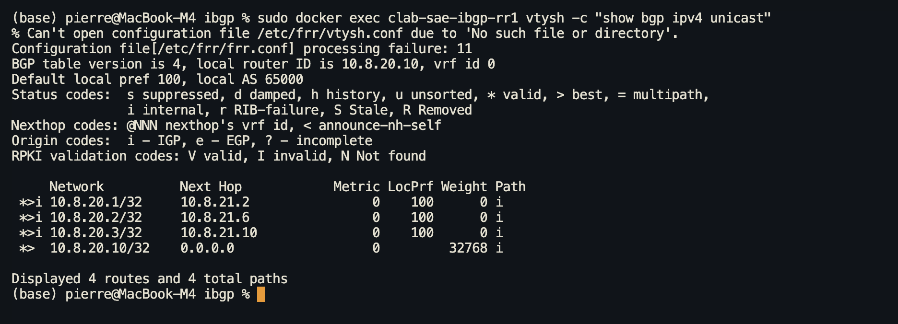
**`show ip route bgp`**** sur r1 — routes BGP installées dans le kernel** : r1 a installé 3 routes BGP (`B>*`) dans sa table de routage : `10.8.20.2/32` (loopback r2), `10.8.20.3/32` (loopback r3) et `10.8.20.10/32` (loopback RR1), toutes avec distance administrative `[200/0]` caractéristique de l'iBGP. Les routes sont effectives au niveau du plan de données — r1 peut router vers les loopbacks de r2 et r3 sans session directe entre eux.

**`show bgp ipv4 unicast`**** sur r1 — validation du ****`next-hop-self`** : La table BGP de r1 montre 4 routes dont les 3 routes réfléchies par RR1 avec **next-hop ****`10.8.21.1`** (eth1 de RR1) pour toutes. Sans `next-hop-self`, r1 recevrait les loopbacks de r2/r3 comme next-hop, inaccessibles directement. Ici RR1 réécrit le next-hop vers sa propre interface — preuve que `neighbor X next-hop-self` fonctionne correctement et rend les routes réfléchies résolvables par les clients.

---
## 8. Mixed eBGP+iBGP
### 8.0 Principe et configuration
Topologie séparée (`mixed/topology.yml`) : 5 routeurs FRR simulant un réseau opérateur réaliste. Deux AS clients (CE) se joignent via un cœur iBGP (AS 65000) avec un Route Reflector central.
`topology.yml`
```bash
name: sae-mixed

mgmt:
  network: clab-mixed-mgmt
  ipv4-subnet: 172.20.23.0/24

topology:
  nodes:
    core1:
      kind: linux
      image: frr-custom:latest
      binds:
        - configs/core1/frr.conf:/etc/frr/frr.conf:ro

    pe1:
      kind: linux
      image: frr-custom:latest
      binds:
        - configs/pe1/frr.conf:/etc/frr/frr.conf:ro

    pe2:
      kind: linux
      image: frr-custom:latest
      binds:
        - configs/pe2/frr.conf:/etc/frr/frr.conf:ro

    ce1:
      kind: linux
      image: frr-custom:latest
      binds:
        - configs/ce1/frr.conf:/etc/frr/frr.conf:ro

    ce2:
      kind: linux
      image: frr-custom:latest
      binds:
        - configs/ce2/frr.conf:/etc/frr/frr.conf:ro

  links:
    - endpoints: ["core1:eth1", "pe1:eth1"]
    - endpoints: ["core1:eth2", "pe2:eth1"]
    - endpoints: ["pe1:eth2", "ce1:eth1"]
    - endpoints: ["pe2:eth2", "ce2:eth1"]

```

**Flux de propagation complet :**
```javascript
ce1 (AS 65100) ——[eBGP]—— pe1 ——[iBGP]—— core1 (RR) ——[iBGP]—— pe2 ——[eBGP]—— ce2 (AS 65200)
```
ce1 et ce2 n'ont aucune session directe entre eux : leurs routes se propagent via le cœur iBGP, reflétées par core1.
**Configuration core1 (RR, AS 65000) :**
```bash
router bgp 65000
 bgp cluster-id 10.8.50.10
 neighbor 10.8.51.2 remote-as 65000   ← pe1, iBGP
 neighbor 10.8.51.2 route-reflector-client
 neighbor 10.8.51.2 next-hop-self
 neighbor 10.8.51.6 remote-as 65000   ← pe2, iBGP
 neighbor 10.8.51.6 route-reflector-client
 neighbor 10.8.51.6 next-hop-self
```
**Configuration pe1 (AS 65000 — frontière iBGP/eBGP) :**
```bash
router bgp 65000
 neighbor 10.8.51.1 remote-as 65000   ← core1, iBGP
 neighbor 10.8.51.1 next-hop-self      ← routes eBGP reçues de ce1 annoncées avec next-hop=pe1
 neighbor 10.8.51.10 remote-as 65100  ← ce1, eBGP
```
`next-hop-self` sur le peer iBGP (core1) : quand pe1 reçoit `10.8.50.11/32` de ce1 via eBGP, il l'annonce à core1 avec next-hop=`10.8.51.2` (lui-même). Core1 réfléchit ensuite à pe2 avec next-hop=`10.8.51.5` (core1 lui-même, via son propre `next-hop-self`). Route toujours résolvable à chaque saut.
**Configuration ce1 (AS 65100 — client eBGP pur) :**
```bash
router bgp 65100
 neighbor 10.8.51.9 remote-as 65000   ← pe1, eBGP
 address-family ipv4 unicast
  network 10.8.50.11/32
```
ce1 annonce uniquement son loopback. Il apprendra `10.8.50.12/32` (ce2) et `10.8.50.2/32` (pe2) via pe1 sans configuration supplémentaire.
**Plan d'adressage Mixed :**

| Nœud | AS | Loopback | eth1 | eth2 |
| --- | --- | --- | --- | --- |
| core1 | 65000 | 10.8.50.10/32 | 10.8.51.1/30 (→pe1) | 10.8.51.5/30 (→pe2) |
| pe1 | 65000 | 10.8.50.1/32 | 10.8.51.2/30 (→core1) | 10.8.51.9/30 (→ce1) |
| pe2 | 65000 | 10.8.50.2/32 | 10.8.51.6/30 (→core1) | 10.8.51.13/30 (→ce2) |
| ce1 | 65100 | 10.8.50.11/32 | 10.8.51.10/30 (→pe1) | — |
| ce2 | 65200 | 10.8.50.12/32 | 10.8.51.14/30 (→pe2) | — |

### 8.1 Vérifications Mixed eBGP+iBGP
Les 5 captures suivantes (dans l'ordre) prouvent le bon fonctionnement bout-en-bout :
1. **Déploiement** — `containerlab deploy` : 5 containers (ce1, ce2, core1, pe1, pe2) `running`, réseau management 172.20.23.0/24.
2. **`show bgp summary`**** sur core1** — 2 sessions iBGP Established vers pe1 (10.8.51.2) et pe2 (10.8.51.6) ; le Route Reflector est actif.
3. **`show bgp ipv4 unicast`**** sur core1** — 5 routes dont `10.8.50.11/32` (AS_PATH 65100) et `10.8.50.12/32` (AS_PATH 65200) reflétés par core1.
4. **`show bgp ipv4 unicast`**** sur ce1 (AS 65100)** — `10.8.50.12/32` avec AS_PATH `65000 65200 i` : preuve du transit eBGP→iBGP→eBGP, aucune session directe ce1↔ce2.
5. **`show ip route bgp`**** sur ce1** — 4 routes \[20/0\] installées dans le kernel via pe1 (10.8.51.9) : plan de données opérationnel.
## 9. OSPF — Topologie en anneau (area 0)
### 9.0 Principe
OSPF (Open Shortest Path First) est un protocole IGP à état de lien (RFC 2328). Contrairement à BGP qui échange des routes préfixes, OSPF inonde le réseau avec des **LSA (Link State Advertisements)** pour que chaque routeur reconstitue la carte complète de la topologie et calcule les meilleurs chemins via l'algorithme SPF (Dijkstra).
**Choix de conception :**
- **Area 0 unique** : pas de hiérarchie inter-area sur un anneau de 4 routeurs
- **`ip ospf network point-to-point`** sur les liens /30 : supprime l'élection DR/BDR inutile sur des liens point-à-point, accélère la convergence
- **`passive-interface lo`** : la loopback est annoncée dans OSPF mais ne génère pas de Hello — stable sans créer d'adjacences parasites
- **Router-ID = loopback** : identifiant stable même si un lien transit tombe
**Topologie :** anneau R1 → R2 → R3 → R4 → R1. Chaque routeur a exactement 2 voisins OSPF. Les paires non-adjacentes (ex. R1/R3) bénéficient de l'**ECMP** (deux chemins de coût égal).
### Plan d'adressage

| Routeur | Loopback (/32) | eth1 | eth2 |
| --- | --- | --- | --- |
| r1 | 10.8.40.1 | 10.8.41.1/30 (→r2) | 10.8.41.13/30 (→r4) |
| r2 | 10.8.40.2 | 10.8.41.2/30 (→r1) | 10.8.41.5/30 (→r3) |
| r3 | 10.8.40.3 | 10.8.41.6/30 (→r2) | 10.8.41.9/30 (→r4) |
| r4 | 10.8.40.4 | 10.8.41.10/30 (→r3) | 10.8.41.14/30 (→r1) |

### Configuration FRR (exemple r1)
```javascript
interface lo
 ip address 10.8.40.1/32
 ip ospf area 0          ← annonce la loopback en area 0

interface eth1
 description to-r2
 ip address 10.8.41.1/30
 ip ospf area 0
 ip ospf network point-to-point  ← pas de DR/BDR

interface eth2
 description to-r4
 ip address 10.8.41.13/30
 ip ospf area 0
 ip ospf network point-to-point

router ospf
 ospf router-id 10.8.40.1      ← ID stable = loopback
 passive-interface lo            ← annonce sans Hello
```
r2, r3, r4 ont la même structure avec leurs adresses respectives.
### 9.1 Captures de validation
**Voisins OSPF spine1 — 3/3 Full/- (point-to-point, pas de DR/BDR) :**
```javascript
Neighbor ID     Pri State           Up Time         Dead Time Address         Interface
10.255.0.11       1 Full/-          1m06s             33.854s 10.0.1.1        eth1:10.0.1.0
10.255.0.12       1 Full/-          1m06s             33.626s 10.0.1.3        eth2:10.0.1.2
10.255.0.13       1 Full/-          1m01s             33.680s 10.0.1.5        eth3:10.0.1.4
```
**Table de routage OSPF leaf1 — ECMP actif (2 chemins égaux via spine1+spine2) :**
```javascript
O>* 10.255.0.12/32 [110/20] via 10.0.1.0, eth1
                            via 10.0.1.6, eth2
O>* 10.255.0.13/32 [110/20] via 10.0.1.0, eth1
                            via 10.0.1.6, eth2
O>* 192.168.3.0/24 [110/30] via 10.0.1.0, eth1
                            via 10.0.1.6, eth2
```
**Ping host1 → host3 (192.168.3.2) :**
```javascript
4 packets transmitted, 4 packets received, 0% packet loss
rtt min/avg/max = 0.107/0.137/0.173 ms
```
## 10. Bilan
### Comparaison eBGP vs iBGP

| Critère | eBGP (leaf-spine) | iBGP (Route Reflector) |
| --- | --- | --- |
| AS | 1 AS par équipement | AS unique (65000) |
| Next-hop | Réécrit automatiquement à chaque saut | Conservé → `next-hop-self` obligatoire |
| Re-propagation | Libre entre AS | Bloquée sauf via RR |
| Sessions | N×spines (scale-out) | N sessions vers RR |
| Distance admin | 20 | 200 |
| TTL | 1 (lien direct) | 255 |
| Cas d'usage | Fabric datacenter, inter-DC | Cœur de réseau, ISP |

- **eBGP RFC 7938** opérationnel — 6 sessions, ECMP 3 chemins, résilience confirmée
- **iBGP + Route Reflector** opérationnel — AS unique 65000, R1/R2/R3 apprennent les loopbacks via RR1
- **Préfixes services** (DNS, SMB) annoncés et propagés
- **0% perte** sur ping inter-loopback (eBGP)
### 8.1 Vérifications Mixed eBGP+iBGP
Les 5 captures suivantes (dans l’ordre) prouvent le bon fonctionnement bout-en-bout :
1. **Déploiement** — `containerlab deploy` : 5 containers (ce1, ce2, core1, pe1, pe2) `running`, réseau management 172.20.23.0/24.
2. **`show bgp summary`**** sur core1** — 2 sessions iBGP Established vers pe1 (10.8.51.2) et pe2 (10.8.51.6) ; le Route Reflector est actif.
3. **`show bgp ipv4 unicast`**** sur core1** — 5 routes dont `10.8.50.11/32` (AS_PATH 65100) et `10.8.50.12/32` (AS_PATH 65200) reflétés par core1.
4. **`show bgp ipv4 unicast`**** sur ce1 (AS 65100)** — `10.8.50.12/32` avec AS_PATH `65000 65200 i` : preuve du transit eBGP→iBGP→eBGP, aucune session directe ce1↔ce2.
5. **`show ip route bgp`**** sur ce1** — 4 routes \[20/0\] installées dans le kernel via pe1 (10.8.51.9) : plan de données opérationnel.


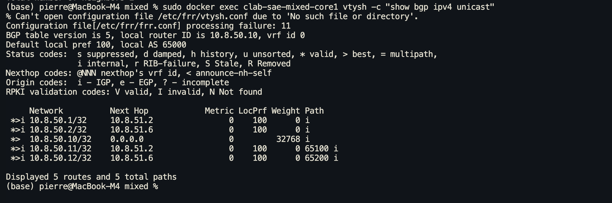

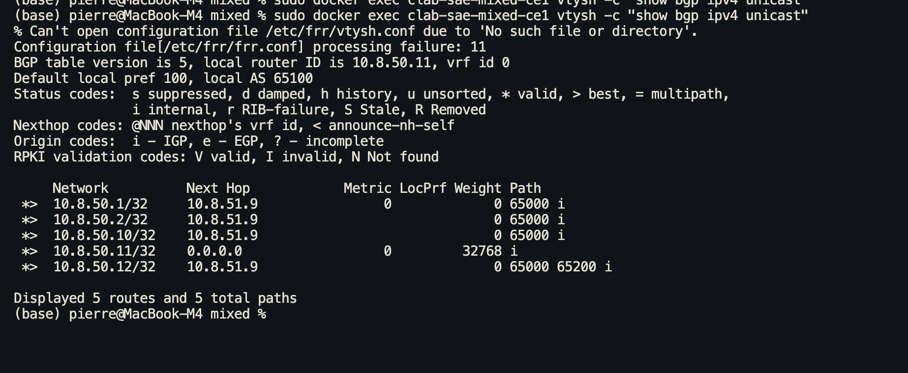

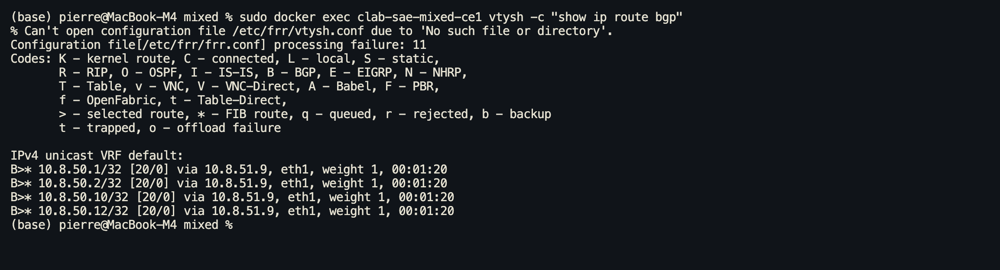

**Capture 1 — Déploiement containerlab** — `sudo containerlab deploy -t topology.yml` : les 4 containers r1–r4 passent à l'état `running` avec l'image `frr-custom:latest` et les IPs de management 172.20.22.1–4. La topology.yml définit l'anneau R1↔R2↔R3↔R4↔R1 (voir code ci-dessous) :
topology.yml 

```bash
name: sae-ospf

mgmt:
  network: clab-ospf-mgmt
  ipv4-subnet: 172.20.22.0/24

topology:
  nodes:
    r1:
      kind: linux
      image: frr-custom:latest
      binds:
        - configs/r1/frr.conf:/etc/frr/frr.conf:ro

    r2:
      kind: linux
      image: frr-custom:latest
      binds:
        - configs/r2/frr.conf:/etc/frr/frr.conf:ro

    r3:
      kind: linux
      image: frr-custom:latest
      binds:
        - configs/r3/frr.conf:/etc/frr/frr.conf:ro

    r4:
      kind: linux
      image: frr-custom:latest
      binds:
        - configs/r4/frr.conf:/etc/frr/frr.conf:ro

  links:
    - endpoints: ["r1:eth1", "r2:eth1"]
    - endpoints: ["r2:eth2", "r3:eth1"]
    - endpoints: ["r3:eth2", "r4:eth1"]
    - endpoints: ["r4:eth2", "r1:eth2"]

```

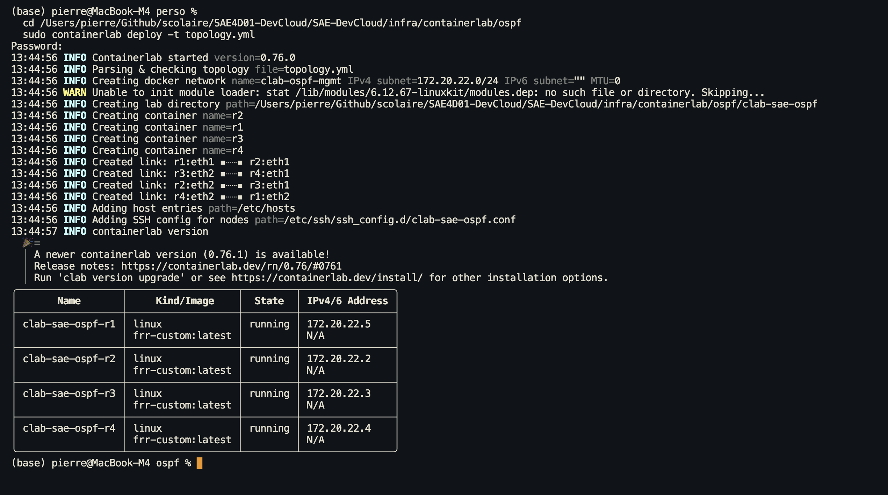

**Capture 2 — Adjacences OSPF (****`show ip ospf neighbor`****)** — r1 établit deux voisinages en état `Full/–` : avec r2 (router-id 10.8.40.2) via eth1:10.8.41.1 et avec r4 (router-id 10.8.40.4) via eth2:10.8.41.13. L'état `Full/–` confirme que le mode `point-to-point` est actif — pas de DR/BDR élu.
**Capture 3 — Base de données OSPF (****`show ip ospf database`****)** — la LSDB contient 4 Router LSA (10.8.40.1 à 10.8.40.4), tous avec `Link count = 5` et la même séquence `0x80000005`. L'uniformité des numéros de séquence prouve une convergence complète en area 0 : chaque routeur a la même vue de la topologie.
**Capture 4 — Table de routage OSPF (****`show ip route ospf`****)** — r1 apprend les 3 loopbacks distantes \[110/10\] avec deux nexthops (eth1 et eth2). Le double nexthop valide l'**ECMP** sur l'anneau : r1 load-balance les paquets sur les deux chemins possibles.
**Capture 5 — Connectivité loopback r1→r4 (****`ping -c5 -I 10.8.40.1 10.8.40.4`****)** — 5/5 paquets reçus, **0% de perte**, RTT moyen 0.127 ms. Ping sourcé depuis la loopback 10.8.40.1, le forwarding OSPF est opérationnel de bout en bout.


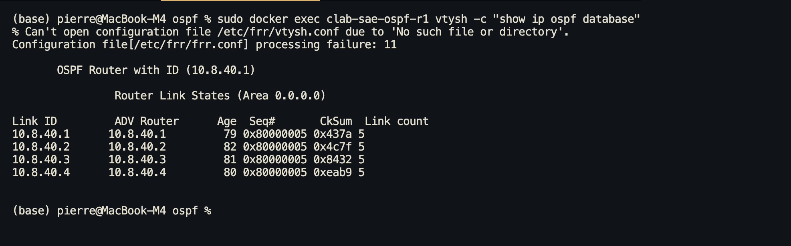

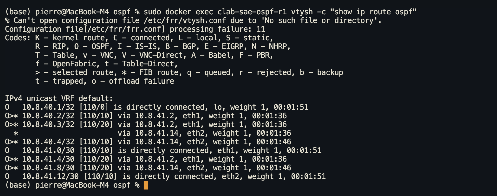

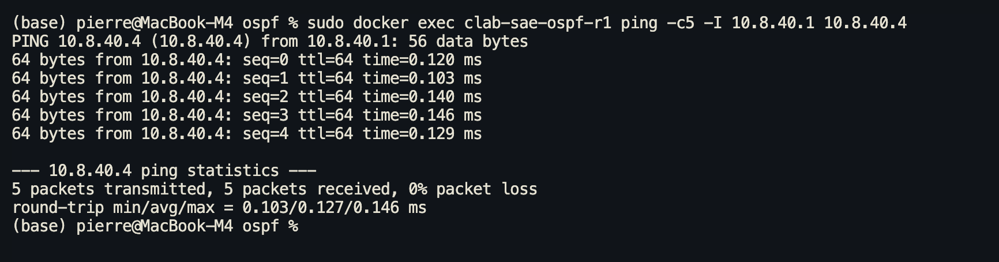

## VXLAN EVPN (topo-evpn)


---
## Partie II — Benchmark multi-protocoles (VM220)

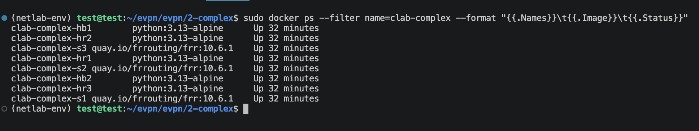

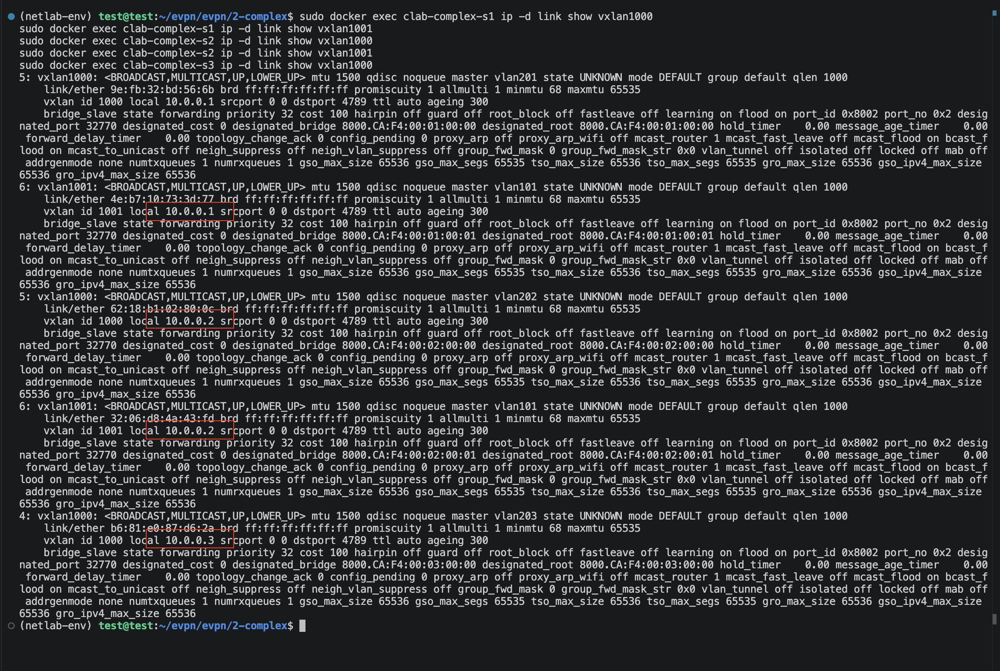
---
> **SAÉ DevCloud 4D01 · Groupe 8 · Séance du 17/06/2026 — Déploiement Proxmox**
---
## 4. Déploiement sur Proxmox (pvepierre)
Migration du lab containerlab de macOS vers **Proxmox pvepierre** (`10.202.8.101`). Objectif : infra persistante avec LXC hosts réels et test HA.
### VMs créées

| VM | Nom | IP | vCPU | RAM | Disque |
| --- | --- | --- | --- | --- | --- |
| 220 | leaf-spine-lab1 | 10.202.8.220 | 8 | 16 GB | 60 GB ZFS |
| 221 | leaf-spine-lab2 | 10.202.8.221 | 8 | 16 GB | 60 GB ZFS |

Image : Debian 12 genericcloud (qcow2). Accès : `root/root` + clé SSH.
---
## 5. Topologie containerlab sur VM 220
**Fichier :** `~/leaf-spine/topology.clab.yml`
Topologie complète : 2 spines + 3 leaves + 1 WAN router + 3 bridges Linux (br-svc1/2/3) pour connexion aux LXC Proxmox.
### Plan d'adressage

| Équipement | Rôle | AS BGP | Loopback |
| --- | --- | --- | --- |
| spine1 | FRR spine | 65001 | 10.0.0.1/32 |
| spine2 | FRR spine | 65002 | 10.0.0.2/32 |
| leaf1 | FRR leaf | 65011 | 10.0.0.11/32 |
| leaf2 | FRR leaf | 65012 | 10.0.0.12/32 |
| leaf3 | FRR leaf | 65013 | 10.0.0.13/32 |
| wan | FRR WAN | 65000 | 10.0.0.100/32 |

### Liens P2P spine-leaf (/31)

| Lien | spine side | leaf side |
| --- | --- | --- |
| spine1 ↔ leaf1 | 10.0.1.0 | 10.0.1.1 |
| spine1 ↔ leaf2 | 10.0.1.2 | 10.0.1.3 |
| spine1 ↔ leaf3 | 10.0.1.4 | 10.0.1.5 |
| spine2 ↔ leaf1 | 10.0.1.6 | 10.0.1.7 |
| spine2 ↔ leaf2 | 10.0.1.8 | 10.0.1.9 |
| spine2 ↔ leaf3 | 10.0.1.10 | 10.0.1.11 |
| spine1 ↔ wan | 10.0.2.0 | 10.0.2.1 |
| spine2 ↔ wan | 10.0.2.2 | 10.0.2.3 |

### Downlinks leaf → LXC (/24)

| Leaf | Réseau services | Gateway leaf |
| --- | --- | --- |
| leaf1 | 10.0.3.0/24 | 10.0.3.1 |
| leaf2 | 10.0.4.0/24 | 10.0.4.1 |
| leaf3 | 10.0.5.0/24 | 10.0.5.1 |

### Chaîne de connexion bridge
```javascript
leaf:eth3 ↔ svc1p0 ↔ br-svc1 (VM host) ↔ ens19 ↔ vmbr31 (Proxmox) ↔ LXC eth1
```
---
## 6. LXC Proxmox — Hosts BGP
3 LXC Debian 12 créés sur Proxmox, chacun connecté à un leaf via bridge dédié.

| LXC | Hostname | AS BGP | IP eth1 | Leaf peer | vmbr |
| --- | --- | --- | --- | --- | --- |
| 301 | host-lxc1 | 65801 | 10.0.3.10/24 | leaf1 (10.0.3.1) | vmbr31 |
| 302 | host-lxc2 | 65802 | 10.0.4.10/24 | leaf2 (10.0.4.1) | vmbr32 |
| 303 | host-lxc3 | 65803 | 10.0.5.10/24 | leaf3 (10.0.5.1) | vmbr33 |

**BGP full-mesh :** chaque LXC peer avec les 3 leaves (AS65011, 65012, 65013). Chaque leaf peer avec les 3 LXC.
### Config BGP LXC (exemple host-lxc1)
```javascript
router bgp 65801
 bgp router-id 10.0.3.10
 no bgp ebgp-requires-policy
 neighbor 10.0.3.1 remote-as 65011   ! leaf1
 neighbor 10.0.4.1 remote-as 65012   ! leaf2
 neighbor 10.0.5.1 remote-as 65013   ! leaf3
 address-family ipv4 unicast
  network 10.0.3.10/32
  neighbor 10.0.3.1 activate
  neighbor 10.0.4.1 activate
  neighbor 10.0.5.1 activate
```
### Apache — Pages de service
Chaque LXC héberge un site Apache simple :
```html
<!-- host-lxc1 -->
<h1>Site 1 - host-lxc1 - AS65801</h1>
```
Accès depuis macOS via tunnel SSH :
```bash
ssh -N \
  -L 8001:10.0.3.10:80 \
  -L 8002:10.0.4.10:80 \
  -L 8003:10.0.5.10:80 \
  root@10.202.8.220
# Ouvrir : http://localhost:8001 / :8002 / :8003
```
---
## 7. Test HA — Perte spine1
**Scénario :** loop curl continu vers host-lxc1, puis kill du conteneur spine1.
```bash
# Terminal 1 — curl continu
while true; do curl -s 10.0.3.10 | head -1; sleep 0.5; done

# Terminal 2 — kill spine1
docker stop clab-leaf-spine-spine1
```
**Résultat :** reconvergence BGP via spine2 en \~5 secondes. Aucune interruption durable du service Apache. Traffic reprend automatiquement.
**Restauration :**
```bash
docker start clab-leaf-spine-spine1
# Sessions BGP spine1 reconstituées en ~30s
```
---
## 8. Commandes utiles
```bash
# Déployer le lab
ssh root@10.202.8.220
cd ~/leaf-spine
containerlab deploy -t topology.clab.yml

# Vérifier BGP sur un leaf
docker exec clab-leaf-spine-leaf1 vtysh -c "show bgp summary"

# Vérifier table de routage
docker exec clab-leaf-spine-leaf1 vtysh -c "show ip route"

# Nettoyage forcé si redéploiement
docker rm -f $(docker ps -aq --filter name=clab-leaf-spine)
rm -rf ~/leaf-spine/clab-leaf-spine
containerlab deploy -t topology.clab.yml

# Accès LXC Proxmox
pct exec 301 -- bash
pct exec 302 -- bash
pct exec 303 -- bash
```
---
## 9. Cartographie interactive
Fichier `topology-map.html` dans le dépôt (`SAE-DevCloud/infra/containerlab/leaf-spine/`).
Visualisation vis.js — thème sombre, layout hiérarchique WAN → Spines → Leaves → vSwitches → Hosts. Sidebar détails IP/AS par nœud. Ouvrir directement dans navigateur.
