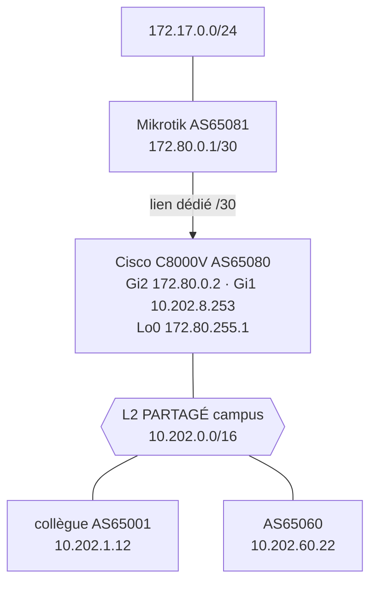

# Pierre — HA + eBGP Physique

> Source : page Notion (groupe 8, SAE4D01). 2026-06-17.
> Routeur perso **Cisco C8000V-G8 (AS65080)** + **Mikrotik (AS65081)** en leaf, raccordés au L2 partagé campus `10.202.0.0/16`. eBGP réel entre les groupes.

## Topologie du LAN physique

Deux VMs sous **Debian 12** sur Proxmox `pvepierre` (10.202.8.101) : `leaf-spine-lab1` (10.202.8.220) et `leaf-spine-lab2` (10.202.8.221). Le routeur **Cisco C8000V-G8** et le **Mikrotik** forment le cœur eBGP physique relié au campus.


## Plan d'adressage

| Élément | IP | Rôle |
| --- | --- | --- |
| Cisco Gi1 | `10.202.8.253/16` | uplink campus (L2 partagé) |
| Cisco Gi2 | `172.80.0.2/30` | lien dédié vers Mikrotik |
| Cisco Lo0 | `172.80.255.1/32` | IP stable hors zone partagée |
| Mikrotik | `172.80.0.1/30` | leaf, AS65081 |
| Derrière Mikrotik | `172.17.0.0/24` | services annoncés |



## Sessions eBGP (Cisco AS65080)

| Voisin | AS | IP peer | État | Lien |
| --- | --- | --- | --- | --- |
| Mikrotik | 65081 | 172.80.0.1 | ✅ Established (stable 1h44) | dédié Gi2 |
| Collègue | 65001 | 10.202.1.12 | ⚠️ Established mais **flap** | L2 partagé |
| — | 65060 | 10.202.60.22 | ⚠️ Established mais **flap** | L2 partagé |
| — | 65014 / 65070 / 65082 | — | ❌ Idle (groupes éteints) | — |

## Configuration appliquée (Cisco)

```
! Lien dédié vers le Mikrotik (renuméroté 172.20 -> 172.80)
interface GigabitEthernet2
 ip address 172.80.0.2 255.255.255.252
! Loopback : IP stable hors du /16 partagé
interface Loopback0
 ip address 172.80.255.1 255.255.255.255
! Annonces BGP
router bgp 65080
 network 172.80.0.0   mask 255.255.255.252
 network 172.80.255.1 mask 255.255.255.255
 neighbor 172.80.0.1   remote-as 65081   ! Mikrotik
 neighbor 10.202.1.12  remote-as 65001   ! collègue
 neighbor 10.202.60.22 remote-as 65060
```

Côté Mikrotik — chemin retour vers l'extérieur :

```
/ip route add dst-address=0.0.0.0/0 gateway=172.80.0.2
```

## Vérifications

**Annonces poussées aux peers :**

```
C8000V-G8#show bgp ipv4 unicast neighbors 10.202.1.12 advertised-routes | include 172.80
 *>   172.17.0.0/24    172.80.0.1                             0 65081 i
 *>   172.80.0.0/30    0.0.0.0                  0         32768 i
 *>   172.80.255.1/32  0.0.0.0                  0         32768 i
```

**Ping Mikrotik depuis le Cisco (3 sources, toutes 100%) :**

```
C8000V-G8#ping 172.80.0.1 source Loopback0
Packet sent with a source address of 172.80.255.1
!!!!!  Success rate is 100 percent (5/5)
```

> ✅ La source `Loopback0` (IP non-connectée) force le Mikrotik à utiliser sa default route → 100% : forward OK, return OK, pas de firewall drop.

## Diagnostic : un collègue ne ping pas le Mikrotik

Routes parfaites côté collègue, mais ping = 0% :

```
Router#show ip route 172.80.0.1
Known via "bgp 65001", via 10.202.8.253, AS Hops 1, tag 65080
Router#ping 172.80.0.1 source GigabitEthernet2
.....  Success rate is 0 percent (0/5)
```

**Cause trouvée — le L2 partagé perd des paquets.** Compteurs `show ip bgp summary` :

```
Neighbor      V      AS   Up/Down  State/PfxRcd
10.202.1.12   4   65001  00:00:18    12   <- FLAP (collègue, LAN partagé)
10.202.60.22  4   65060  00:00:18    12   <- FLAP (LAN partagé)
172.80.0.1    4   65081  01:44:50     1   <- STABLE (lien dédié)
```

`show ip bgp neighbors` → `Connections established 2076; dropped 2075` sur le collègue, contre `1 / 0` sur le Mikrotik. TCP : `retransmit 5, SRTT 413ms, RTTO 3205ms`.

```
Moi      : Cisco -> Gi2 (lien dédié) -> Mikrotik           => 100% (jamais le LAN)
Collègue : Cisco -> L2 PARTAGÉ (drop) -> mon Cisco -> Gi2  => 0% (meurt sur le LAN)
```

## Conclusion

- ✅ Infra perso **saine** : lien dédié /30 stable, eBGP propre, renumérotation sans casse, loopback hors zone partagée annoncée, chemin retour Mikrotik en place.
- ❌ Le **broadcast domain partagé `10.202.0.0/16`** (mutualisé entre tous les groupes) perd des paquets → flap BGP + perte ICMP. **Hors de mon contrôle, pas un défaut de routage** (routage prouvé bon des deux côtés).
- 💡 **Recommandation** : isoler le trafic inter-groupes (VLAN par groupe ou sous-réseau dédié) au lieu d'un seul broadcast domain plat, pour supprimer le flap.

> CR détaillé Cisco+Mikrotik : voir [sae4d01-cr-reseau-cisco-mikrotik-ebgp.md](sae4d01-cr-reseau-cisco-mikrotik-ebgp.md).
